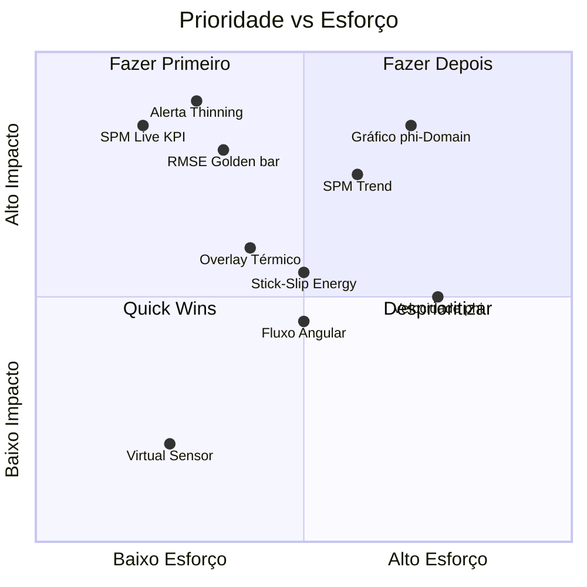

# Relatório: Visualização Atual do Frontend vs Novos Dados do Data-Processing

## Visão Geral do Frontend (PDF)

O design do frontend possui **5 módulos principais**:

| Módulo | Descrição |
|---|---|
| **Production** | Monitoramento em tempo real de operação |
| **Die Setup** | Configuração de projetos e sensores |
| **GSQE** | Inspeção de qualidade com marcação de defeitos |
| **Relatórios** | Histórico de batches com exportação PDF/CSV |
| **Ajustes** | Administração de usuários e configurações |

---

## 1. O que o Frontend JÁ POSSUI (PDF)

### 🔵 Production — Dashboard Principal

| Elemento | Dados Usados | Fonte |
|---|---|---|
| **KPIs** (Score, Batidas, Defeitos, Limiar) | Contagem de strokes, % defeitos | acquisition (panel count) |
| **Lista de Sensores** (DP01-DP06, GP01-GP04) | Nome, timestamp, dados brutos | sensor + acquisition |
| **Gráfico de Magnitude** (Y: 0-180, X: 0-2k samples) | Valores brutos X/Y/Z ou abs | acquisition.value (X,Y,Z,abs) |
| **% Desvio X Sensores** (bar chart horizontal) | % desvio por sensor | Calculado a partir de cl/ucl/lcl |
| **% Desvio X Sensor Draw-in** (separado) | % desvio DRAWIN | acquisition DRAWIN values |
| **% Desvio X Sensor Gap** (separado) | % desvio GAP | acquisition GAP values |
| **Desvio (%) X Batidas (t)** (time-series) | Evolução desvio ao longo do tempo | Não implementado no backend |
| **Score (%) X Batida (t)** (time-series trend) | Score por stroke ao longo do tempo | Não implementado no backend |
| **Lote Atual** (card com info do batch) | ID Projeto, Nome, Batidas, Defeitos, Score | batch + panel |
| **Mesa 1/2 selector** | Estado da prensa (Operando/Vazia/Aguardando) | die + press |
| **Agregar / Limiar** (configuração) | Threshold consolidation | Configuração do sensor |
| **Matriz Ativa / Em Espera** | Estado da ferramenta na prensa | die status |
| **Visualização** toggle (Sensores/Painéis) | Switch entre lista de sensores e painéis | — |

### 🟢 Die Setup

| Elemento | Dados Usados |
|---|---|
| Lista de projetos | ID, Name, Timestamp, Score |
| Categorias (Porta, Teto, Modelo A/B) | die.die_name categorizado |
| Sensores config | Sensor, Máximo, Mínimo, Tolerância (%) |
| Status (Pronto/Aguardando/Detectando) | Conexão switch/hub |
| Go Online / Descartar Edições | Ativar configuração |
| Arquivados / Lixeira | Soft delete de projetos |

### 🟡 GSQE

| Elemento | Dados Usados |
|---|---|
| Lista de GSQE | ID GSQE, Data, Projeto, Score |
| Marcação de defeitos no modelo 3D | Posição (x,y mm), Tipo, Classe |
| Tipos de defeitos | Flangeamento, Abaulamento, Estria, Rachadura, etc. |
| Classificação | A1-A3, B1-B3, C1-C3, D1-D3 |
| Controllable vs Uncontrollable | Categoria do defeito |
| Resumo GSQE | Somatória dos Defeitos, Objetivo, Zona/Classe |
| Status da Batida | Aprovada / Defeito / Defeito Crítico |

### 🔴 Relatórios

| Elemento | Dados Usados |
|---|---|
| Lista de batches | ID Projeto, Nome, Batidas Sucesso/Total, Score, Data |
| Filtro Por Projeto | die_id |
| Exportação | PDF (layout) + CSV (valores separados por vírgula) |
| Relatório Geral / Por Sensor / Por Painel | Tipos de relatório |
| Lista de Paradas de Linha / Manutenção | Paradas de produção |

---

## 2. Novos Dados do Data-Processing NÃO Visualizados

### Sensor GAP — Campos Novos

| Campo | Tipo | O que Representa | Visualização Sugerida |
|---|---|---|---|
| `abs_comp` | array 1D | Magnitude com compensação térmica | **Overlay no gráfico de magnitude** (linha tracejada vs original) |
| `abs_comp_max` | scalar | Máximo da magnitude compensada | **KPI card** ou coluna na tabela de sensores |
| `rmse_vs_golden` | scalar | RMSE vs ciclo de referência | **Gauge/indicador** por sensor — quão próximo do golden cycle |
| `thinning_detected` | boolean | Desgaste detectado | **Alerta visual** (badge vermelho no sensor) |
| `abs_phi` | array 1001 pts | Magnitude no domínio de fase | **Novo gráfico** φ-domain (eixo X: 0-1000 fase, Y: magnitude) |
| `spm` | scalar | Strokes por minuto instantâneo | **KPI card** no dashboard + trend line |
| `t_start_idx` / `t_end_idx` | scalar | Limites da janela de conformação | **Marcadores verticais** no gráfico de magnitude |

### Sensor DRAWIN — Campos Novos

| Campo | Tipo | O que Representa | Visualização Sugerida |
|---|---|---|---|
| `theta_flow` | scalar (rad) | Ângulo de fluxo de material | **Gráfico polar/radial** por sensor — indicador de direção |
| `E_ss_x` / `E_ss_y` / `E_ss_total` | scalar | Energia stick-slip | **Heatmap** por sensor + **trend line** ao longo dos strokes |
| `D_virtual` | scalar | Deslocamento virtual extrapolado | **Valor alternativo** quando sensor perde sinal |
| `phi_loss` | scalar | Fase onde sinal foi perdido | **Marcador visual** no gráfico φ-domain |
| `virtual_flag` | boolean | Indica sensor virtual ativo | **Badge/indicador** no card do sensor |
| `X_cal_phi` / `Y_cal_phi` | array 1001 pts | Posição calibrada no domínio de fase | **Novo gráfico** φ-domain sobreposto |
| `v_x_phi` / `v_y_phi` | array 1001 pts | Velocidade no domínio de fase | **Novo gráfico** de velocidade φ-domain |

---

## 3. Oportunidades de Adição por Módulo

### ⭐ Production — Adições Prioritárias

| Adição | Onde no Layout | Dados | Impacto |
|---|---|---|---|
| **SPM Live** | Novo KPI card ao lado de Score/Batidas/Defeitos | `spm` | Alto — operador vê velocidade real da prensa |
| **Alerta de Thinning** | Badge no card do sensor GP | `thinning_detected` | Alto — detecção de desgaste em tempo real |
| **Overlay Térmico** | Gráfico magnitude existente | `abs_comp` overlay | Médio — comparação com/sem compensação |
| **RMSE Golden** | Nova coluna no % Desvio bar chart | `rmse_vs_golden` | Alto — desvio quantitativo vs referência |
| **Gráfico φ-Domain** | Novo toggle no Visualização | `abs_phi`, `X_cal_phi`, `Y_cal_phi` | Alto — análise independente de velocidade |
| **Velocidade φ** | Sub-menu do gráfico | `v_x_phi`, `v_y_phi` | Médio — diagnóstico avançado |
| **Fluxo Angular** | Ícone direcional no sensor DRAWIN | `theta_flow` | Médio — direção do material |
| **Stick-Slip Energy** | Barra ou gauge no card DRAWIN | `E_ss_total` | Médio — indicador de atrito |
| **Virtual Sensor flag** | Ícone no card do sensor | `virtual_flag` | Baixo — raramente ativado |
| **SPM Trend** | Desvio (%) X Batidas (t) existente | `spm` time-series | Alto — trend de velocidade |

### 🟢 Die Setup — Adições

| Adição | Onde | Dados |
|---|---|---|
| **Golden Cycle config** | Configuração do Projeto | Definir ciclo de referência por sensor |
| **Parâmetros de processamento** | Configuração avançada | `V_THRESHOLD`, `OMEGA_CUTOFF_RATIO`, `THINNING_MARGIN` |
| **Limites de RMSE/E_ss** | Na tabela de Máximo/Mínimo/Tolerância | Novos thresholds para alertas |

### 🟡 GSQE — Adições

| Adição | Onde | Dados |
|---|---|---|
| **Correlação Defeito↔Sensor** | Resumo GSQE | Linking `thinning_detected` com defeitos apontados |
| **Score calculado a partir de dados** | Score do GSQE | `rmse_vs_golden` + `E_ss_total` como inputs automáticos |

### 🔴 Relatórios — Adições

| Adição | Onde | Dados |
|---|---|---|
| **SPM médio por lote** | Coluna na lista de batches | Média de `spm` por batch |
| **Thinning events** | Label/contagem na lista | Contagem `thinning_detected=true` |
| **Exportação dos dados φ-domain** | CSV exports | Arrays `*_phi` como colunas |
| **Relatório de Golden Cycle** | Novo tipo de relatório | `rmse_vs_golden` por sensor ao longo do batch |

---

## 4. Matriz de Prioridade

> [!IMPORTANT]
> **Quick Wins** (alto impacto, baixo esforço): SPM Live KPI, alerta de Thinning, RMSE Golden no bar chart — são dados escalares que já chegam no JSON, basta adicioná-los aos cards/barras existentes.

> [!WARNING]
> **Pré-requisito crítico**: Nenhuma dessas visualizações funcionará até que o **backend NestJS** seja atualizado para consultar as tabelas reais (`acquisition`, `field`, `panel`, `sensor`). Atualmente as entidades Sequelize mapeiam para tabelas inexistentes.
