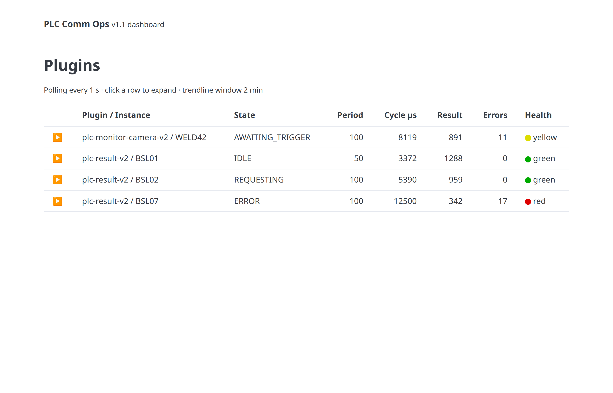
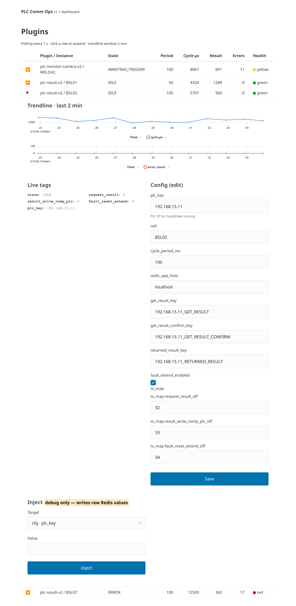
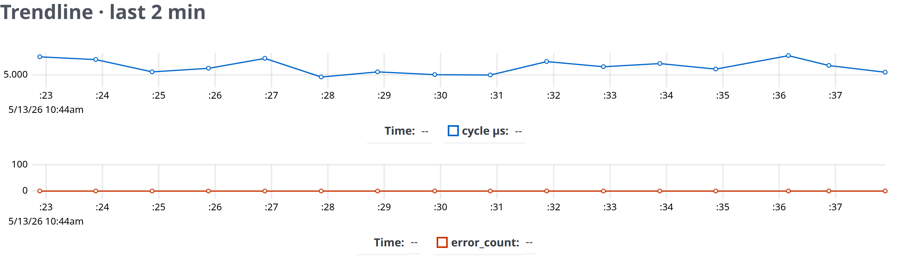
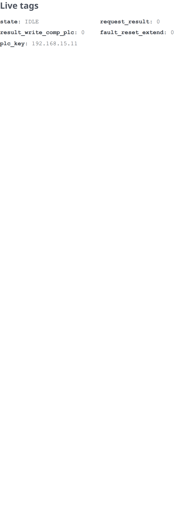
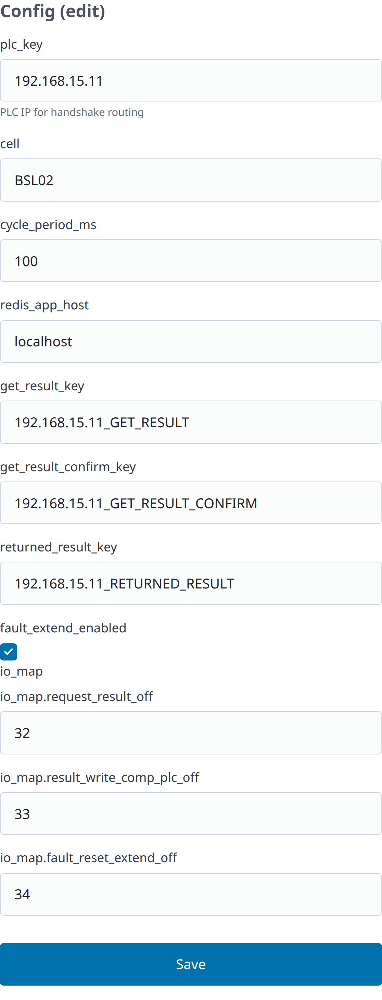
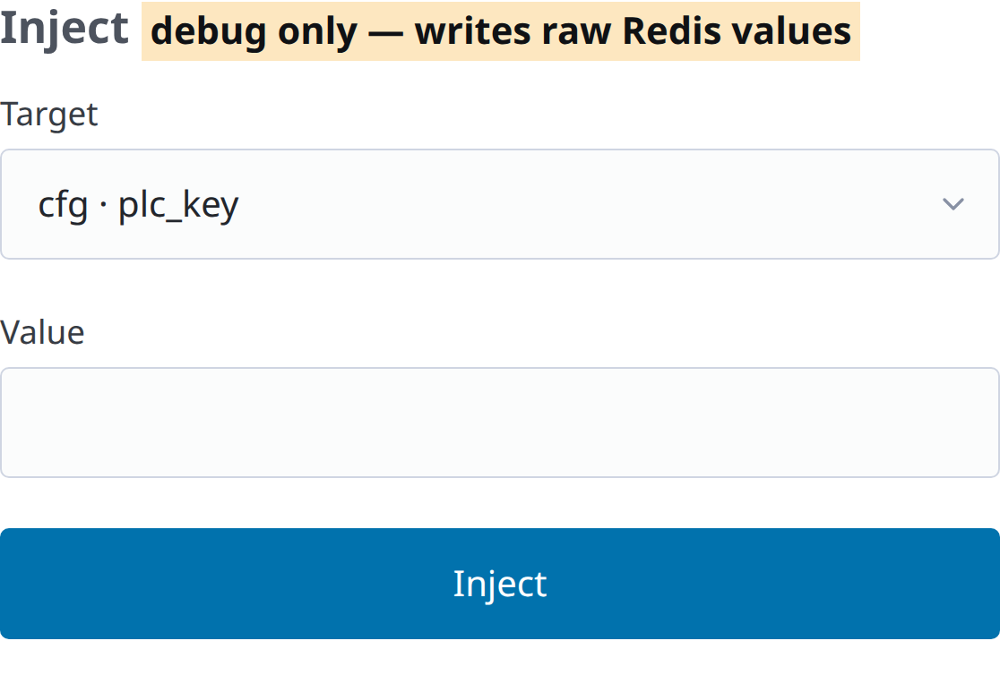

<style>
  .header-bar {
    display: flex;
    justify-content: space-between;
    align-items: flex-start;
    border-bottom: 2px solid #1a3a5c;
    padding-bottom: 4px;
    margin-bottom: 24px;
  }
  .header-bar img {
    height: 80px;
  }
  .header-info {
    text-align: right;
    font-size: 8.5px;
    line-height: 1.5;
    color: #444;
  }
  .header-info strong {
    font-size: 9px;
    color: #1a3a5c;
  }
  body { font-size: 10.5px; line-height: 1.55; }
  h1 { font-size: 22px; color: #1a3a5c; }
  h2 { font-size: 16px; color: #1a3a5c; margin-top: 28px; }
  h3 { font-size: 13px; color: #1a3a5c; margin-top: 20px; }
  h4 { font-size: 11px; color: #1a3a5c; margin-top: 16px; }
  code { background: #f3f4f6; padding: 1px 5px; border-radius: 3px; font-size: 9.5px; }
  pre { background: #f3f4f6; padding: 10px 12px; border-radius: 4px; font-size: 9px; line-height: 1.4; overflow-x: auto; }
  pre code { background: transparent; padding: 0; font-size: 9px; }
  table { width: 100%; border-collapse: collapse; font-size: 9.5px; margin: 8px 0 16px; }
  table th { background: #f0f3f7; padding: 6px 8px; text-align: left; border-bottom: 1px solid #d0d6de; color: #1a3a5c; }
  table td { padding: 5px 8px; border-bottom: 1px solid #e5e7eb; vertical-align: top; }
  img { max-width: 100%; height: auto; border: 1px solid #e0e4ea; border-radius: 3px; }
  figcaption { font-size: 9px; color: #666; text-align: center; margin-top: 4px; margin-bottom: 14px; }
  .callout { background: #fff8e1; border-left: 4px solid #f0b400; padding: 8px 12px; margin: 10px 0; font-size: 9.5px; }
  .callout-danger { background: #fde7e7; border-left-color: #d33; }
  .callout-info { background: #e7f2fb; border-left-color: #1a73e8; }
</style>

<div class="header-bar">
  
  <div class="header-info">
    <strong>Strokmatic Automação Industrial Ltda</strong><br>
    CNPJ: 41.597.854/0001-84<br>
    (Matriz) Rua Arno Waldemar Döhler, 308<br>
    CEP: 89.218-153. Santo Antônio – Joinville (SC)<br>
    Fone: +55 (47) 3030-2280<br>
    E-mail: contato@strokmatic.com
  </div>
</div>

# Manual da Stack PLC Comm Ops

**Produto:** Camada de comunicação certificada com PLCs industriais<br>
**Versão da stack:** SDK v0.2.1 · plc-comm-ops v1.1<br>
**Autor:** Strokmatic Innovation Technology<br>
**Última atualização:** 13/05/2026<br>
**Público-alvo:** Engenheiros de implantação, operadores de planta, time de suporte técnico

---

## Sumário

1. Visão Geral
2. Arquitetura da Stack
3. Pré-requisitos
4. Implantação
5. Configuração
6. Uso da Interface
7. Operação
8. Solução de Problemas
9. Referência Rápida

---

## 1. Visão Geral

A **stack PLC Comm Ops** é o conjunto de software responsável por intermediar a comunicação entre o adaptador EtherNet/IP certificado da Strokmatic (`strokmatic-eip`, baseado em OpENer) e os módulos de aplicação Python que processam os dados de produção (plc-result-v2, plc-monitor-camera-v2 e futuros plugins).

A arquitetura segue um padrão *fan-out* simples: o adaptador certificado fala CIP Class 1 com o PLC e mantém *byte lanes* em Redis. Cada plugin Python lê e escreve sua faixa de bytes específica, sem necessidade de recertificação a cada novo módulo de aplicação. A camada PLC Comm Ops adiciona a esse modelo:

- Um **SDK** comum (`strokmatic-comm-sdk`) que padroniza carga/salvamento de configuração, publicação de schema JSON e snapshot de variáveis decodificadas por ciclo;
- Uma **interface web operacional** (`plc-comm-ops`) que descobre automaticamente os plugins em execução, exibe seus valores ao vivo, permite edição de configuração com concorrência otimista e oferece um painel de injeção para depuração com PLC ausente ou em laboratório.

Esse manual descreve a versão **v1.1**, lançada em maio de 2026, que substitui a interface anterior (listagem + página de detalhes) por um dashboard único expansível com trendlines no navegador.

### 1.1 Componentes da stack

| Componente | Repositório | Versão atual | Responsabilidade |
|---|---|---|---|
| `strokmatic-comm-sdk` | `strokmatic/strokmatic-comm-sdk` | v0.2.1 | Helpers Python: PluginConfig, publish_schema, publish_tags, AuditLog |
| `plc-result-v2` | `strokmatic/plc-result-v2` | branch `v2/sdk-based` | Plugin: handshake de resultado de inspeção contra o PLC |
| `plc-monitor-camera-v2` | `strokmatic/plc-monitor-camera-v2` | branch `v2/sdk-based` | Plugin: gatilho de captura de imagem por câmera |
| `plc-comm-ops` | `strokmatic/plc-comm-ops` | v1.1 (`feat/v1.1`) | UI operacional (FastAPI + jinja2 + uPlot) |
| `strokmatic-eip` | `strokmatic/strokmatic-eip` | master | Adaptador C OpENer certificado (fora do escopo deste manual) |

### 1.2 Quando usar este manual

- Implantação inicial de uma planta nova com plugins novos;
- Adoção do dashboard v1.1 em uma planta que já roda plugins compatíveis com SDK v0.2.x;
- Diagnóstico de problemas operacionais (heartbeat ausente, contagem de erros crescente, conflito de configuração);
- Testes em bancada ou laboratório com PLC simulado via injeção manual em Redis.

---

## 2. Arquitetura da Stack

```
┌────────────────────┐  CIP Class 1   ┌─────────────────────────────┐
│                    │ ◀────────────▶ │                              │
│   PLC industrial   │                │  strokmatic-eip (OpENer)     │
│                    │                │  - adaptador certificado     │
└────────────────────┘                │  - byte lanes em Redis (io)  │
                                      └──────────────┬──────────────┘
                                                     │
                                       Redis     io:in:<plc_key>
                                     ──────────  io:out:<plc_key>
                                                     │
                                                     ▼
   ┌──────────────────────────────────────────────────────────────────┐
   │  plugins Python (cada um lê sua faixa de bytes)                  │
   │                                                                   │
   │  plc-result-v2 (bytes 32–47)        plc-monitor-camera-v2 (16–31) │
   │  ├─ PluginConfig.load (cfg:*)       ├─ PluginConfig.load           │
   │  ├─ publish_schema (schema:*)       ├─ publish_schema              │
   │  ├─ decode_in / encode_out          ├─ decode_in / encode_out      │
   │  ├─ publish_tags (tags:*)           ├─ publish_tags                │
   │  ├─ heartbeat → status:*            ├─ heartbeat → status:*        │
   │  └─ AuditLog → audit:*              └─ AuditLog → audit:*          │
   └──────────────────────────────────────────────────────────────────┘
                                                     │
                                                     ▼
   ┌──────────────────────────────────────────────────────────────────┐
   │  plc-comm-ops (FastAPI + jinja2 + uPlot)                          │
   │                                                                   │
   │  - descobre plugins via cfg:plc-*:*                               │
   │  - lê status:* + tags:* a cada 1 s e devolve via /api/dashboard   │
   │  - renderiza form de edição via schema:*                          │
   │  - injeta valores em cfg:*, io:in:*, get_result_* com auditoria   │
   └──────────────────────────────────────────────────────────────────┘
                                                     │
                                                     ▼
                                          navegador do operador
                                          (table expansível, trendlines
                                           uPlot, injeção)
```

### 2.1 Fluxo de dados

1. **PLC ↔ adaptador EtherNet/IP** — O OpENer estabelece conexão CIP Class 1 com o PLC e mantém duas áreas em Redis: `io:in:<plc_key>` (dados do PLC, 48 bytes) e `io:out:<plc_key>` (dados para o PLC, 16 bytes).
2. **Adaptador ↔ plugins** — Cada plugin lê sua faixa (lane) específica do buffer de entrada, processa, e escreve sua faixa do buffer de saída. As faixas são definidas no `io_map` da configuração do plugin.
3. **Plugins ↔ Redis (estado e auditoria)** — A cada ciclo os plugins publicam:
   - `tags:<plugin>:<instance>` — snapshot das variáveis decodificadas (estado da máquina, flags de handshake, contadores em vôo);
   - `status:<plugin>:<instance>` — contadores acumulados, `last_beat_ms`, último erro;
   - `audit:<plugin>:<instance>` — stream Redis com cada alteração de configuração.
4. **plc-comm-ops ↔ Redis** — O dashboard polla a API JSON do backend a cada 1 segundo. O backend lê `cfg:*`, `status:*`, `tags:*` e devolve um único payload com todas as instâncias descobertas.
5. **Navegador** — JavaScript mantém um *ring buffer* de 120 amostras (2 minutos a 1 Hz) por linha e renderiza dois gráficos uPlot (cycle µs e error_count) quando a linha é expandida.

### 2.2 Espaços de chaves Redis

| Chave | Tipo | Quem escreve | Quem lê | Propósito |
|---|---|---|---|---|
| `cfg:<plugin>:<instance>` | string (JSON) | plc-comm-ops, plugin (load) | plugin, plc-comm-ops | Documento de configuração canônico |
| `schema:<plugin>:<instance>` | string (JSON) | plugin (startup) | plc-comm-ops | JSON Schema da configuração para renderização do formulário |
| `status:<plugin>:<instance>` | hash | plugin (cada ciclo) | plc-comm-ops | Contadores, heartbeat, último erro |
| `tags:<plugin>:<instance>` | hash | plugin (cada ciclo) | plc-comm-ops | Snapshot de variáveis decodificadas |
| `audit:<plugin>:<instance>` | stream | plugin, plc-comm-ops | observador | Histórico de mudanças de cfg (campo, valor antigo, valor novo, ator) |
| `io:in:<plc_key>` | string (bytes) | adaptador EIP | plugins | 48 bytes lidos do PLC |
| `io:out:<plc_key>` | string (bytes) | plugins | adaptador EIP | 16 bytes a escrever no PLC |
| `<plc_key>_GET_RESULT*` | string | plc-comm-ops (inject) | aplicação a montante | Handshake auxiliar com o sistema de resultado |

---

## 3. Pré-requisitos

### 3.1 Sistema operacional e runtime

- Linux x86_64 (Ubuntu 22.04 ou 24.04 testados);
- Docker 24+ e Docker Compose v2 (`docker compose` ou `docker-compose`);
- Python 3.11+ (necessário se forem executados os plugins fora de contêiner);
- Acesso SSH ao GitHub configurado na máquina, com chave habilitada para os repositórios privados da Strokmatic.

### 3.2 Infraestrutura

- **Redis 7+** acessível pelas máquinas que rodam os plugins e o plc-comm-ops. Pode ser local (`localhost:6379`) ou compartilhado em um host de planta;
- Conectividade TCP/IP com o(s) PLC(s) na rede de chão de fábrica;
- Porta HTTP disponível para expor o plc-comm-ops aos operadores (padrão: `8000`).

### 3.3 Credenciais

- Chave de implantação (deploy key) com permissão de leitura no repositório `strokmatic/strokmatic-comm-sdk`. Necessária porque a build do contêiner busca o SDK via `git+ssh`. No CI, configurada como secret `STROKMATIC_COMM_SDK_DEPLOY_KEY`.

---

## 4. Implantação

A ordem recomendada de instalação é: Redis → adaptador EIP (fora do escopo deste manual) → plugins → plc-comm-ops.

### 4.1 Redis

Se a planta ainda não tem Redis, suba um contêiner dedicado:

```bash
docker run -d --name redis-plc \
  --restart unless-stopped \
  --network host \
  redis:7 redis-server --save "" --appendonly no
```

A flag `--save ""` desabilita snapshots em disco (a stack PLC Comm Ops não precisa persistência — `cfg:*` é regenerado pelos plugins na partida, `status:*` e `tags:*` são reescritos a cada ciclo).

### 4.2 Plugins (plc-result-v2 e plc-monitor-camera-v2)

Os plugins ainda não estão publicados como imagens Docker públicas; cada planta constrói localmente a partir do Dockerfile do repositório.

```bash
# Clonar o repositório do plugin
git clone git@github.com:strokmatic/plc-result-v2.git
cd plc-result-v2

# Build com BuildKit (necessário para encaminhar a chave SSH durante pip install)
DOCKER_BUILDKIT=1 docker build --ssh default \
  -f plc-result-v2.Dockerfile \
  -t strokmatic/plc-result-v2:v1.0 .
```

Repita o mesmo processo para `plc-monitor-camera-v2`.

#### Modelo de docker-compose

Um arquivo `docker-compose.yml` típico de planta combina os componentes:

```yaml
version: "3.8"

services:
  plc-result:
    image: strokmatic/plc-result-v2:v1.0
    restart: unless-stopped
    network_mode: host
    environment:
      REDIS_HOST: 127.0.0.1
      PLC_KEY: 192.168.15.10
      CELL: BSL01

  plc-monitor-camera:
    image: strokmatic/plc-monitor-camera-v2:v1.0
    restart: unless-stopped
    network_mode: host
    environment:
      REDIS_HOST: 127.0.0.1
      PLC_KEY: 192.168.15.20
      INSTANCE: WELD42

  plc-comm-ops:
    image: strokmatic/plc-comm-ops:v1.1
    restart: unless-stopped
    network_mode: host
    environment:
      REDIS_HOST: 127.0.0.1
      PORT: 8000
```

> **Nota:** `network_mode: host` é usado para simplificar o acesso ao Redis local. Em ambientes multi-host, exponha o Redis via porta TCP e ajuste `REDIS_HOST` para o IP do host correspondente.

### 4.3 plc-comm-ops

```bash
git clone git@github.com:strokmatic/plc-comm-ops.git
cd plc-comm-ops

DOCKER_BUILDKIT=1 docker build --ssh default \
  -f plc-comm-ops.Dockerfile \
  -t strokmatic/plc-comm-ops:v1.1 .
```

Para um teste rápido sem docker-compose:

```bash
docker run --rm -d \
  --name plc-comm-ops \
  --network host \
  -e REDIS_HOST=127.0.0.1 \
  -e PORT=8000 \
  strokmatic/plc-comm-ops:v1.1

curl http://127.0.0.1:8000/healthz   # deve responder "ok"
```

Abra o navegador em `http://<host>:8000/` para ver o dashboard.

### 4.4 Verificação pós-deploy

| Verificação | Comando | Resultado esperado |
|---|---|---|
| Redis acessível | `redis-cli -h <redis_host> ping` | `PONG` |
| Plugin publicou schema | `redis-cli keys 'schema:plc-*'` | Pelo menos uma chave por instância |
| Plugin publicou cfg | `redis-cli keys 'cfg:plc-*'` | Idem |
| Plugin emitiu heartbeat recente | `redis-cli hget status:plc-result-v2:BSL01 last_beat_ms` | timestamp em ms próximo de "agora" |
| plc-comm-ops servindo | `curl http://<host>:8000/healthz` | `ok` |
| Dashboard JSON | `curl http://<host>:8000/api/dashboard.json` | Array com uma entrada por instância |

---

## 5. Configuração

### 5.1 Variáveis de ambiente do plc-comm-ops

| Variável | Padrão | Descrição |
|---|---|---|
| `REDIS_HOST` | `localhost` | Host onde os keyspaces `cfg:*`, `status:*`, `tags:*` vivem |
| `REDIS_PORT` | `6379` | Porta do Redis |
| `HEARTBEAT_FRESH_S` | `5` | Heartbeat até este valor → status verde |
| `HEARTBEAT_STALE_S` | `60` | Heartbeat acima deste valor → status vermelho |
| `ERROR_WINDOW_S` | `300` | Janela para detectar incremento recente de `error_count` |
| `PORT` | `8000` | Porta HTTP de exposição |
| `LOG_LEVEL` | `INFO` | Nível de log do uvicorn (`DEBUG`, `INFO`, `WARNING`, `ERROR`) |

Entre `HEARTBEAT_FRESH_S` e `HEARTBEAT_STALE_S` o status é amarelo. Da mesma forma, um incremento em `error_count` dentro de `ERROR_WINDOW_S` rebaixa o status para amarelo mesmo que o heartbeat esteja fresco.

### 5.2 Esquema de configuração dos plugins

Cada plugin define seu próprio modelo Pydantic e o publica no Redis na partida via `PluginConfig.publish_schema()`. O plc-comm-ops lê esse schema para renderizar o formulário de edição automaticamente, sem precisar importar o pacote Python do plugin.

#### Exemplo: plc-result-v2

```json
{
  "type": "object",
  "properties": {
    "plc_key":                  { "type": "string" },
    "cell":                     { "type": "string" },
    "cycle_period_ms":          { "type": "integer", "minimum": 10, "maximum": 500 },
    "redis_app_host":           { "type": "string" },
    "get_result_key":           { "type": "string" },
    "get_result_confirm_key":   { "type": "string" },
    "returned_result_key":      { "type": "string" },
    "fault_extend_enabled":     { "type": "boolean" },
    "io_map": {
      "type": "object",
      "properties": {
        "request_result_off":         { "type": "integer" },
        "result_write_comp_plc_off":  { "type": "integer" },
        "fault_reset_extend_off":     { "type": "integer" }
      }
    }
  }
}
```

#### Convenções

- **`<algo>_off`** dentro de `io_map` indica um *offset* de byte no buffer `io:in:<plc_key>`. O nome sem o sufixo `_off` é o nome do campo decodificado (ex.: `request_result_off=32` decodifica o byte 32 do buffer como o booleano `request_result`).
- **`<algo>_key`** com `result` no nome (ex.: `get_result_key`, `returned_result_key`) indica uma chave Redis externa usada para handshakes auxiliares.
- O nome `plc_key` é especial: ele identifica a faixa de bytes (e o IP do PLC, na prática), mas não é uma chave Redis nesse sentido — o plc-comm-ops sabe distinguir.

### 5.3 Recarga em tempo real

Desde o SDK v0.2.0, cada plugin lê a configuração ao início de cada ciclo via `PluginConfig.reload(cached_raw=...)`. Em outras palavras, **qualquer alteração feita pelo dashboard surte efeito dentro de um ciclo do plugin**, sem reinicialização do contêiner. O `cached_raw` evita o custo de re-deserialização Pydantic quando nada mudou.

---

## 6. Uso da Interface

Esta seção descreve a interface v1.1, acessível em `http://<host>:8000/`.

### 6.1 Visão geral do dashboard

A página inicial é uma tabela única com todas as instâncias de plugin descobertas em Redis. Cada linha mostra os indicadores mais relevantes em tempo real: estado da máquina, período de ciclo, último tempo de ciclo em microssegundos, contagem acumulada de resultados, contagem de erros, e o indicador colorido de saúde.



<figcaption>Figura 1 — Dashboard principal com quatro instâncias: WELD42 (amarelo, heartbeat parado há 25 s), BSL01 (verde, IDLE), BSL02 (verde, no meio de um handshake) e BSL07 (vermelho, heartbeat parado há mais de 1 min).</figcaption>

Os números nas colunas são atualizados a cada segundo (1 Hz) sem recarregar a página. O cursor sobre uma linha sinaliza que ela é clicável.

### 6.2 Expandindo uma linha

Clicar em qualquer linha alterna entre o estado colapsado (`▶`) e expandido (`▼`). Múltiplas linhas podem ficar expandidas simultaneamente.



<figcaption>Figura 2 — Linha de plc-result-v2/BSL02 expandida, mostrando trendline (cycle µs em azul, error_count em vermelho), tags ao vivo, formulário de edição de configuração e painel de injeção.</figcaption>

Cada linha expandida contém quatro seções, descritas abaixo.

### 6.3 Trendlines

Os dois gráficos uPlot exibem o histórico das últimas 2 minutos (120 amostras a 1 Hz) das duas métricas escalares mais úteis para diagnóstico:

- **cycle µs** (linha azul) — tempo de cada ciclo do plugin, em microssegundos. Picos súbitos indicam contenção em Redis ou na CPU. Variação dentro de ~20% do esperado é normal.
- **error_count** (linha vermelha) — contagem acumulada de erros desde o último reset do plugin. Linha plana é o estado saudável; subida indica falha de handshake ou conflito de configuração.



<figcaption>Figura 3 — Trendline de cycle µs (acima) e error_count (abaixo) para BSL02. O eixo X é UTC.</figcaption>

> **Importante:** O ring buffer é mantido no navegador. Recarregar a aba ou fechar a janela apaga o histórico. Para visualização de janelas mais longas (horas/dias), a planta deve usar Prometheus + Grafana via o exporter dos plugins (fora do escopo do plc-comm-ops v1.1).

### 6.4 Tags ao vivo

A grade "Live tags" mostra cada campo do hash `tags:<plugin>:<instance>` no Redis. Os valores são atualizados a cada poll de 1 segundo. Booleanos são exibidos como `0` ou `1` (convenção do SDK para facilitar grep direto no Redis).



<figcaption>Figura 4 — Tags do plc-result-v2/BSL02 em um instante do handshake: state=IDLE, request_result=0, result_write_comp_plc=0, fault_reset_extend=0. O plc_key é repetido aqui para uso interno pelo painel de injeção.</figcaption>

Os campos publicados dependem do plugin:

| Plugin | Tags típicas |
|---|---|
| plc-result-v2 | `state`, `request_result`, `result_write_comp_plc`, `fault_reset_extend`, `plc_key` |
| plc-monitor-camera-v2 | `state`, `start_cycle`, `get_image_confirm`, `image_cap_comp`, `image_ok_cap_comp`, `plc_key` |

### 6.5 Edição de configuração

A seção "Config (edit)" carrega um formulário gerado dinamicamente a partir do JSON Schema publicado pelo plugin. Os valores atuais já vêm preenchidos.



<figcaption>Figura 5 — Formulário gerado a partir do schema do plc-result-v2/BSL02. Campos numéricos exibem min/max; campos booleanos viram checkbox; objetos aninhados (como io_map) aparecem como sub-grupos.</figcaption>

#### Fluxo de edição

1. Altere o valor desejado.
2. Clique em **Save**.
3. O backend valida o documento e tenta salvar via `WATCH/MULTI/EXEC` (concorrência otimista).
4. Em caso de sucesso, uma mensagem verde "Saved" aparece e o formulário é recarregado.
5. Em caso de conflito (alguém alterou o cfg entre o load e o save), uma mensagem vermelha "Conflict — reloading" aparece e o formulário é recarregado com os valores frescos. O operador deve re-aplicar a alteração.

Toda alteração é registrada na stream `audit:<plugin>:<instance>`, com endereço IP do operador como `actor`.

### 6.6 Painel de injeção

O painel "Inject" permite escrever um valor único diretamente em uma das três áreas de Redis usadas pela stack. É uma ferramenta de **depuração** — banner amarelo em destaque sinaliza esse fato.



<figcaption>Figura 6 — Painel de injeção do plc-result-v2/BSL02. O menu Target lista todos os destinos válidos: campos de cfg, campos de io:in (entrada do PLC), e chaves *_GET_RESULT.</figcaption>

#### Tipos de injeção

| Prefixo do Target | O que é escrito | Caso de uso típico |
|---|---|---|
| `cfg · <campo>` | Altera um campo da configuração via o mesmo caminho do "Save" | Editar um único valor sem mexer no resto do formulário |
| `io:in · <campo>` | Escreve um byte (0–255) no offset correspondente do buffer `io:in:<plc_key>` | Simular um sinal vindo do PLC quando ele não está presente (laboratório, bancada) |
| `get_result · <chave>` | Set direto na chave nomeada | Forçar um cenário do sistema de resultado externo (`GET_RESULT_CONFIRM=1`, etc.) |

#### Fluxo de injeção

1. Selecione o destino no dropdown.
2. Digite o valor.
3. Clique em **Inject**.
4. Um diálogo de confirmação resume a operação: `Inject "1" to io:in:192.168.15.10.request_result?`.
5. Confirme. O resultado aparece à direita do botão: **OK** (verde) ou mensagem de erro (vermelho).
6. Toda injeção é registrada em `audit:<plugin>:<instance>`.

> **Cuidado:** Em uma planta em produção com PLC conectado, injetar em `io:in` é **ignorado pelo PLC** — o adaptador EIP sobrescreve o buffer a cada ciclo CIP. Já em uma bancada de teste sem PLC, a injeção é a única forma de exercitar a lógica do plugin. Conheça o ambiente antes de injetar.

### 6.7 Deep links

URLs do tipo `http://<host>:8000/#<plugin>/<instance>` expandem automaticamente a linha indicada no carregamento da página. Use para compartilhar visualizações específicas via Telegram, e-mail, ou tickets de suporte. Exemplo:

```
http://192.168.15.2:8000/#plc-result-v2/BSL01
```

---

## 7. Operação

### 7.1 Estados de saúde

| Cor | Significado | O que fazer |
|---|---|---|
| Verde | Heartbeat fresco (< 5 s) e nenhum erro recente | Nenhuma ação |
| Amarelo | Heartbeat entre 5–60 s OU incremento de `error_count` nos últimos 5 minutos | Investigar logs do plugin; comparar `cycle µs` com a baseline |
| Vermelho | Heartbeat ausente há mais de 60 s OU plugin nunca emitiu heartbeat | Verificar se o contêiner do plugin está rodando; reiniciar se preciso |

### 7.2 Auditoria

Para consultar o histórico de mudanças de configuração de uma instância:

```bash
redis-cli -h <redis_host> XRANGE audit:plc-result-v2:BSL01 - +
```

Cada entrada da stream contém:

- `ts` — timestamp Unix em milissegundos
- `actor` — endereço IP do operador que originou a alteração (ou `unknown` para operações sem `request.client`)
- `field_path` — caminho do campo alterado (ex.: `cycle_period_ms`) ou `inject:<target_key>:<target_field>` para injeções
- `old` — valor anterior
- `new` — valor novo

A stream é capada em 10 000 entradas (aproximadas) para evitar crescimento ilimitado.

### 7.3 Reinício e recuperação

| Cenário | Ação |
|---|---|
| Plugin trava (heartbeat congela) | `docker restart <nome-do-plugin>` — o plugin recarrega a cfg do Redis na partida |
| Cfg corrompida (JSON inválido) | `redis-cli del cfg:<plugin>:<inst>`, depois reiniciar o plugin (que republicará a default) |
| Redis cai | Plugins entram em loop de retry; ao Redis voltar, eles republicam schema/cfg/status automaticamente |
| plc-comm-ops cai | Nenhum impacto operacional — é apenas uma UI; reinicie o contêiner para restabelecer |

---

## 8. Solução de Problemas

### 8.1 Dashboard mostra "No plugins discovered yet"

**Sintoma:** A tabela está vazia.

**Diagnóstico:** O plc-comm-ops descobre instâncias via `cfg:plc-*:*`. Se não houver chaves no padrão, nada aparece.

```bash
redis-cli -h <redis_host> keys 'cfg:plc-*'
```

Se vazio: o plugin não publicou sua configuração ainda. Verifique se o contêiner está rodando e se ele tem acesso ao Redis.

### 8.2 Trendlines vazias (sem linha)

**Sintoma:** O gráfico abre mas a área de plotagem fica em branco.

**Diagnóstico:** O ring buffer só começa a acumular após a primeira chamada de poll. Aguarde 2–3 segundos depois de expandir a linha. Se mesmo assim a linha não aparecer:

```bash
redis-cli -h <redis_host> hgetall status:plc-result-v2:BSL01
```

Verifique se `last_cycle_us` está sendo escrito. Se não, o plugin não está chegando ao ponto de publicar status — provavelmente trava na inicialização. Olhe `docker logs <nome-do-plugin>`.

### 8.3 "Conflict — reloading" toda vez que tento salvar

**Sintoma:** Cada save retorna 409 mesmo sem outro operador conectado.

**Diagnóstico:** Algum processo externo está reescrevendo `cfg:<plugin>:<inst>`. Em ambientes corretamente configurados, **só o plc-comm-ops escreve em cfg**. Verifique se algum script ou job de manutenção está sobrepondo a chave.

### 8.4 Inject retorna "Forbidden target namespace"

**Sintoma:** O painel de injeção retorna erro mesmo para um target listado no dropdown.

**Diagnóstico:** As únicas áreas permitidas são `cfg:*`, `io:in:*` e as chaves `get_result_*` publicadas explicitamente na cfg do plugin. Se o destino foi montado manualmente (alterando o JSON do option na ferramenta de desenvolvedor do navegador), ele será recusado. Selecione um item do dropdown sem editar.

### 8.5 Schema not published

**Sintoma:** O formulário de configuração exibe "Schema not published. Restart the plugin."

**Diagnóstico:** O plugin não chamou `PluginConfig.publish_schema()` na partida. Possíveis causas:

- Plugin antigo (SDK v0.1.x ou anterior). Atualize para v0.2.x+.
- O plugin reiniciou o Redis (`FLUSHDB`) e ainda não passou pelo próximo ciclo de boot.

Reinicie o plugin e atualize a página.

---

## 9. Referência Rápida

### 9.1 Rotas HTTP do plc-comm-ops

| Método | Rota | Resposta | Propósito |
|---|---|---|---|
| GET | `/` | HTML | Esqueleto do dashboard (rows e expansões) |
| GET | `/healthz` | text "ok" | Health probe |
| GET | `/api/dashboard.json` | JSON | Polled a 1 Hz pelo navegador. Array `[{plugin, instance, health, status, tags}, …]` |
| GET | `/plugin/{p}/{i}/cfg-form` | HTML fragment | Fragmento de formulário para edição inline |
| POST | `/plugin/{p}/{i}/save` | 303 / 409 | Salva a cfg via concorrência otimista |
| GET | `/plugin/{p}/{i}/status` | HTML fragment | Partial usado por HTMX (legado v1) |
| GET | `/plugin/{p}/{i}/inject-targets` | JSON | `{cfg_fields, io_in_fields, get_result_keys}` |
| POST | `/plugin/{p}/{i}/inject` | JSON | `{ok: true}` ou `{error: "..."}` (400) |

### 9.2 Mapa de keyspaces

| Prefixo | Escrito por | Vida útil |
|---|---|---|
| `cfg:plc-*:*` | plugin (boot) + plc-comm-ops (edits) | Persistente entre reinícios |
| `schema:plc-*:*` | plugin (boot) | Regenerado a cada boot do plugin |
| `status:plc-*:*` | plugin (cada ciclo) | Sobrescrito por ciclo |
| `tags:plc-*:*` | plugin (cada ciclo) | Sobrescrito por ciclo |
| `audit:plc-*:*` | plugin + plc-comm-ops | Capado em ~10 000 entradas |
| `io:in:<plc_key>` | adaptador EIP / plc-comm-ops inject | Sobrescrito por ciclo CIP |
| `io:out:<plc_key>` | plugin | Sobrescrito por ciclo do plugin |

### 9.3 Versionamento

| Componente | Versão | Compatibilidade |
|---|---|---|
| `strokmatic-comm-sdk` v0.1.0 | obsoleta | Sem schema/tags publish; não suportada pelo plc-comm-ops v1.x |
| `strokmatic-comm-sdk` v0.2.0 | suportada | publish_schema + reload + optimistic save; sem tags |
| `strokmatic-comm-sdk` v0.2.1 | recomendada | + publish_tags (necessária para dashboard v1.1) |
| `plc-comm-ops` v1.0 | substituída | Listagem + detalhe por plugin |
| `plc-comm-ops` v1.1 | atual | Dashboard único + trendlines + inject |

A política é **patch-bumps aditivos** no SDK enquanto for possível. Quebras de API exigem major (`v0.3.0`) e coordenação com todos os plugins.

### 9.4 Documentos relacionados

| Documento | Localização | Propósito |
|---|---|---|
| Design v1 | `docs/superpowers/specs/2026-05-12-plc-comm-ops-design.md` | Decisões arquiteturais originais |
| Design v1.1 | `docs/superpowers/specs/2026-05-13-plc-comm-ops-v1.1-design.md` | Decisões arquiteturais do dashboard |
| Plano v1 | `docs/superpowers/plans/2026-05-12-plc-comm-ops.md` | Tarefas de implementação v1 |
| Plano v1.1 | `docs/superpowers/plans/2026-05-13-plc-comm-ops-v1.1.md` | Tarefas de implementação v1.1 |
| README do repo | `plc-comm-ops/README.md` | Quickstart de desenvolvimento |
| CERTIFICATION.md | `strokmatic-eip/CERTIFICATION.md` | Trilha de recertificação ODVA |

---

<div class="callout callout-info">
<strong>Suporte técnico</strong><br>
Para questões sobre a stack PLC Comm Ops, abra uma issue no repositório correspondente ou contate o time de engenharia de produto da Strokmatic via canal interno. Em incidentes de planta com PLC presente, registre uma entrada no <code>audit:</code> stream descrevendo a ação tomada antes de reiniciar serviços.
</div>
