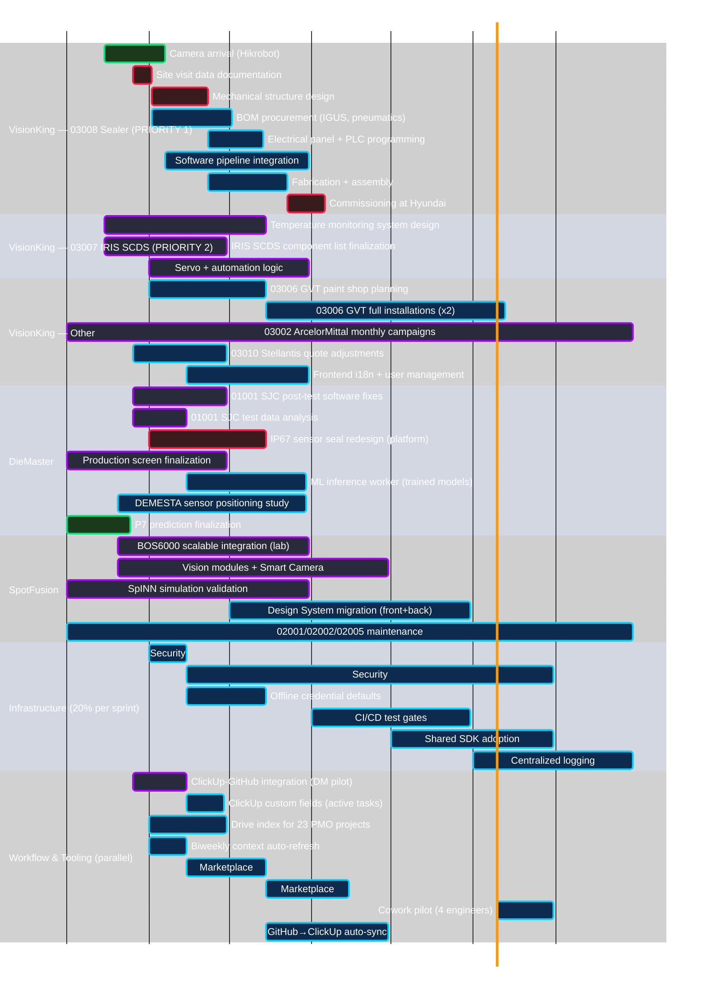
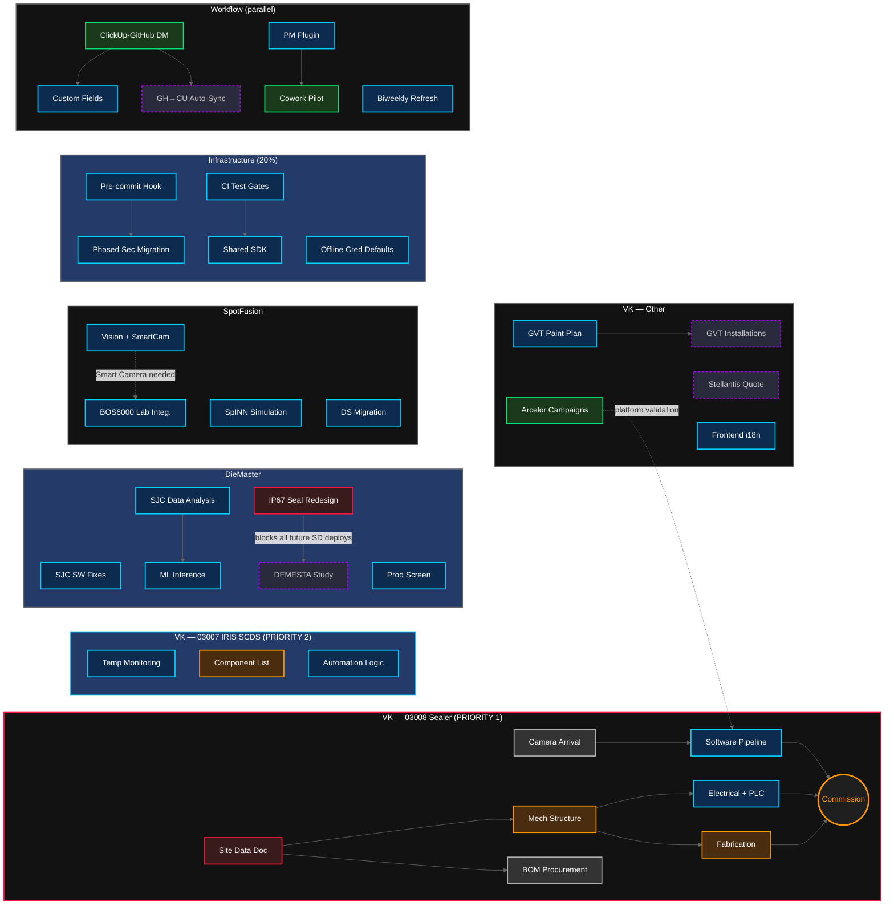

# Strokmatic Roadmap & Workflow Integration Plan — 2026

**Date:** 2026-03-26
**Status:** Grilled (25 decisions resolved) — ready for Gantt revision
**Input:** Master context (3,218 ClickUp tasks, 3 codebase explorations, PMO data)
**Grilling session:** 2026-03-24/25, all branches converged

---

## 1. Roadmap Overview

Based on current sprint focus, backlog analysis, and deployment pipeline, the roadmap organizes into 4 streams across 3 time horizons.

### Streams

| Stream | What | H1 Approach |
|---|---|---|
| **A. Product Delivery** | Client deployments, commissioning, field support | **Primary focus** |
| **B. Workflow & Tooling** | ClickUp/GitHub/Drive integration, JARVIS, marketplace | **In parallel** |
| **C. Infrastructure** | CI/CD, security, shared SDK, monitoring | **20% of each sprint** (not a separate stream) |

### Time Horizons

| Horizon | When | Focus |
|---|---|---|
| **H1: Now** | Q1-Q2 2026 (Apr-Jun) | Deliver current commitments (03008, 03007, SJC), workflow pilot |
| **H2: Next** | Q3 2026 (Jul-Sep) | Platform hardening, new deployments, infra debt |
| **H3: Later** | Q4 2026 (Oct-Dec) | Scale, new capabilities, automation maturity |

---

## 2. Gantt Roadmap



---

## 3. Dependency Flowchart



---

## 4. Workflow Integration Plan

### 4.1 Current State (How the Company Works Today)

| Activity | Current Tool | Pain Point |
|---|---|---|
| Sprint planning | ClickUp (TÉCNICO space) | Tasks lived in sprint folders — just fixed |
| Code development | GitHub repos (submodules) | No link to ClickUp tasks |
| PR reviews | GitHub + JARVIS automated | Reviews not linked to ClickUp |
| Client deliverables | Google Drive (shared drives) | No link to ClickUp tasks |
| Engineering reports | JARVIS → Drive | Manual process, no traceability |
| Team communication | Google Chat + email | Context scattered |
| Project management | ClickUp (ROADMAP space) | Disconnected from engineering |

### 4.2 Proposed Integration (Two-Lane Model)

#### Lane 1: Software Tasks

```
ClickUp Sprint Task                    GitHub
├── PM creates task                    │
├── Branch naming: feat/CU-xxxx       ├── Auto-linked via ClickUp-GitHub integration
├── Developer works in GitHub          ├── PR references issue
├── JARVIS reviews PR                  ├── Review posted to GitHub
├── PR merged                          ├── Issue closed
└── ClickUp automation: → Complete    └── Status synced
```

**Implementation steps:**
1. Enable ClickUp-GitHub integration (OAuth, per-org) — **Week 1**
2. Add custom fields to ClickUp (Project Code, Drive Folder, GitHub Issue, Task Lane) — **Week 1**
3. Configure ClickUp Automations (PR merge → Complete, branch create → In Progress) — **Week 1**
4. Document branch naming convention (`feat/CU-<id>-<desc>`) — **Week 1**
5. Create GitHub Projects board per product (kanban) — **Week 3**
6. Build sprint sync automation (ClickUp → GitHub Issues) — **Week 5**

#### Lane 2: Engineering Tasks

```
ClickUp Task                           Google Drive
├── PM creates task with project code  │
├── Custom field: Drive Folder link    ├── Engineer opens Drive folder
├── Engineer works (CAD, JARVIS, etc.) ├── Uploads deliverable
├── Deliverable attached to task       ├── ClickUp-Drive integration
└── PM reviews → Complete             └── Archived
```

**Implementation steps:**
1. Enable ClickUp-Drive integration — **Week 1**
2. Populate Drive Folder custom field on existing tasks — **Week 2**
3. Run `/gdrive <code> index` for all 23 PMO projects — **Week 2**
4. Install Markdown Viewer add-on org-wide — **Week 2**
5. Build `project-management` plugin for Cowork (Windows engineers) — **Week 3**
6. Train team on workflow — **Week 4**

### 4.3 What Changes for Each Role

| Role | Before | After |
|---|---|---|
| **PM** | Creates tasks in ClickUp, checks status manually | Creates tasks with custom fields; status auto-updates from GitHub |
| **Software Dev** | Picks tasks from ClickUp, works in GitHub, no link | Picks tasks, names branch with CU-ID, everything auto-links |
| **Engineering** | Picks tasks from ClickUp, uploads to Drive manually | Same flow + Drive folder pre-linked, deliverable tracked |
| **Data Science** | Works in notebooks, uploads models manually | Model versioning (H2), notebook→Drive pipeline |
| **Pedro (JARVIS)** | Orchestrates manually, reviews PRs, generates reports | JARVIS automates: PR review → ClickUp update → Drive upload |

### 4.4 Marketplace Expansion Plan

| Plugin | Target Users | Content | Timeline |
|---|---|---|---|
| `office-suite` | Everyone | docx, xlsx, pptx, md-to-pdf | **Done** |
| `development` | All devs | tdd, grill-me, write-a-prd, prd-to-issues, improve-architecture | **Done** |
| `google-workspace` | Everyone | gdoc, gsheet, gslides, gdrive via gws CLI | **Done** |
| `project-management` | PMs, engineers | /pmo, /clickup, /sprint-board | **H1 (Apr)** |
| `engineering` | Mech/automation engineers | /cad, /mechanical, /cae, /engineering-report | **H1 (May)** |
| `pr-review` | Software leads | /review-pr, /pr-inbox | **H2 (Jul)** |

### 4.5 GitHub Projects Structure

One project board per product:

```
strokmatic/diemaster — "DieMaster Development"
├── Backlog (from ClickUp sync)
├── Sprint (current sprint tasks)
├── In Progress (branch created)
├── In Review (PR open)
└── Done (PR merged, ClickUp auto-complete)

strokmatic/spotfusion — "SpotFusion Development"
└── (same columns)

strokmatic/visionking — "VisionKing Development"
└── (same columns)
```

**Labels per product:**
- `product:diemaster`, `product:spotfusion`, `product:visionking`
- `priority:critical`, `priority:high`, `priority:normal`, `priority:low`
- `type:feature`, `type:bugfix`, `type:refactor`, `type:test`, `type:docs`
- `sprint:XX` (current sprint number)
- `project:01001`, `project:03002`, etc. (PMO code)

---

## 5. Priority Stack (What to Do First)

### Immediate (This Week)

| # | Action | Effort | Impact |
|---|---|---|---|
| 1 | Enable ClickUp-GitHub native integration | 1h | Unlocks auto-linking |
| 2 | Add custom fields to ClickUp spaces | 2h | Enables tracking |
| 3 | Configure 2 ClickUp Automations (PR merge, branch create) | 1h | Auto-status |
| 4 | Document branch naming convention for team | 1h | Team alignment |
| 5 | Finish VK migration remaining 2 Compras tasks (manual) | 5min | Cleanup |

### Short Term (April)

| # | Action | Effort | Impact |
|---|---|---|---|
| 6 | Run Drive index for all 23 PMO projects | 1 day | Knowledge base |
| 7 | Populate Drive Folder field on ClickUp tasks | 2 days | Traceability |
| 8 | Build `project-management` marketplace plugin | 3 days | Cowork users |
| 9 | Create GitHub Projects boards (3 products) | 2 days | Dev visibility |
| 10 | Start security remediation (hardcoded creds) | 5 days | Critical debt |

### Medium Term (May-Jun)

| # | Action | Effort | Impact |
|---|---|---|---|
| 11 | Build `engineering` marketplace plugin | 3 days | Mech engineers on Cowork |
| 12 | Cloud Build test gates for all products | 5 days | Quality |
| 13 | Shared SDK adoption across products | 5 days | Consistency |
| 14 | Team Cowork onboarding + training | 2 days | Adoption |
| 15 | Automated sprint sync (ClickUp → GitHub Issues) | 5 days | Workflow |

---

## 6. Success Metrics

| Metric | Current | H1 Target | H2 Target |
|---|---|---|---|
| ClickUp tasks with GitHub link | 0% | 50% (software tasks) | 90% |
| ClickUp tasks with Drive folder | ~10% | 80% | 95% |
| PRs referencing ClickUp tasks | 0% | 60% | 90% |
| Engineers using Cowork plugins | 1 (Pedro) | 5 | 10+ |
| Security issues (hardcoded creds) | ~100 files | 50 files | 0 |
| CI/CD with test gates | 0 products | 1 product | All 3 |
| Automated PR reviews linked to tasks | 0% | 30% | 80% |

---

## 7. Risks & Mitigations

| Risk | Likelihood | Impact | Mitigation |
|---|---|---|---|
| Team resists branch naming convention | Medium | High | Start with software devs only; automate ClickUp link via bot |
| ClickUp-GitHub integration scope creep | Medium | Medium | Stick to native integration first; custom sync later |
| Engineering team doesn't adopt Cowork | Medium | Medium | Start with PM plugin only; demonstrate value with 1 engineer |
| Security remediation breaks services | Low | Critical | Feature-flag credential loading; migrate one service at a time |
| ClickUp rate limits block automation | Low | Medium | Use REST API v3 with rate limit headers; batch operations |

---

## 8. Open Questions (For Discussion)

1. **Sprint sync granularity** — Should ALL ClickUp sprint tasks become GitHub Issues, or only software tasks? The two-lane model says only software, but some engineering tasks have code components.

2. **Who owns the ClickUp-GitHub link?** — Should PMs paste GitHub Issue URLs, or should JARVIS auto-create issues from ClickUp tasks?

3. **Drive folder structure** — Should we standardize the subfolder structure across all projects (reports/, specs/, drawings/, etc.), or let each project evolve organically?

4. **Model versioning tool** — MLflow (heavy, full experiment tracking) vs custom registry (lightweight, integrated with existing Deploy toolkit) vs DVC (git-based, fits submodule pattern)?

5. **Centralized logging priority** — GCP Cloud Logging (native, easy) vs ELK (self-hosted, more control) vs Datadog (SaaS, expensive)? Budget consideration.

6. **GitHub Projects vs ClickUp for sprint visibility** — If developers use GitHub Projects daily, do PMs still need ClickUp sprint views? Or does ClickUp become roadmap-only?

7. **Engineering task definition** — Where exactly is the line between "software task" (Lane 1) and "engineering task" (Lane 2)? Tasks like "design pneumatic circuit and write control logic" span both.

8. **Cowork vs Claude Code** — Should we invest in standardizing on Cowork (cross-platform, GUI) or keep Claude Code as the primary (Linux, CLI, more powerful)? Can plugins work identically in both?
