# Fluxo Integrado de Informação — Strokmatic

> Como a informação flui das fontes externas, passa pelo repositório PMO, e chega aos consumidores finais (engenheiros, Pedro, bots). Cobre Lane 1 (Software) e Lane 2 (Engenharia), e como agentes com contexto de projeto potencializam ambas.

## Visão Geral da Arquitetura

```mermaid
flowchart TB
    %% ===== EXTERNAL SOURCES =====
    subgraph SOURCES["Fontes Externas (Live)"]
        CU["ClickUp<br/>Tarefas, Sprints,<br/>Custom Fields"]:::camBlue
        GH["GitHub<br/>PRs, Issues,<br/>Commits, CI"]:::camBlue
        GD["Google Drive<br/>SoR: CAD, Specs,<br/>Reports, Docs"]:::camBlue
        GM["Gmail<br/>Emails de Projeto"]:::camBlue
        GC["Google Chat<br/>Espaços de Projeto"]:::camBlue
        MEETS["Daily Meetings<br/>Transcrição + Notas<br/>automáticas<br/>(por produto, no Drive)"]:::camBlue
    end

    %% ===== LANE 1: MECHANICAL SYNC =====
    subgraph LANE1["Lane 1 — Sync Mecânico (Existente)"]
        SYNC["github-clickup-sync<br/>PM2 · 192.168.15.2<br/>Bidirecional · 15 min"]:::default
        SYNC_DETAIL["Issues ↔ Tasks · Status ·<br/>Sprint labels · Assignees ·<br/>Parent/subtask"]:::weld
    end

    %% ===== LANE 1: AGENT-ASSISTED (NEW) =====
    subgraph AGENT_L1["Lane 1 — Agentes Assistidos (Novo)"]
        subgraph SPRINT_PLAN["Sprint Planning (Human-in-the-Loop)"]
            AG_PREP["Agent prepara briefing:<br/>• Fatos/decisões (PMO)<br/>• PRs/issues (GitHub)<br/>• Backlog (ClickUp)<br/>• Dailies recentes<br/>• Blockers + riscos"]:::camYellow
            HUMAN["Tech Lead / Pedro<br/>revisa, decide scope,<br/>aprova tarefas"]:::camBlue
            AG_EXEC["Agent executa:<br/>• Tasks → sprint list<br/>• Descrições c/ template<br/>• Custom fields<br/>• sprint.md ★"]:::camYellow
        end
        AG_FOLLOW["Sprint Follow-up<br/>• Blockers<br/>• GH vs CU drift<br/>• Tasks paradas<br/>• sprint.md ★"]:::camYellow
        AG_FIELDS["Custom Field Agent<br/>• GitHub Issue URL<br/>• Project Code<br/>• Drive Folder"]:::camYellow
    end

    %% ===== INDEX LAYER =====
    subgraph INDEX["Indexação Periódica"]
        IDX_DRIVE["gdrive-index<br/>Diário (noturno)"]:::default
        IDX_EMAIL["email-index<br/>Diário (noturno)"]:::default
        IDX_CHAT["jarvis-chat distill<br/>Horário"]:::default
        IDX_MEETS["meeting-index<br/>Diário<br/>→ meetings/index.json<br/>(por produto)"]:::default
    end

    %% ===== PMO REPO =====
    subgraph PMO["PMO Repository (git, equipe)"]
        subgraph PROJ["projects/{code}/"]
            README["README.md"]:::success
            subgraph INDEXES["Índices"]
                DI["drive-index.json"]:::weld
                EI["emails/index.json"]:::weld
            end
            subgraph REPORTS["reports/md/ — Documentação viva"]
                STD_OV["overview.md ★"]:::success
                STD_ST["status.md ★"]:::success
                STD_DEC["decisions.md ★"]:::success
                STD_SPR["sprint.md ★"]:::success
                CUSTOM["[específicos]"]:::default
            end
            CTX[".claude/context.md"]:::camYellow
            CACHE["cache/ (gitignored)"]:::weld
        end
        subgraph PROD_IDX["por produto (DM / SF / VK)"]
            MI["meetings/index.json<br/>Índice de dailies<br/>(metadados + action items)"]:::weld
        end
    end

    %% ===== CHAT MEMORY =====
    subgraph CHATMEM["Memória de Chat"]
        FS["facts/*.jsonl"]:::weld
    end

    %% ===== KB GENERATION =====
    subgraph KBGEN["JARVIS KB Generator"]
        GEN["Regenera reports ★<br/>+ context.md<br/>(Periódico)"]:::camYellow
    end

    %% ===== CENTRAL KB =====
    CKB["KB Central<br/>knowledge-base/<br/>128 pg PT-BR"]:::success

    %% ===== DRIVE =====
    DRIVE["Google Drive SoR"]:::camBlue

    %% ===== CONSUMERS =====
    subgraph CONSUMERS["Consumidores"]
        LOCAL["Pedro<br/>/pmo · /gdrive"]:::camBlue
        DEV["Engenheiro<br/>git pull"]:::camBlue
        JBOT["jarvis-chat"]:::camYellow
        KBOT["kb-chat"]:::camYellow
    end

    %% ===== FLOW: Lane 1 mechanical =====
    GH <-->|"issues, status"| SYNC
    CU <-->|"tasks, sprints"| SYNC
    SYNC --- SYNC_DETAIL
    SYNC -->|"state mapping"| AG_FIELDS
    AG_FIELDS -->|"writeback"| CU

    %% ===== FLOW: Meetings → Index =====
    MEETS -->|"transcrições +<br/>notas no Drive"| IDX_MEETS
    IDX_MEETS -->|"metadados,<br/>action items,<br/>decisões"| MI

    %% ===== FLOW: Sprint Planning HITL =====
    CU -->|"backlog"| AG_PREP
    GH -->|"PRs, commits"| AG_PREP
    REPORTS -->|"fatos, decisões"| AG_PREP
    FS -->|"fatos de chat"| AG_PREP
    MI -->|"dailies recentes<br/>action items"| AG_PREP
    AG_PREP -->|"briefing"| HUMAN
    HUMAN -->|"aprovado"| AG_EXEC
    AG_EXEC -->|"sprint list"| CU
    AG_EXEC --> STD_SPR

    %% ===== FLOW: Sprint Follow-up =====
    CU -->|"sprint tasks"| AG_FOLLOW
    GH -->|"PR status"| AG_FOLLOW
    MI -->|"dailies"| AG_FOLLOW
    AG_FOLLOW --> STD_SPR
    AG_FOLLOW -->|"alertas"| JBOT

    %% ===== FLOW: Sources → Index =====
    GD --> IDX_DRIVE
    GM --> IDX_EMAIL
    GC --> IDX_CHAT
    IDX_DRIVE --> DI
    IDX_EMAIL --> EI
    IDX_CHAT --> FS

    %% ===== FLOW: Drive ↔ PMO =====
    DRIVE <-->|"download / upload"| CACHE
    REPORTS -->|"MD + PDF"| DRIVE

    %% ===== FLOW: KB Generation =====
    DI --> GEN
    EI --> GEN
    FS --> GEN
    MI --> GEN
    CU -.->|"tasks ativas"| GEN
    GEN --> REPORTS
    GEN --> CTX

    %% ===== FLOW: → Consumers =====
    CTX --> LOCAL
    REPORTS --> DEV
    REPORTS --> JBOT
    CKB --> KBOT
    CKB --> JBOT

    %% ===== STYLES =====
    classDef default fill:#1f1f1f,stroke:#fff,stroke-width:1px,color:#fff;
    classDef weld fill:#333333,stroke:#b0b0b0,stroke-width:2px,color:#fff;
    classDef camBlue fill:#0d2b4e,stroke:#00d2ff,stroke-width:2px,color:#fff;
    classDef camYellow fill:#4a2c0f,stroke:#ff9800,stroke-width:4px,color:#fff;
    classDef success fill:#1b3a1b,stroke:#00e676,stroke-width:2px,color:#fff;
    linkStyle default stroke:#666,stroke-width:1px;

    style SOURCES fill:#121212,stroke:#00d2ff,stroke-width:2px,color:#fff
    style LANE1 fill:#121212,stroke:#ff1744,stroke-width:2px,color:#fff
    style AGENT_L1 fill:#121212,stroke:#ff9800,stroke-width:2px,color:#fff
    style SPRINT_PLAN fill:#1a1a1a,stroke:#ff9800,stroke-width:1px,color:#fff
    style INDEX fill:#121212,stroke:#666,stroke-width:2px,color:#fff
    style PMO fill:#121212,stroke:#00e676,stroke-width:2px,color:#fff
    style PROJ fill:#1a1a1a,stroke:#00e676,stroke-width:1px,color:#fff
    style PROD_IDX fill:#1a1a1a,stroke:#aa00ff,stroke-width:1px,color:#fff
    style INDEXES fill:#1a1a1a,stroke:#666,stroke-width:1px,color:#fff
    style REPORTS fill:#1a1a1a,stroke:#00e676,stroke-width:2px,color:#fff
    style CHATMEM fill:#121212,stroke:#aa00ff,stroke-width:2px,color:#fff
    style KBGEN fill:#121212,stroke:#ff9800,stroke-width:2px,color:#fff
    style CONSUMERS fill:#121212,stroke:#00d2ff,stroke-width:2px,color:#fff
```



## Princípios de Design

1. **Drive é a fonte de verdade** para todos os artefatos de projeto — CAD, especificações, cotações, relatórios, atas. O repositório PMO local armazena índices e conhecimento gerado, não cópias.

2. **PMO é o estado vivo.** Os índices mudam conforme as fontes mudam. Os relatórios acompanham a evolução do projeto. O histórico do git fornece controle de versão.

3. **Relatórios padrão SÃO a KB por projeto.** Não existe uma base de conhecimento separada — `reports/md/` contém documentação viva (overview, status, decisões, sprint) que serve tanto engenheiros quanto agentes de IA.

4. **`context.md` é um resumo gerado.** Comprime a KB completa em um ponto de entrada otimizado para carregamento de contexto por IA (`/pmo <code>`). Retrocompatível com o skill existente.

5. **Agentes assistem, humanos decidem.** Sprint planning é preparado por agente e aprovado por humano. O agente consolida informação; o tech lead toma as decisões de escopo.

6. **Duas lanes, um tracker.** Lane 1 (software/código) e Lane 2 (engenharia/documentos) compartilham o ClickUp como fonte única de planejamento. O sync mecânico faz a ponte GitHub ↔ ClickUp; a camada de agentes faz a ponte PMO ↔ ClickUp.

## Fontes Externas

Seis sistemas alimentam informação no ecossistema:

| Fonte | O que fornece | Como é consumido |
|---|---|---|
| **ClickUp** | Tarefas, sprints, status, campos customizados, time tracking | Sync mecânico com GitHub; consultas dos agentes para sprint planning; on-demand pelo KB Generator |
| **GitHub** | PRs, issues, commits, status de CI | Sync mecânico com ClickUp; consultas dos agentes para briefing de sprint |
| **Google Drive** | Arquivos CAD, especificações, cotações, datasheets, normas, relatórios | Índice diário (noturno) → `drive-index.json`; download on-demand para `cache/` |
| **Gmail** | Emails de projeto | Índice diário (noturno) → `emails/index.json` (apenas metadados, conteúdo sob demanda) |
| **Google Chat** | Conversas da equipe nos espaços de projeto | Polling a cada 1 min → transcrições; destilação horária → fatos estruturados |
| **Daily Meetings** | Transcrições e notas geradas automaticamente (por produto, armazenadas no Drive) | Índice diário → `meetings/index.json` por produto (DM/SF/VK) |

## Camada de Indexação

Pipelines periódicos que extraem metadados das fontes externas em índices estruturados locais:

| Pipeline | Cadência | Entrada | Saída |
|---|---|---|---|
| `gdrive-index.sh` | Diário (noturno) | Pastas do Google Drive | `projects/{code}/drive-index.json` |
| `email-index.sh` | Diário (noturno) | Gmail API | `projects/{code}/emails/index.json` |
| `jarvis-chat distill` | Horário | Transcrições de chat | `data/jarvis-chat/facts/{mês}.jsonl` |
| `meeting-index` | Diário | Transcrições de reuniões no Drive | `products/{produto}/meetings/index.json` |

Os índices armazenam **apenas metadados** — nomes de arquivo, timestamps, action items, decisões, entidades. O conteúdo completo é obtido sob demanda quando agentes ou o KB Generator precisam.

## Estrutura do Repositório PMO

O repositório PMO é compartilhado por toda a equipe via git. Engenheiros clonam para acessar documentação de projetos. O JARVIS gera e atualiza os relatórios padrão.

### Por projeto (`projects/{code}/`)

```
projects/03002/
├── README.md                  # Orientação do projeto, links para relatórios
├── drive-index.json           # Mapa de pastas do Drive (diário, gerado)
├── emails/
│   └── index.json             # Metadados de email (diário, gerado)
├── reports/md/
│   ├── overview.md        ★   # Visão geral do projeto (padrão, gerado pelo JARVIS)
│   ├── status.md          ★   # Status atual + blockers (padrão)
│   ├── decisions.md       ★   # Log de decisões-chave (padrão)
│   ├── sprint.md          ★   # Status do sprint ATUAL (padrão, vivo)
│   ├── sprints/                # Arquivo de sprints encerrados
│   │   ├── 2026-02-14-sprint-30.md  #   Fechado em 14/02
│   │   ├── 2026-02-28-sprint-31.md  #   Fechado em 28/02
│   │   └── 2026-03-14-sprint-32.md  #   Fechado em 14/03
│   └── [customizado].md       # Análises específicas do projeto (escrito por humanos)
├── .claude/
│   └── context.md             # Contexto comprimido para IA (gerado a partir dos relatórios)
└── cache/                     # Arquivos do Drive baixados sob demanda (gitignored)
```

★ = Relatórios padrão, regenerados periodicamente pelo JARVIS KB Generator. Estes compõem a base de conhecimento por projeto. O git rastreia o histórico de versões.

Relatórios customizados (sem ★) são escritos por humanos e nunca sobrescritos pelo gerador.

### Por produto (`products/{produto}/`)

```
products/
├── diemaster/
│   └── meetings/index.json    # Índice de dailies (DM)
├── spotfusion/
│   └── meetings/index.json    # Índice de dailies (SF)
└── visionking/
    └── meetings/index.json    # Índice de dailies (VK)
```

Os índices de reuniões são organizados por produto (não por projeto) porque as dailies cobrem todos os projetos de uma linha de produto. O KB Generator faz referência cruzada dos itens de reunião com projetos específicos via códigos de projeto mencionados nas transcrições.

### Registro central

```
config/project-codes.json      # Mapeia código → produto, IDs de pastas Drive, idioma
```

## Lane 1 — Software (Código)

### Sync mecânico (existente)

O serviço `github-clickup-sync` roda no servidor `192.168.15.2` via PM2, com polling a cada 15 minutos. Sincroniza:

- Issues do GitHub ↔ Tasks do ClickUp (título, descrição, status, prioridade, responsáveis)
- Pertencimento a sprint no ClickUp → labels `sprint-N` no GitHub
- Hierarquia pai/subtask via marcadores no corpo da issue

Atualmente operacional **apenas para repos DieMaster** (8 processos). Expansão para SpotFusion e VisionKing planejada.

### Workflow de sprint assistido por agentes (novo)

Três agentes que complementam o sync mecânico com contexto de projeto:

**Sprint Planning Agent (human-in-the-loop)**

O agente NÃO é autônomo — ele prepara um briefing, o tech lead decide, o agente executa.

1. **Agente prepara o briefing** consolidando:
   - Novos fatos e decisões dos relatórios PMO (`decisions.md`, `status.md`)
   - Fatos recentes da memória de chat do jarvis-chat
   - Atividade recente no GitHub (PRs mergeados, issues abertas, status de CI)
   - Action items e decisões das dailies recentes
   - Backlog atual do ClickUp (priorizado, com dados de time-in-status)
   - Blockers resolvidos e novos riscos identificados

2. **Tech lead / Pedro revisa** o briefing, decide o escopo do sprint, seleciona as tarefas, ajusta prioridades.

3. **Agente executa** as decisões aprovadas:
   - Move tarefas selecionadas para a lista do sprint no ClickUp
   - Gera descrições usando o template PT-BR
   - Popula campos customizados (GitHub Issue URL, Project Code, Drive Folder)
   - Faz commit do `sprint.md` ★ com o plano do sprint

**Sprint Follow-up Agent**

Mais autônomo que o planning — roda periodicamente e produz relatórios + alertas:

- Compara status das tarefas no sprint do ClickUp vs estado das issues/PRs no GitHub (detecta divergências)
- Identifica tarefas paradas em um status por mais de N dias
- Cruza notas de dailies com action items não resolvidos
- Atualiza `sprint.md` ★ com a saúde do sprint atual
- Envia alertas de blockers via jarvis-chat no espaço Google Chat do projeto

**Custom Field Agent**

Roda após o sync mecânico criar ou atualizar uma task no ClickUp. Popula campos que o serviço de sync não trata:

- `GitHub Issue` — URL da issue vinculada
- `Project Code` — derivado do mapeamento lista ClickUp → project-codes.json
- `Drive Folder` — link para a pasta do projeto no Drive

### Ciclo de vida do sprint na documentação

O `sprint.md` é um documento **vivo** que acompanha o sprint atual. No fechamento do sprint, ele é arquivado e um novo ciclo começa:

```
Sprint N em andamento
─────────────────────
  sprint.md (vivo)          ← Follow-up Agent atualiza continuamente
      │
      │  Fechamento do Sprint N
      │
      ▼
  sprints/YYYY-MM-DD-sprint-N.md  ← Relatório final com timestamp (permanente)
      │
      │  Abertura do Sprint N+1
      │
      ▼
  sprint.md (resetado)      ← Planning Agent inicializa com novo escopo
```

**No fechamento do sprint**, o agente:

1. Consolida o estado final de cada tarefa (entregue, parcial, não iniciada, movida para o próximo sprint)
2. Calcula métricas de execução (tarefas planejadas vs entregues, tempo médio por status, velocity)
3. Registra blockers que impactaram o sprint e como foram resolvidos
4. Salva como `sprints/YYYY-MM-DD-sprint-{N}.md` — arquivo permanente com timestamp do fechamento, nunca sobrescrito
5. Reseta `sprint.md` para o próximo sprint

O arquivo `sprints/sprint-{N}.md` é legível por qualquer engenheiro que faça `git pull` — sem necessidade de navegar histórico do git. Serve como registro factual para retrospectivas e planejamento futuro.

## Lane 2 — Engenharia (Documentos)

### KB Generator (novo)

Pipeline diário (noturno) que lê todos os índices disponíveis e gera os relatórios padrão:

1. Lê `drive-index.json` — sabe quais artefatos existem no Drive
2. Lê `emails/index.json` — sabe quais correspondências aconteceram
3. Lê `facts/*.jsonl` — sabe o que foi discutido no Chat
4. Lê `meetings/index.json` — sabe o que foi decidido nas dailies
5. Consulta ClickUp sob demanda — sabe o status atual das tarefas
6. Baixa documentos específicos do Drive para `cache/` conforme necessário
7. Chama `claude --print` para regenerar cada relatório padrão
8. Regenera `.claude/context.md` como resumo comprimido de todos os relatórios
9. Faz commit das mudanças no git
10. Upload do MD + PDF dos relatórios para o Drive (`05-Relatorios/`)

### Relatórios → Drive → Equipe

Os relatórios padrão existem tanto no git quanto no Drive:
- Git fornece controle de versão (o diff mostra o que mudou entre regenerações)
- Drive fornece acesso à equipe (engenheiros sem acesso ao git leem os relatórios lá)
- Exportações em PDF acompanham cada relatório markdown no Drive

## KB Central

A KB central (repositório `knowledge-base/`, 128 páginas PT-BR) é cross-projeto e curada manualmente. Cobre arquitetura dos produtos, infraestrutura de plataforma, operações e histórico de decisões.

A KB por projeto (relatórios padrão) e a KB central servem propósitos distintos:

| | KB por Projeto | KB Central |
|---|---|---|
| **Escopo** | Um projeto (ex: VK 03002) | Todos os produtos, cross-projeto |
| **Conteúdo** | Status, decisões, sprint, blockers | Arquitetura, operações, runbooks |
| **Autoria** | JARVIS (gerado) | Humanos (curado) |
| **Cadência de atualização** | Diário noturno (automático) | Sob demanda (manual + auto-update Fase 2) |
| **Consumidores** | jarvis-chat, engenheiros, Pedro | kb-chat, engenheiros, Pedro |

Fatos de projetos individuais (especialmente decisões e observações) podem alimentar atualizações na KB central. Esse fluxo é curado, não automático — um humano avalia qual conhecimento específico de projeto merece visibilidade cross-projeto.

## Consumidores

| Consumidor | O que acessa | Como |
|---|---|---|
| **Pedro** | `context.md` via `/pmo`, arquivos do Drive via `/gdrive` | Claude Code localmente |
| **Engenheiro** | `README.md` → `reports/md/` | `git pull` + leitura |
| **jarvis-chat** | Relatórios por projeto + KB central + fact store | Bot no Google Chat nos espaços de projeto |
| **kb-chat** | Apenas KB central | Bot no Google Chat no DM do Pedro |

## Estado Atual vs Planejado

| Componente | Status |
|---|---|
| `github-clickup-sync` | ✅ Operacional (apenas DieMaster) |
| ClickUp MCP + skills | ✅ Operacional (62 tools + navigator + routing) |
| `gdrive-index.sh` | ✅ Operacional (cron diário noturno) |
| `jarvis-chat` (poll + distill) | ✅ Construído e testado (sandbox validado) |
| `kb-chat` | ⚠️ Construído, nunca implantado |
| `email-index.sh` (apenas metadados) | 🔲 Planejado |
| `meeting-index` | 🔲 Planejado |
| KB Generator | 🔲 Planejado |
| Templates de relatórios padrão | 🔲 Planejado |
| Sprint Planning Agent | 🔲 Planejado |
| Sprint Follow-up Agent | 🔲 Planejado |
| Custom Field Agent | 🔲 Planejado |
| Expansão SF/VK no sync | 🔲 Planejado |
