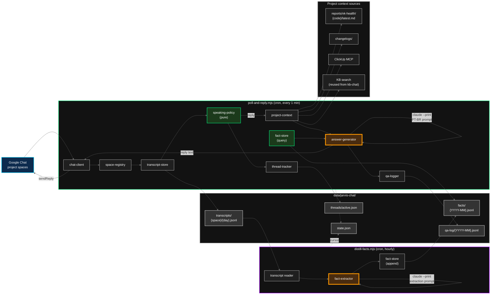
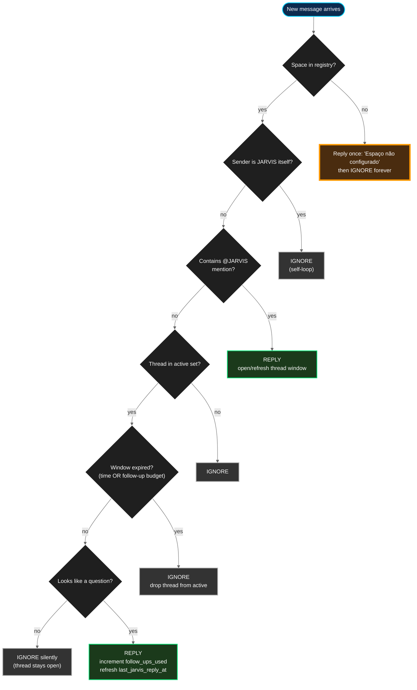

# JARVIS Chat Presence — Design Spec

**Status:** Draft
**Date:** 2026-04-10
**Author:** Pedro Teruel (with JARVIS)
**Working name:** `jarvis-chat`

## 1. Summary

A second Google Chat bot, parallel to the existing `kb-chat`, that lives inside Strokmatic project spaces alongside humans. Two responsibilities:

1. **Project-aware Q&A** — answers questions about a project using PMO data, ClickUp tasks, recent reports, KB pages, and accumulated chat facts. Replies in Portuguese (PT-BR), in-thread, only when explicitly invoked.
2. **Ambient project memory** — silently logs every message in mapped project spaces and runs an hourly distillation pass that extracts structured facts (decisions, action items, blockers, open questions, observations, risks, commitments, metrics). Those facts feed both Q&A retrieval and cross-project insight surfacing.

The bot speaks only when mentioned; once mentioned in a thread, it stays engaged for a short window (5 minutes / 3 follow-ups) then falls silent until re-mentioned. Cross-project context surfaces naturally when fact-store hits from other spaces are highly relevant, with explicit attribution. All Strokmatic project Chat spaces are internal-only, so there is no shareability classification — facts are globally searchable.

## 2. Goals & non-goals

### Goals
- Project-aware Q&A in any mapped Chat space, in PT-BR.
- Ambient memory: every message logged, periodic fact extraction, persistent fact store.
- Cross-project insight surfacing with attribution.
- Deterministic, observable conversation policy with three tunable knobs.
- Reuse the existing `kb-chat` Chat I/O layer rather than reimplementing it.
- Unit-testable speaking policy and fact retrieval (pure functions, no I/O).

### Non-goals (v1)
- Write actions (creating ClickUp tasks, dispatching code reviews, generating reports on demand). Read-only assistant.
- Proactive interjection — JARVIS never speaks without being mentioned. Hooks for this exist but are not implemented.
- Real-time webhook ingestion via Pub/Sub. Cron-driven polling at 1-minute cadence.
- Vector embeddings or external vector DBs. Keyword + recency ranking on JSONL files.
- Multi-project space binding (one space → many project codes). Single binding only.
- Explicit "thanks JARVIS" dismissal recognizer. The window timeout does the work.
- Merging `jarvis-chat` and `kb-chat` into one service. Parallel for v1; merge planned for v2.

## 3. Decisions

| # | Decision | Chosen | Why |
|---|---|---|---|
| Q1 | Bot purpose | Q&A + ambient memory (no actions) | Defers auth/blast-radius problem; the hard work is the policy and the memory |
| Q2 | Speaking policy | Strict mention-only, with hooks for proactive later | Existing KB bot proves mention-only works; proactive needs real chat history to tune |
| Q3 | Multi-turn behavior | Thread-sticky window (5 min / 3 follow-ups) + question-shape gate, no LLM "subject closed" classifier | 90% of value at 10% of complexity; timeout is the safety net |
| Q4 | Memory granularity | Raw transcript + extracted facts (no embeddings) | Raw log is debugging insurance; facts are high-signal retrieval |
| Q5 | Space → project mapping | Explicit `jarvis-chat-spaces.json` config; refuse-on-unmapped | Boring, unambiguous, version-controlled, fails loudly |
| Q6 | Cross-project lookups | Wide open, single global fact index, attribution in answers | All project spaces are internal-only — no classification overhead needed |
| — | Language | 100% PT-BR for all bot output | Aligned with KB bot, FORGE distribution, PMO reports |
| — | Answer model | `claude-sonnet-4-6` (configurable) | Answers are short and retrieval-grounded; cost matters at 1-min cadence |
| — | Fact types | 8 types: `decision`, `action_item`, `blocker`, `open_question`, `observation`, `risk`, `commitment`, `metric` | Covers project-management chatter; small enough to keep extraction prompt simple |

## 4. Architecture

### 4.1 Module decomposition

Each module is one file with one responsibility, designed to be readable in isolation.

| Module | File | Responsibility |
|---|---|---|
| Chat I/O | `lib/chat-client.mjs` (shared) | List spaces, list messages, send replies. Promoted from `kb-chat/lib/` and shared between both bots. |
| Space registry | `lib/space-registry.mjs` | Reads `config/orchestrator/jarvis-chat-spaces.json`, resolves `space_id → {project_code, product, memory_enabled}`, refuses unmapped spaces. |
| Transcript store | `lib/transcript-store.mjs` | Append-only raw message log at `data/jarvis-chat/transcripts/{space_id_safe}/{YYYY-MM-DD}.jsonl`. |
| Thread tracker | `lib/thread-tracker.mjs` | In-memory + on-disk record of currently engaged threads with expiry. Persisted to `data/jarvis-chat/threads/active.json`. |
| Speaking policy | `lib/speaking-policy.mjs` | Pure function `decideAction({ message, threadState, config, botUserId }) → { action, reason, newThreadState }`. The entire conversation policy lives here. |
| PT-BR messages | `lib/messages.pt-br.js` | Centralized PT-BR string constants (error messages, fallbacks, "not configured" replies). |
| Project context loader | `lib/project-context.mjs` | Given a project code, loads VK health, recent reports, recent ClickUp tasks, top KB pages. Returns a bounded context bundle. |
| Fact store | `lib/fact-store.mjs` | Append-only global JSONL at `data/jarvis-chat/facts/{YYYY-MM}.jsonl`. Query side is a pure function: keyword + recency ranking with project-code preference boost. |
| Fact extractor | `lib/fact-extractor.mjs` | Reads new transcript rows since last cursor, calls `claude --print` with the extraction prompt, appends to fact store. |
| Answer generator | `lib/answer-generator.mjs` | Given (question, project context, fact-store hits), calls `claude --print` with the PT-BR answer prompt. Returns Markdown. |
| Q&A logger | `lib/qa-logger.mjs` (shared) | Records every answered question for audit and gap detection. Promoted from `kb-chat/lib/` and shared. |
| Main loop | `poll-and-reply.mjs` | Cron entrypoint: poll → log → route → answer → reply. |
| Distillation loop | `distill-facts.mjs` | Cron entrypoint: read new transcripts → extract facts → write to fact store. |

### 4.2 Component diagram



Green-bordered modules are pure functions (no I/O, fully unit-testable). Amber modules call `claude --print`.

### 4.3 Runtime model

Two cron entries, no daemons:

| Job | Cadence | Script | Purpose |
|---|---|---|---|
| `poll-and-reply` | Every 1 min | `scripts/jarvis-chat/poll-and-reply.mjs` | Poll all mapped spaces, log new messages, decide replies, post answers |
| `distill-facts` | Every 1 hour | `scripts/jarvis-chat/distill-facts.mjs` | Read new transcript rows since last cursor, extract facts, append to global fact store |
| `commit-jarvis-chat-logs` (deferred to v1.1) | Daily | `scripts/jarvis-chat/commit-logs.sh` | Snapshot transcripts and facts to a private backup repo |

Why polling, not Pub/Sub webhooks: webhooks require a public HTTPS endpoint and Pub/Sub plumbing that does not exist today, and the latency win (sub-minute vs ~30-second average) is not load-bearing for mention-only Q&A. The day proactive interjection ships, that is when webhooks earn their keep.

## 5. Conversation policy

The heart of the system. Lives in `lib/speaking-policy.mjs` and `lib/thread-tracker.mjs`. Pure logic, no I/O, no LLM calls — deterministic and unit-testable.

### 5.1 Per-thread state

```js
{
  thread_id: "spaces/AAQAxxxx/threads/yyy",
  space_id: "spaces/AAQAxxxx",
  engaged_at: "2026-04-10T14:32:11Z",      // when @JARVIS was first mentioned
  last_jarvis_reply_at: "2026-04-10T14:32:14Z",
  follow_ups_used: 0,                       // follow-ups answered so far
  status: "active"                          // active | expired
}
```

Persisted to `data/jarvis-chat/threads/active.json`. Pruned on every poll cycle — anything past expiry is dropped immediately to keep the file tiny.

### 5.2 Knobs

```json
{
  "thread_window_minutes": 5,
  "max_follow_ups_per_window": 3,
  "question_shape_required": true
}
```

A thread is considered **expired** if either:
- `now - last_jarvis_reply_at > thread_window_minutes`, or
- `follow_ups_used >= max_follow_ups_per_window`

`question_shape_required = false` is a kill switch that makes JARVIS reply to every in-window message regardless of shape — useful during early tuning.

### 5.3 Decision flow



### 5.4 Three load-bearing properties

1. **Window refresh on JARVIS reply, not on every human message.** If the window refreshed every time anyone spoke in the thread, JARVIS would stay engaged indefinitely as long as humans kept chatting around it. Refreshing only when JARVIS itself replies gives the conversation a natural fade-out.

2. **The question-shape gate is silent — it does not drop the thread.** Non-question messages in an active thread are ignored without ending engagement. This avoids the "JARVIS keeps trying to answer non-questions" failure mode without prematurely closing real conversations.

3. **Unmapped spaces fail loudly, then go silent.** If JARVIS is added to a space that is not in the registry, the first mention gets a one-shot reply explaining the space is not configured; subsequent mentions are ignored. State for "I have already explained myself in this space" lives in `state.json` keyed by `space_id` so the warning does not repeat.

### 5.5 Question-shape detector

A small heuristic, not an LLM. `isQuestion(text)` in `speaking-policy.mjs` returns true if any of:

- The text contains a `?` character.
- The first word (lowercased, punctuation stripped) is in the PT-BR question-word list: `qual`, `quais`, `quanto`, `quantos`, `quantas`, `quando`, `como`, `onde`, `por`, `porque`, `o`, `quem`. (`o` is the start of `o que`; `por` is the start of `por que`.)

No English fallback — all bot interaction is PT-BR by decision. ~30 lines, ~15 unit tests.

### 5.6 Mention detection

The existing `kb-chat` heuristic (case-insensitive substring `"jarvis"`) is upgraded:

1. **Primary:** scan `message.annotations[]` for entries of type `USER_MENTION` whose `userMention.user.name` matches the bot's own user ID. Precise, no false positives.
2. **Fallback:** case-insensitive substring match on `text` for `"jarvis"`. Resilient to malformed annotation payloads.

Either source triggers the mention path.

## 6. Memory & retrieval

### 6.1 Directory layout

All state lives under `data/jarvis-chat/`. Gitignored — operational state, not code.

```
data/jarvis-chat/
├── transcripts/
│   └── {space_id_safe}/         # space_id with "/" → "_"
│       └── 2026-04-10.jsonl     # one file per space per UTC day
├── facts/
│   ├── 2026-04.jsonl            # global, sharded by month
│   └── 2026-05.jsonl
├── threads/
│   └── active.json              # current thread-tracker state
├── qa-log/
│   └── 2026-04.jsonl            # answered Q&A audit trail
└── state.json                   # poll cursors per space, distillation cursor, "warned-unmapped" set
```

### 6.2 Transcript record

```json
{
  "ts": "2026-04-10T14:32:11Z",
  "space_id": "spaces/AAQAxxxx",
  "thread_id": "spaces/AAQAxxxx/threads/yyy",
  "message_id": "spaces/AAQAxxxx/messages/zzz",
  "sender": { "id": "users/123", "name": "Pedro Teruel" },
  "text": "@JARVIS qual o status do VK03?",
  "is_bot": false
}
```

JARVIS's own replies are also logged with `is_bot: true` so the full conversation can be replayed for debugging.

### 6.3 Fact record

```json
{
  "id": "f_2026-04-10_001",
  "extracted_at": "2026-04-10T15:00:00Z",
  "source": {
    "space_id": "spaces/AAQAxxxx",
    "space_label": "VK 03002 — Nissan Smyrna",
    "project_code": "03002",
    "product": "visionking",
    "thread_id": "spaces/AAQAxxxx/threads/yyy",
    "message_ids": ["spaces/AAQAxxxx/messages/zzz"]
  },
  "type": "decision",
  "summary": "Decidido aumentar prefetch do RabbitMQ para 50 no vk03 após pico de fila em 09/04.",
  "entities": ["vk03", "RabbitMQ", "prefetch"],
  "people": ["Pedro Teruel", "Joshua"]
}
```

**Eight fact types:** `decision`, `action_item`, `blocker`, `open_question`, `observation`, `risk`, `commitment`, `metric`.

### 6.4 Fact extraction

Hourly cron job `distill-facts.mjs`:

1. Read distillation cursor from `state.json`.
2. For each space, read all transcript rows newer than the cursor (across day-files if needed).
3. Group rows by thread, drop threads shorter than 2 messages (not enough signal).
4. For each remaining thread, call `claude --print` with the PT-BR extraction prompt:
   - System: structured extraction instructions, the 8-type taxonomy, "Responda sempre em PT-BR. Saída em JSON. Não invente fatos."
   - User: thread messages with sender labels, plus space/project metadata for the source block.
5. Parse JSON output, append each extracted fact to the current month's `facts/{YYYY-MM}.jsonl`.
6. Advance cursor to the latest processed message timestamp.

Extraction prompt is adapted from the meeting-assistant MCP server (`mcp-servers/meeting-assistant/`) which already does this for meeting transcripts. Output schema is the fact record above.

### 6.5 Retrieval at answer time

When the speaking policy decides to reply, `answer-generator.mjs` runs this pipeline:

1. **`project-context.load(project_code)`** returns a bounded context bundle:
   - `reports/vk-health/{code}/latest.md` if it exists (for VK projects).
   - Last 3 changelog entries from any changelog matching the project code.
   - Last 5 ClickUp tasks tagged to the project (via existing ClickUp MCP).
   - Top-3 KB pages by keyword match against the question (reuses `kb-chat/lib/kb-search.mjs`).
   - Hard cap on total bundle size (~ 4000 tokens of text).

2. **`fact-store.search(question, { project_code, k: 10 })`** returns ranked facts:
   - Tokenize the question, drop PT-BR stopwords (`o`, `a`, `de`, `do`, `da`, `que`, `e`, `é`, `em`, `para`, `com`, etc.).
   - Read the last 3 monthly fact shards (~90 days).
   - Score each fact by token overlap on `summary + entities + people`.
   - Recency boost: facts < 7 days old get ×1.5; < 30 days ×1.2.
   - Project-code preference: facts from the same `project_code` get ×1.3 (preference, not exclusion — a strongly-matching fact from another project still wins).
   - Return top-k with scores.

3. **`answer-generator.generate({ question, projectContext, facts })`** assembles a PT-BR prompt for `claude --print`:
   - System: "Você é o JARVIS, assistente do Pedro e do time Strokmatic. Responda sempre em português brasileiro, mesmo que a pergunta venha em outro idioma. Use apenas o contexto fornecido. Se uma informação vier de outro projeto, mencione a origem explicitamente, ex: *(de espaço VK 03001 — Stellantis)*. Se não souber, diga que não sabe."
   - User: question + project context bundle + numbered facts (each prefixed with its `space_label` and `extracted_at`).
   - Returns Markdown reply.

4. **Reply** is posted in-thread via `chat-client.sendReply()`. The Q&A is appended to `qa-log/{YYYY-MM}.jsonl`.

### 6.6 Cross-project attribution

The answer prompt instructs JARVIS to attribute any cross-project fact inline. Example output:

> O sintoma que você descreveu é parecido com um caso recente em **espaço VK 03001 — Stellantis** (decidido em 03/04) onde o time aumentou o prefetch do RabbitMQ para 50 e o problema cessou. Vale tentar a mesma mudança aqui.

A reply that surfaces a cross-project fact without a source label is a bug — it means either the prompt was not followed or JARVIS is hallucinating. The Q&A log makes this auditable.

### 6.7 Why no embeddings in v1

At projected volumes (a handful of project spaces, dozens to low hundreds of messages per day per space, low thousands of facts at steady state), full-scan keyword ranking on monthly JSONL shards is microseconds. Adding embeddings would bring a new dependency, a new failure mode, and a new debugging surface for zero observable benefit. The day fact-store search starts feeling shallow — and that day is detectable, because Q&A logs will show wrong answers caused by missed retrieval rather than missed reasoning — that is the day to add embeddings, and by then there will be real query traces to tune against.

## 7. Configuration

### 7.1 `config/orchestrator/jarvis-chat.json`

```json
{
  "enabled": true,
  "poll_interval_minutes": 1,
  "distill_interval_minutes": 60,
  "thread_window_minutes": 5,
  "max_follow_ups_per_window": 3,
  "question_shape_required": true,
  "max_context_pages": 5,
  "max_facts_per_answer": 10,
  "model": "claude-sonnet-4-6",
  "language": "pt-br"
}
```

### 7.2 `config/orchestrator/jarvis-chat-spaces.json`

```json
{
  "spaces": {
    "spaces/AAQAxxxx": {
      "label": "VK 03002 — Nissan Smyrna",
      "project_code": "03002",
      "product": "visionking",
      "memory_enabled": true
    },
    "spaces/AAQAyyyy": {
      "label": "DM 01001 — Honda",
      "project_code": "01001",
      "product": "diemaster",
      "memory_enabled": true
    }
  }
}
```

`memory_enabled` is the per-space kill switch. Defaults to `true` for new spaces under the all-internal trust assumption. Setting it to `false` disables both transcript logging and fact extraction for that space, while still allowing mention-triggered Q&A.

### 7.3 Cron entries

Added to `config/cron/orchestrator.cron`:

```
# JARVIS chat presence — poll spaces, route mentions, post replies
* * * * * cd $ORCHESTRATOR_HOME && node scripts/jarvis-chat/poll-and-reply.mjs >> logs/jarvis-chat-poll.log 2>&1

# JARVIS chat presence — hourly fact distillation
0 * * * * cd $ORCHESTRATOR_HOME && node scripts/jarvis-chat/distill-facts.mjs >> logs/jarvis-chat-distill.log 2>&1
```

## 8. Relationship to existing systems

| System | Relationship |
|---|---|
| `kb-chat` (Phase 3 KB bot) | **Parallel for v1.** Different policies (single-shot vs thread-sticky), different scope (KB-only vs project-aware). Shared code: `chat-client.mjs`, `qa-logger.mjs` are promoted out of `kb-chat/lib/` to a shared location and imported by both. **v2 plan:** fold `kb-chat` into `jarvis-chat` as one of several context sources. |
| KB search (`kb-chat/lib/kb-search.mjs`) | Imported by `project-context.mjs` as one of the context sources. No changes needed. |
| Meeting-assistant MCP server | Source of the fact extraction prompt. The PT-BR extraction prompt is ported and adapted for chat-message-shape input. |
| `config/project-codes.json` | Source of truth for valid project codes and their product mapping. `space-registry.mjs` cross-validates new entries against this file. |
| ClickUp MCP server | Called by `project-context.mjs` to fetch recent tasks for a project. |
| Google Workspace MCP server | Provides the underlying Chat read/write API. Already has all required scopes (read/write Chat messages and spaces). |
| Notifier (Telegram) | Out of scope. JARVIS speaks to Google Chat, not to Telegram. |

## 9. Testing strategy

The design is built around two pure-function modules that are the primary unit-test surface:

### 9.1 `speaking-policy.test.mjs`

`decideAction()` is a pure function from plain objects to plain objects. Test cases (~20):

- Unmapped space → reply once with "not configured", second mention → ignore.
- Self-loop (sender is bot) → ignore.
- Mention in mapped space, no active thread → reply, open thread.
- Mention in mapped space, active thread → reply, refresh window, follow_ups_used unchanged.
- In-window follow-up that is a question → reply, increment follow_ups_used.
- In-window follow-up that is not a question → ignore silently, thread stays active.
- In-window follow-up but follow-up budget exhausted → ignore, drop thread.
- Time-expired follow-up → ignore, drop thread.
- Mention re-opens an expired thread → reply, fresh window.
- `question_shape_required: false` → all in-window messages reply.
- Question-word detector: PT-BR words (`qual`, `quais`, `o que`, `por que`, etc.), `?` character, edge cases (sentence starting with `O ` non-question, sentence containing `?` but really a statement).

### 9.2 `fact-store.test.mjs`

`fact-store.search()` is a pure function over an in-memory list of facts. Test cases (~10):

- Token overlap scoring on `summary + entities + people`.
- Recency boost (< 7 days, < 30 days, > 30 days).
- Project-code preference boost (same code wins ties, but loses to a much higher token-overlap from another code).
- PT-BR stopword stripping.
- Empty query → empty result.
- No matches → empty result.
- `k` parameter respected.

### 9.3 Integration smoke test

A single end-to-end script `scripts/jarvis-chat/test-integration.mjs` that:

1. Reads a fixture transcript file (3 messages, one mention).
2. Runs `poll-and-reply.mjs` against a fake `chat-client` that returns the fixture and captures sent replies.
3. Asserts: one reply was sent in-thread, the thread is in `active.json`, `qa-log/` has one entry, `transcripts/` has the messages.

### 9.4 Manual end-to-end (one-time)

Before enabling cron, run `poll-and-reply.mjs` manually against a single test space (e.g. a newly-created "JARVIS Sandbox" Chat space mapped to a throwaway project code) and verify the full loop works against the real Chat API.

## 10. Rollout plan

1. **Promote shared code.** Move `chat-client.mjs` and `qa-logger.mjs` out of `scripts/kb-chat/lib/` to `scripts/jarvis-chat-shared/lib/` (or similar). Update `kb-chat` imports. Verify `kb-chat` still passes its existing manual checks.
2. **Build pure modules first** (TDD): `speaking-policy.mjs`, `fact-store.mjs`. Both have full unit-test coverage before any I/O is wired up.
3. **Build storage modules:** `transcript-store.mjs`, `thread-tracker.mjs`. Cover with file-system integration tests using a temp directory.
4. **Build context loaders:** `project-context.mjs`, then verify it loads cleanly for one VK project (e.g. 03002) and one DM project.
5. **Build the answer pipeline:** `answer-generator.mjs` with the PT-BR prompt. Verify against a fixture project context and a fixture fact list, calling `claude --print` for real.
6. **Build the extraction pipeline:** `fact-extractor.mjs` and `distill-facts.mjs`. Verify against a fixture transcript day.
7. **Wire `poll-and-reply.mjs`:** the orchestrator that ties everything together. Run integration smoke test.
8. **Manual end-to-end** in a sandbox Chat space.
9. **Enable cron** for one real project space (recommend the smallest active project).
10. **Watch Q&A logs and fact logs daily for one week.** Tune knobs (`thread_window_minutes`, `max_follow_ups_per_window`, question-word list) based on observed misclassifications.
11. **Roll out to remaining project spaces** one product line at a time.
12. **Plan v2 spec:** fold `kb-chat` into `jarvis-chat`.

## 11. Open items deferred to v1.1+

| Item | Reason for deferral |
|---|---|
| Daily commit job for transcripts/facts to a backup repo | Useful, not load-bearing — can ship after v1 works |
| Explicit "thanks JARVIS" / "valeu JARVIS" dismissal recognizer | Window timeout already does the work; one regex if/when needed |
| Webhook-based ingestion via Pub/Sub | Not needed until proactive interjection ships |
| Proactive interjection (option C from Q2) | Needs real chat history to tune the "should I speak?" classifier |
| Vector embeddings for fact retrieval | Not needed until Q&A logs show retrieval-caused wrong answers |
| Multi-project space binding | YAGNI until a "team general" space actually appears |
| Merge `kb-chat` into `jarvis-chat` (v2) | Ship the new service first, fold the old one in once it is stable |
| Write actions (create ClickUp task, dispatch review, etc.) | Authorization model is its own design problem; defer to a future spec |

## 12. Success criteria for v1

- JARVIS replies in PT-BR to `@JARVIS` mentions in at least one mapped project space, in-thread, with project-aware context, within 60 seconds.
- Thread-sticky window works as specified: 3 in-window follow-ups answered, 4th ignored, 5-minute timeout drops the thread.
- Fact extraction runs hourly without errors, produces at least one fact per active project per week at steady state.
- A cross-project insight surfaces with attribution at least once during the first month of operation.
- No spam: zero unsolicited replies in any space; all replies are mention-triggered or in-window follow-ups to a question.
- Q&A logs are clean enough to audit weekly: every wrong answer can be traced to either missed retrieval, wrong context, or model error.
