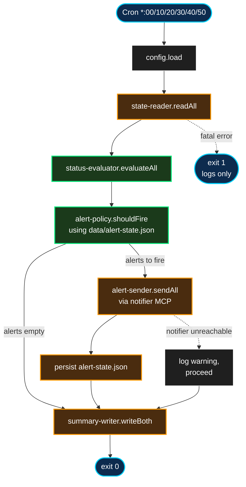

# health-monitor — Design Spec

**Status:** Draft
**Date:** 2026-04-14
**Author:** Pedro Teruel (com JARVIS)
**Localização no infra repo:** `services/health-monitor/`

## 1. Resumo

Serviço passivo de observabilidade para a plataforma Strokmatic. Lê heartbeats dos demais serviços do infra server, avalia saúde (healthy/stale/failed/partial/bootstrapping), aplica política de dedup de alertas, e dispara notificações no grupo Telegram `jarvis-alerts` via notifier MCP. Gera também um resumo agregado (JSON + markdown) para consumo humano e programático.

**O que resolve:** hoje, se `pr-review` ou `context-refresh` falham, Pedro só descobre por inspeção manual via SSH. Nenhum alerta é disparado. Essa lacuna é o ponto mais doloroso do ecossistema atual e é o que motivou o health-monitor como primeiro serviço novo a ser construído (P0 no roadmap).

## 2. Goals & non-goals

### Goals

- Detectar e alertar falhas explícitas (`last_status: failed`, exit code != 0) dos serviços monitorados em até 10 minutos.
- Detectar e alertar staleness (serviço não rodou dentro da janela esperada).
- Detectar e alertar execuções parciais (`last_status: partial`) quando o serviço declarar que isso merece alerta.
- Emitir alerta positivo de recuperação (`service_recovered`) quando um serviço previamente em falha volta a `success`.
- Deduplicar alertas: 1h de cooldown por `(serviço, tipo)` para evitar ruído, com exceção para escalações de severidade e eventos de recuperação.
- Gerar resumo agregado (`health-summary.json` + `health-summary.md`) em cada execução, legível por humano e consumível por outros serviços.
- Padronizar o schema de `state.json` que todos os serviços do infra passam a escrever.
- Migrar `pr-review`, `context-refresh` e `github-clickup-sync` para o schema novo como parte desse rollout.

### Non-goals (v1)

- **Orquestração.** Não decide quando os jobs rodam nem aplica gates de dependência. Cada serviço mantém seu próprio cron. Gate condicional pode vir em v2.
- **Endpoint HTTP.** Alertas via Telegram + arquivos de resumo no filesystem. Sem servidor HTTP, sem dashboard web. Pode ser adicionado depois se o sprint-agent ou outro consumidor precisar.
- **Cobertura do JARVIS host.** Monitora apenas serviços que rodam no infra server (`192.168.15.2`). `vk-health`, `system-health-check.sh` e outros scripts do JARVIS host ficam fora do escopo. `vk-health` já tem alertas próprios; `system-health-check.sh` é periódico humano.
- **Métricas históricas / time series.** Não mantém série temporal de performance dos serviços. Apenas estado atual + histórico de alertas ativos.
- **Auto-remediation.** Não tenta restart, rerun, ou qualquer ação corretiva. Observa e alerta — ponto.
- **Multi-host federation.** Uma instância rodando em um host. Não há replicação nem agregação entre hosts.
- **Integração com jarvis-chat.** jarvis-chat é reativo (só responde a menções). Não há push proativo de alerts para espaços Chat em v1. Pode ser adicionado depois.

## 3. Decisões tomadas durante o brainstorming

| # | Decisão | Escolhido | Por quê |
|---|---|---|---|
| Q1 | Passivo vs ativo vs híbrido | **Passivo (A)** | Resolve o gap mais doloroso com mínimo de código, não introduz novo SPOF no caminho crítico dos jobs |
| Q2 | Onde roda + escopo | **Infra server, cobre só infra** | Onde a dor está; vk-health já tem alertas; sem SSH cross-host |
| Q3 | Protocolo de heartbeat | **`state.json` canônico por serviço** | Extensível, legível, alinhado com o que o pr-review já tem |
| Q4 | Cadência + alertas + dedup | **10min + 4 tipos + cooldown 1h/tipo** | Responsivo o suficiente, evita alert fatigue |
| Q5 | Visibilidade | **Telegram + arquivo agregado (JSON + MD)** | YAGNI — HTTP só se houver consumidor real |
| — | Status `bootstrapping` com grace period | **Sim** | Evita falso positivo quando serviço novo acabou de ser configurado mas ainda não rodou |
| — | Migração do context-refresh | **Remove `last-run.txt` e `last-task-count.txt`** | Substituídos pelo `state.json` equivalente, sem dupla escrita |
| — | Rollout | **Deploy do health-monitor antes das migrações** | Incremental: serviços migram e ficam verdes um por vez |

## 4. Arquitetura

### 4.1 Runtime

Node.js ESM (versão presente no infra server via nvm), cron `*/10 * * * *`. Zero dependências externas além de Node built-ins (`fs`, `path`, `child_process`). Chamadas ao notifier MCP feitas via `claude --print --allowedTools mcp__notifier__send_notification`, seguindo padrão existente do `pr-review` e `context-refresh`.

### 4.2 Estrutura de arquivos do serviço

```
services/health-monitor/
├── run.sh                         # Cron entry point (bash thin wrapper)
├── deploy.sh                      # Rsync + crontab install, padrão infra
├── package.json                   # type: module
├── index.mjs                      # Orquestrador principal
├── config/
│   └── services.json              # Lista de serviços + cadência esperada
├── lib/
│   ├── config.mjs                 # Carrega/valida services.json
│   ├── state-reader.mjs           # Pure: lê state.json de um serviço
│   ├── status-evaluator.mjs       # Pure: (state, cfg, now) → status
│   ├── alert-policy.mjs           # Pure: (evals, history, now) → alerts[]
│   ├── alert-sender.mjs           # I/O: invoca notifier MCP
│   └── summary-writer.mjs         # I/O: escreve health-summary.{json,md}
├── test/
│   ├── status-evaluator.test.mjs
│   ├── alert-policy.test.mjs
│   ├── state-reader.test.mjs
│   ├── config.test.mjs
│   └── test-integration.mjs
├── data/
│   ├── alert-state.json           # Dedup state (igual padrão vk-health)
│   ├── health-summary.json        # Output consumível por máquina
│   └── health-summary.md          # Output consumível por humano
└── logs/
    └── run-YYYY-MM-DD.log
```

### 4.3 Decomposição em módulos

Decomposição por pureza, para maximizar testabilidade:

| Módulo | Papel | Pureza |
|---|---|---|
| `config.mjs` | Lê `config/services.json`, valida campos obrigatórios, retorna lista com defaults aplicados | Quase puro (lê arquivo, mas determinístico) |
| `state-reader.mjs` | Lê um `state.json` de serviço. Retorna `{state, error}` onde `error` é `null` em sucesso ou estruturado em falha (`file_missing`, `parse_error`, `missing_required_field`). Nunca lança. | Quase puro (lê FS) |
| `status-evaluator.mjs` | **Função central.** `(state, serviceConfig, now) → {status, reason, severity}`. Implementa tabela de decisão. Zero I/O. | 100% pura |
| `alert-policy.mjs` | **Função dedup.** `(evaluations, alertHistory, now) → {alertsToFire, newAlertHistory}`. Cooldown 1h, escalação, recovery. Zero I/O. | 100% pura |
| `alert-sender.mjs` | Formata mensagem Telegram. Invoca notifier MCP via `claude --print`. | I/O (subprocess) |
| `summary-writer.mjs` | Gera `health-summary.json` (structured) e `health-summary.md` (human-readable). | I/O (filesystem) |
| `index.mjs` | Orquestrador: `load config → read all states → evaluate all → apply policy → send alerts → write summary → persist alert state`. | I/O composto |

### 4.4 Orquestração



## 5. Schema canônico de `state.json`

Cada serviço escreve `<service_dir>/data/state.json` ao final de cada execução.

### 5.1 Campos obrigatórios

| Campo | Tipo | Significado |
|---|---|---|
| `service` | string | Nome canônico (bate com chave em `services.json`) |
| `last_run` | ISO 8601 UTC | Timestamp de quando a execução terminou |
| `last_status` | enum: `"success"` \| `"partial"` \| `"failed"` | Resultado da execução |
| `duration_ms` | number | Duração em milissegundos |

### 5.2 Campos opcionais

| Campo | Tipo | Uso |
|---|---|---|
| `exit_code` | number | Código de saída. Usado em debug; não afeta avaliação (o que conta é `last_status`). |
| `details` | object | Livre por serviço. Usado no markdown de summary, não na lógica de alerta. |
| `next_expected_before` | ISO 8601 UTC | Se o serviço souber, informa próxima execução esperada. Health-monitor calcula a partir de `cadence_minutes` se ausente. |

### 5.3 Helper bash compartilhado

Em `services/_shared/state-writer.sh`:

```bash
#!/usr/bin/env bash
# Usage: write_state <service> <status> <duration_ms> [<details_json>]
write_state() {
  local service="$1"
  local status="$2"
  local duration_ms="$3"
  local details="${4:-{}}"
  local exit_code="${EXIT_CODE:-0}"
  local now=$(date -u +%Y-%m-%dT%H:%M:%SZ)
  local state_file="${STATE_FILE:-$SCRIPT_DIR/data/state.json}"

  mkdir -p "$(dirname "$state_file")"
  cat > "$state_file" <<EOF
{
  "service": "$service",
  "last_run": "$now",
  "last_status": "$status",
  "duration_ms": $duration_ms,
  "exit_code": $exit_code,
  "details": $details
}
EOF
}
```

Cada `run.sh` dos serviços monitorados termina com ~3 linhas que chamam essa função.

**Tratamento do caminho de falha:** o serviço deve invocar `write_state "<nome>" "failed" "$duration_ms"` ANTES de sair com `exit 1`, tipicamente via `trap ERR` ou handler explícito. Se o processo crasha sem chegar nessa linha, o `state.json` fica com o valor anterior (stale) — o detector de staleness do health-monitor (Regra 7 da tabela de decisão) é o backstop para crashes. Exemplo típico no início do `run.sh`:

```bash
trap 'write_state "$SERVICE_NAME" "failed" "$(($(date +%s%3N) - START_MS))"' ERR
```

### 5.4 Exemplo completo

```json
{
  "service": "pr-review",
  "last_run": "2026-04-14T03:10:00Z",
  "last_status": "success",
  "duration_ms": 45230,
  "exit_code": 0,
  "details": {
    "new_reviews": 3,
    "total_prs": 47,
    "uploaded_to_drive": 3
  }
}
```

## 6. Avaliação de status

### 6.1 Os 5 status possíveis

- `healthy` — tudo em ordem, sem alerta
- `partial` — rodou com warnings (só alerta se config do serviço pedir)
- `stale` — `last_run` mais antigo do que cadência × tolerância
- `failed` — `last_status: failed` ou state file corrompido/ausente fora do grace period
- `bootstrapping` — serviço adicionado recentemente, ainda não rodou, dentro do grace period (sem alerta)

### 6.2 Tabela de decisão

Avaliada em ordem, primeira regra que casa vence:

| # | Condição | Status | Severity | Reason template |
|---|---|---|---|---|
| 1 | `state === null` e `now - service.added_at ≤ bootstrap_grace_minutes` | `bootstrapping` | `info` | `"grace period active, expected first run by <T>"` |
| 2 | `state === null` e grace expirou | `stale` | `critical` | `"state file missing, service never ran after grace period"` |
| 3 | `state` é malformado (JSON invalid ou falta campo obrigatório) | `failed` | `critical` | `"state file invalid: <detail>"` |
| 4 | `state.last_status === 'failed'` | `failed` | `critical` | `"last run failed (exit code <N>)"` |
| 5 | `state.last_status === 'partial'` e `service.alert_on_partial === true` | `partial` | `warning` | `"last run completed with warnings"` |
| 6 | `state.last_status === 'partial'` e `alert_on_partial === false` | `healthy` | — | — (log only, não vira alerta) |
| 7 | `(now - last_run) > cadence_minutes × staleness_factor` e delta ≥ 2× | `stale` | `critical` | `"stale: last run <N>min ago, expected every <M>min"` |
| 8 | Mesma condição de 7, mas delta < 2× | `stale` | `warning` | idem |
| 9 | Nenhuma acima | `healthy` | — | — |

### 6.3 Cálculo de `staleness`

```
expected_by = last_run + (cadence_minutes * staleness_factor) minutes
delta_ratio = (now - expected_by) / (cadence_minutes minutes)

severity = 'warning' if delta_ratio < 2 else 'critical'
```

Exemplo: `pr-review` com `cadence_minutes: 5`, `staleness_factor: 2.5`, `last_run: 03:00`.
- Às 03:12: `expected_by = 03:12.5`, ainda não stale → `healthy`
- Às 03:15: delta_ratio = (15 - 12.5)/5 = 0.5 → `stale, warning`
- Às 03:25: delta_ratio = (25 - 12.5)/5 = 2.5 → `stale, critical`

### 6.4 Fixtures para unit test

~20 testes em `status-evaluator.test.mjs` cobrem cada linha da tabela + edge cases:

- Timestamp futuro (clock skew)
- `last_run` exatamente igual à borda do threshold (on-boundary)
- Campos obrigatórios individualmente ausentes
- `exit_code` ausente (opcional)
- Transição warning → critical por tempo
- `bootstrapping` dentro e fora do grace

## 7. Política de alertas e dedup

### 7.1 Tipos de alerta

Quatro tipos, cada um mapeado 1:1 a um status resultante:

| Tipo de alerta | Disparado quando |
|---|---|
| `service_failed` | status = `failed` |
| `service_stale` | status = `stale` |
| `service_partial` | status = `partial` (e config pede) |
| `service_recovered` | status = `healthy` e havia alerta ativo prévio |

### 7.2 Estrutura do `alert-state.json`

```json
{
  "pr-review": {
    "failed": {
      "first_fired_at": "2026-04-14T03:15:00Z",
      "last_fired_at": "2026-04-14T03:15:00Z",
      "fire_count": 1,
      "last_severity": "critical",
      "active": true
    }
  },
  "gdrive-index": {
    "stale": {
      "first_fired_at": "2026-04-13T23:45:00Z",
      "last_fired_at": "2026-04-14T00:45:00Z",
      "fire_count": 2,
      "last_severity": "warning",
      "active": true
    }
  }
}
```

### 7.3 Decisão de disparo (`alert-policy.shouldFire`)

Para cada avaliação:

1. Se status é `healthy` e existe entrada `active: true` para qualquer tipo no `alertHistory[service]` → disparar `service_recovered`, marcar todas entradas do serviço como `active: false` (mantidas para audit).
2. Se status é `healthy` sem histórico ativo → nada.
3. Se status é `failed`/`stale`/`partial`:
   - Se não há entrada anterior para esse `(service, type)` ou `active: false` → disparar, criar entrada nova `active: true`.
   - Se existe entrada `active: true` e `last_fired_at < 1h atrás` **e severity não escalou** → silenciar, incrementar `fire_count`, atualizar `last_fired_at`.
   - Se severity escalou (`warning → critical`) → disparar, resetar `first_fired_at` da nova severidade, atualizar.
   - Se `last_fired_at ≥ 1h atrás` → disparar (continuidade após cooldown), atualizar.

### 7.4 Formato da mensagem Telegram

Três templates por tipo:

**Failed/Stale/Partial:**
```
<ÍCONE> [health-monitor] <SERVICE> <STATUS>
<Reason string do evaluator>
Fired <N>x in <duration> | Since <first_fired_at>
```

**Recovered:**
```
🟢 [health-monitor] <SERVICE> RECOVERED
Was <previous_status> for <duration> (<fire_count> alerts fired)
Latest run: success, <duration_ms>ms
```

Ícones: 🔴 critical, 🟡 warning, 🟢 recovered.

### 7.5 Invocação do notifier

```js
// lib/alert-sender.mjs
import { spawn } from 'child_process';

async function callNotifier(domain, summary, details) {
  const prompt = `Call the MCP tool send_notification with these exact arguments: `
    + `{"domain":"${domain}","summary":${JSON.stringify(summary)},`
    + `"details":${JSON.stringify(details)}}. Return only tool output.`;
  return new Promise((resolve, reject) => {
    const proc = spawn('claude', [
      '--print', '--model', 'haiku', '--max-turns', '3',
      '--allowedTools', 'mcp__notifier__send_notification'
    ], { env: { ...process.env }, stdio: ['pipe', 'pipe', 'pipe'] });
    let stderr = '';
    proc.stderr.on('data', d => { stderr += d.toString(); });
    proc.on('close', code => {
      if (code !== 0) reject(new Error(`notifier failed: ${stderr}`));
      else resolve();
    });
    proc.stdin.write(prompt);
    proc.stdin.end();
  });
}
```

`domain: "infra-health"` roteia via `telegram-bots.json` para o bot `jarvis-alerts` (chat id `-1003505195531`).

### 7.6 Testes de `alert-policy`

~15 testes em `alert-policy.test.mjs`:

- Primeiro alerta de cada tipo dispara
- Alerta repetido dentro de 1h silenciado
- Alerta repetido após 1h dispara novamente
- Escalação warning → critical dispara mesmo dentro de cooldown
- Recovery dispara independente de cooldown
- Recovery após múltiplos tipos ativos fecha todos
- Serviço novo entrando no radar não alerta (bootstrapping)
- `alert-state.json` ausente é tratado como histórico vazio

## 8. Summary agregado

### 8.1 `health-summary.json`

```json
{
  "generated_at": "2026-04-14T10:30:00Z",
  "overall": "degraded",
  "counts": { "healthy": 7, "partial": 0, "stale": 1, "failed": 0, "bootstrapping": 0 },
  "services": [
    {
      "service": "pr-review",
      "status": "healthy",
      "last_run": "2026-04-14T10:25:00Z",
      "duration_ms": 43000,
      "details": { "new_reviews": 3, "total_prs": 47 }
    },
    {
      "service": "gdrive-index",
      "status": "stale",
      "last_run": "2026-04-13T22:00:00Z",
      "duration_ms": 12000,
      "severity": "warning",
      "reason": "stale: last run 12h ago, expected every 24h"
    }
  ],
  "active_alerts": [
    { "service": "gdrive-index", "type": "stale", "since": "2026-04-14T10:15:00Z" }
  ]
}
```

`overall` é um agregado simples: `failed` se qualquer serviço `failed`; senão `degraded` se qualquer `stale` ou `partial`; senão `healthy`.

### 8.2 `health-summary.md`

```markdown
# Health Summary

**Generated:** 2026-04-14 10:30:00 UTC
**Overall:** ⚠️ Degraded (1 stale, 7 healthy)

## Services

| Service | Status | Last Run | Duration | Details |
|---|---|---|---|---|
| pr-review | ✅ success | 10:25 (5min ago) | 43s | 3 new reviews |
| context-refresh | ✅ success | seg 06:00 (2d ago) | 98s | 3218 tasks |
| github-clickup-sync | ✅ success | 10:15 (15min ago) | 22s | — |
| gdrive-index | ⚠️ stale | ontem 22:00 (12h ago) | — | — |
| email-index | ✅ success | 22:30 (12h ago) | 67s | 12 new emails indexed |
| meeting-index | ✅ success | 23:00 (11h ago) | 14s | 2 meetings moved |
| kb-generator | ✅ success | 23:30 (11h ago) | 412s | 3 projects regenerated |
| sprint-agent | ✅ success | 08:00 (2h ago) | 38s | — |

## Active alerts

- ⚠️ `gdrive-index` stale since 10:15 UTC (15min ago)

## Recent (last 24h)

- 🔴 2026-04-13 22:15 — `gdrive-index` failed (exit 1, see logs)
- 🟢 2026-04-13 22:45 — `gdrive-index` recovered
```

## 9. Integração com a infraestrutura existente

Mudanças mínimas no ecossistema:

| Item | Mudança |
|---|---|
| `config/orchestrator/notifications.json` (JARVIS host) | Adicionar rota `"infra-health": { "bot": "jarvis-alerts" }` |
| `config/orchestrator/telegram-bots.json` | Nenhuma mudança (`jarvis-alerts` bot + chat_id já configurados) |
| notifier MCP server | Nenhuma mudança (health-monitor é cliente, igual vk-health é hoje) |
| `services/pr-review/run.sh` | Adicionar write_state no fim + medir `duration_ms`. Manter shape antigo de `state.json` com alias para `last_new_reviews` em `details`. Testar com helper bash. |
| `services/context-refresh/run.sh` | Substituir `last-run.txt` + `last-task-count.txt` por `state.json` com helper. Remover os `.txt` legados. |
| `services/github-clickup-sync/...` | Adicionar write_state no fim do poll cycle. Não tem `state.json` hoje — criar do zero. |

## 10. Plano de rollout

Estratégia: **deploy incremental**. O health-monitor sobe antes das migrações e vai ficando verde à medida que cada serviço migra para o schema novo.

1. **Fase 1 — Helper bash e config inicial**
   - Criar `services/_shared/state-writer.sh`
   - Criar `services/health-monitor/` com estrutura inicial + config com todos os serviços registrados mas com `added_at: now` (disparando grace period)
   - Nenhum alerta ainda, apenas setup
2. **Fase 2 — Health-monitor funcional**
   - Implementar todos os módulos (TDD)
   - Testes unitários passando
   - Smoke test de integração
   - Deploy no infra server com cron ativo
   - Todos os serviços aparecem como `bootstrapping` → após grace, viram `stale` (porque nenhum está escrevendo state.json ainda)
   - Alertas disparam mas Pedro já sabe, não é novidade — é o ponto onde a migração dos serviços existentes começa
3. **Fase 3 — Migração pr-review**
   - Editar `run.sh` para emitir `state.json` no shape novo
   - Deploy
   - pr-review vira `healthy` no próximo ciclo do health-monitor
   - Health-monitor alerta `service_recovered` — confirma que o loop fecha
4. **Fase 4 — Migração context-refresh**
   - Idem, remover `.txt` legados, emitir `state.json`
   - Deploy
5. **Fase 5 — Migração github-clickup-sync**
   - Adicionar `write_state` no fim do poll cycle
   - Deploy
   - Agora todos os 3 existentes estão healthy no health-monitor
6. **Serviços novos** (planejados em fases futuras — gdrive-index, email-index, meeting-index, kb-generator, sprint-agent, jarvis-chat, kb-chat): já nascem com o schema novo.

## 11. Testing strategy

### 11.1 Unit tests (`node --test`)

Seguindo padrão jarvis-chat (zero deps externas, zero mocks complexos).

| Arquivo | Testes | Cobertura |
|---|---|---|
| `status-evaluator.test.mjs` | ~20 | Cada linha da tabela de decisão + edge cases (clock skew, on-boundary, campos ausentes, bootstrap grace) |
| `alert-policy.test.mjs` | ~15 | Dedup, escalação, recovery, múltiplos serviços concorrentes |
| `state-reader.test.mjs` | ~5 | Arquivo ausente, JSON malformado, campos obrigatórios faltando, serialização bem-formada |
| `config.test.mjs` | ~3 | Config válida, inválida, defaults aplicados |

**Total: ~43 testes unitários.** Rodam em <1s. Zero I/O externo.

### 11.2 Integration smoke (`test-integration.mjs`)

Único teste end-to-end:

1. `mkdtempSync` com 3 state.json fictícios (1 success, 1 failed, 1 stale)
2. `services.json` fake apontando pros paths tmpdir
3. Mock do `alert-sender` (captura alertas em array em vez de invocar MCP)
4. Rodar pipeline completo: `index.mjs` com env vars apontando pro tmpdir
5. Assertions:
   - Mock recebeu 2 alertas (failed + stale, não o success)
   - `health-summary.md` escrito com 3 linhas, overall = `failed`
   - `alert-state.json` tem entradas para failed e stale, ambas `active: true`
6. Cleanup

### 11.3 Manual end-to-end

Após deploy em Fase 2:

1. Ver no primeiro ciclo: todos os serviços aparecem como `bootstrapping`
2. Aguardar grace period expirar → alertas de `stale` disparam corretamente no Telegram
3. Migrar `pr-review` (Fase 3), ver alerta `service_recovered` chegar no Telegram
4. Provocar falha artificial em `pr-review` (ex: revogar token temporariamente por 10min, deixar cron rodar, restaurar token)
5. Verificar: alerta `service_failed` chega em < 10min; após restauração, alerta `service_recovered` chega no ciclo seguinte

## 12. Configuração exemplo

### 12.1 `config/services.json`

```json
{
  "bootstrap_grace_minutes": 120,
  "services": {
    "pr-review": {
      "state_file": "/opt/jarvis-pr-review/data/state.json",
      "cadence_minutes": 5,
      "staleness_factor": 2.5,
      "alert_on_partial": true,
      "added_at": "2026-04-14T12:00:00Z"
    },
    "context-refresh": {
      "state_file": "/opt/jarvis-context-refresh/data/state.json",
      "cadence_minutes": 20160,
      "staleness_factor": 1.2,
      "alert_on_partial": false,
      "added_at": "2026-04-14T12:00:00Z"
    },
    "github-clickup-sync": {
      "state_file": "/opt/jarvis-github-clickup-sync/data/state.json",
      "cadence_minutes": 15,
      "staleness_factor": 2.0,
      "alert_on_partial": true,
      "added_at": "2026-04-14T12:00:00Z"
    },
    "gdrive-index": {
      "state_file": "/opt/jarvis-gdrive-index/data/state.json",
      "cadence_minutes": 1440,
      "staleness_factor": 1.5,
      "alert_on_partial": true,
      "added_at": null
    }
  }
}
```

`added_at: null` sinaliza serviço planejado mas não implantado — health-monitor ignora silenciosamente (sem bootstrapping, sem staleness, não aparece no summary). Vira ativo quando Pedro atualiza o campo com timestamp real.

`bootstrap_grace_minutes` global é o default; pode ser sobrescrito por serviço se necessário.

### 12.2 `config/cron`

```
*/10 * * * * cd /opt/jarvis-health-monitor && bash run.sh >> logs/cron-$(date +\%Y-\%m-\%d).log 2>&1
```

## 13. Critérios de sucesso para v1

- `pr-review`, `context-refresh` e `github-clickup-sync` emitem `state.json` no schema canônico
- Health-monitor roda a cada 10 min sem erros por 7 dias consecutivos
- Pelo menos 1 alerta `service_failed` ou `service_stale` disparado corretamente no Telegram durante esse período (pode ser induzido para teste inicial)
- `health-summary.md` gerado a cada ciclo, legível, sem campos faltando
- Dedup funciona: alerta repetido do mesmo tipo silenciado dentro de 1h
- Recovery funciona: `service_recovered` dispara quando serviço volta a `success`
- ~43 testes unitários passando
- Adicionar um novo serviço (ex: gdrive-index quando for implementado) é trivial: uma entrada em `services.json`, `added_at` populado, serviço emite state.json no shape canônico, pronto

## 14. Itens deferidos para v1.1+

- Endpoint HTTP `/status` (caso um dashboard ou consumidor programático apareça)
- Integração jarvis-chat (push proativo de alerts para espaços Google Chat)
- Cobertura do JARVIS host (`system-health-check.sh`, cron scripts locais)
- Time series / histórico de performance (duração média, p95, etc.)
- Gate ativo opcional (permitir serviço consultar `/can-run/<X>` antes de rodar)
- Retro-agent consumindo `health-summary` histórico para detectar padrões de falha
