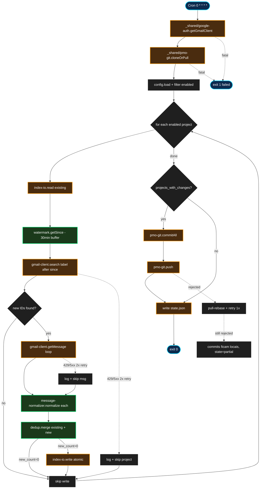

# email-index — Design Spec

**Status:** Draft
**Date:** 2026-04-15
**Author:** Pedro Teruel (com JARVIS)
**Localização no infra repo:** `services/email-index/`

## 1. Resumo

Serviço hourly que sincroniza emails por projeto do Gmail via service account, produzindo `projects/{code}/emails/index.json` no repo PMO (transport via git). Preserva o núcleo maduro do `scripts/email-sync.mjs` atual (delta fetch incremental via `after:`, dedup por `gmail_id`, snippet/metadata extraction) envolvido numa shell arquitetural consistente com `gdrive-index` e `meeting-index` (separação pura/I/O, state.json canônico, integração com health-monitor).

**Pain que resolve:** hoje o `email-sync.mjs` roda no host JARVIS via `system-update.sh`, uma vez por dia no melhor cenário. O `jarvis-chat` e consumidores PMO ficam com `index.json` defasado em até 24h. Sem observabilidade formal, sem health checks. Moving para infra + cadência hourly traz frescor próximo do real-time para uso de chat-bot e reporting, além de integração com os alertas operacionais.

**Escopo v1:** sync-only. Campos de análise semântica (`category`, `analysis`, `analyzed_at`) continuam sendo populados pelo `email-analyze.sh` atual no JARVIS host, em cadência separada. O `email-index` nunca sobrescreve esses campos — o merge preserva o que já foi analisado.

## 2. Goals & non-goals

### Goals

- Rodar hourly (`0 * * * *`) em `/opt/jarvis-email-index/` no infra server
- Sync delta por projeto via Gmail API (service account + DWD, scope `gmail.readonly`)
- Shared auth via `services/_shared/google-auth.mjs`
- Shared git transport via `services/_shared/pmo-git.mjs` (novo shared lib, extraído do gdrive-index)
- Opt-in per-projeto via bloco `email: { label, enabled: true }` em `pmo/config/project-codes.json`
- Preservar schema do `emails/index.json` (compatibilidade com consumidores atuais incluindo `/pmo` skill e `jarvis-chat`)
- Zero-rewrite quando delta vazio (git diff mínimo)
- State.json canônico emitido para health-monitor
- Resiliência: falha de 1 projeto não aborta os outros
- Substituir o trecho `email-sync` do `system-update.sh` na Fase 5 do rollout

### Non-goals (v1)

- **LLM enrichment (classify/extract)** — preservado como hoje no `email-analyze.sh` manual, pro `kb-generator` consumir em v2
- **Gmail push notifications / watch API** — hourly é suficiente; push + reconciliation é complexidade sem consumidor urgente
- **Gmail labels creation/modification automática** — usuários criam labels via Gmail UI
- **Cross-project dedup** — dedup é intra-project por `gmail_id`; se mesmo email aparece em 2 projetos (via 2 labels), aparece em 2 entries (raro, aceito)
- **Attachment download** — só metadata `has_attachments: bool`, sem pull de conteúdo
- **Rollout automático dos 17 projetos sem label** — esses ficam `email` ausente em `project-codes.json`; ativação sob demanda quando alguém usa
- **Realtime indexing** — hourly é trade-off consciente entre frescor e custo operacional

## 3. Decisões tomadas durante o brainstorming

| # | Decisão | Por quê |
|---|---|---|
| Q1 | Hybrid C: preservar núcleo maduro do `email-sync.mjs`, refatorar pra puro + injeção + adicionar shell (state, transport, tests) consistente com outros indexers | `email-sync.mjs` tem valor real (error handling, backoff, corner cases em produção); rewrite completo perderia polish. Mas shell externo precisa matchar o padrão dos outros 2 services. |
| Q2 | Cadência hourly (`0 * * * *`) | Email é signalling channel assíncrono; frescor importa (diferente de Drive). Quota Gmail é praticamente ilimitada; delta fetch é barato; zero-rewrite filtra runs sem mudança → commits só quando há email novo. Se virar problema: flip pra daily é trivial. |
| Q3 | Sync-only v1, defer analyze | Analyze é LLM-driven (diferente natureza de sync). Chain dentro do email-index amplia escopo sem consumidor imediato. Atual `email-analyze.sh` continua servindo ad-hoc; `kb-generator` v2 vai consumir `index.json` cru e fazer agregação própria. |
| Q4 | Opt-in per-projeto via `email: {label, enabled: true}` em `project-codes.json`; default skip silencioso | Alerts fatigue não vale pena. 17 projetos sem label ficam silenciosos. Rollout gradual (8 projetos ativos → adicionar sob demanda) preserva controle. |
| — | Auth via shared `services/_shared/google-auth.mjs` (service account + DWD) | Decisão upstream: indexers batch usam service account direto. Custo marginal de segredo zero (chave compartilhada). |
| — | Transport via shared `services/_shared/pmo-git.mjs` (novo shared lib) | Padrão estabelecido no gdrive-index. Extrair pra `_shared` porque 3 services (gdrive, email, e retrofit do meeting) vão consumir. |
| — | Schema `emails/index.json` mantido; campos analyze (`category`, `analysis`, `analyzed_at`) preservados no merge | Compatibilidade: 8 projetos já têm index.json consumido por outros serviços. Analyze é camada que sobrepõe, gerenciada separadamente. |
| — | Watermark buffer 30min | Race-safety: email que chegou durante run anterior pode escapar do `after:` filter; buffer re-fetch com dedup absorve. Watermark monotônico (nunca regride). |
| — | `max_messages_per_project_per_run: 500` | Cap defensivo contra backlogs grandes (primeira run após period offline). Truncado = próxima run continua via watermark. |

## 4. Arquitetura

### 4.1 Runtime

Node.js ESM em `/opt/jarvis-email-index/` no infra server `192.168.15.2`, cron `0 * * * *` (hourly). Depende de `googleapis` + shared `services/_shared/google-auth.mjs` (scope `gmail.readonly`) + shared `services/_shared/pmo-git.mjs`. Claude CLI não é dependência (sync-only não usa LLM).

### 4.2 Estrutura de arquivos

```
services/email-index/
├── run.sh                         # cron entry; sources nvm
├── deploy.sh                      # rsync + install cron
├── package.json                   # type: module; dep: googleapis, ../_shared
├── index.mjs                      # orquestrador principal
├── config/
│   └── service.json               # repo URL, gmail params, retry
├── lib/
│   ├── config.mjs                 # loader; filtra email.enabled == true
│   ├── gmail-client.mjs           # wrapper googleapis Gmail v1: search, getMessage
│   ├── project-sync.mjs           # per-project pipeline (mostly pure, client injected)
│   ├── message-normalizer.mjs     # PURE: rawGmail → entry
│   ├── dedup.mjs                  # PURE: merge + new_count
│   ├── watermark.mjs              # PURE: max(date) - buffer
│   └── index-io.mjs               # I/O: atomic read/write index.json
├── test/
│   ├── message-normalizer.test.mjs  # ~10 testes
│   ├── dedup.test.mjs               # ~6 testes
│   ├── watermark.test.mjs           # ~5 testes
│   ├── project-sync.test.mjs        # ~6 testes (com client mockado)
│   └── test-integration.mjs         # 1 smoke end-to-end
├── data/
│   ├── pmo-clone/                 # clone local persistente do PMO repo
│   └── state.json                 # heartbeat canônico
└── logs/
    └── run-YYYY-MM-DD.log
```

### 4.3 Decomposição em módulos

| Módulo | Papel | Pureza |
|---|---|---|
| `message-normalizer.mjs` | `normalize(rawMessage) → entry` — extrai `gmail_id`, `thread_id`, `subject`, `sender_name`/`sender_email` (parse RFC 5322), `recipients`, `date`, `snippet`, `has_attachments` (scan de payload parts), `label_ids` | 100% pura |
| `dedup.mjs` | `merge(existing, incoming) → {merged, new_count}`. Chave `gmail_id`. Preserva campos `category`, `analysis`, `analyzed_at` do existing quando mesma key em ambos. Output ordenado por `date` desc | 100% pura |
| `watermark.mjs` | `getSince(existing, bufferMinutes=30) → ISO \| null`. Retorna `max(existing[].date) - buffer`. Entries vazias → `null` (sem filtro `after:`, primeira run) | 100% pura |
| `project-sync.mjs` | Pipeline per-project (client injetado): `compute watermark → search → loop getMessage → normalize → merge → decide write/noop`. Retorna `{changed, new_count, entries}` | Lógica pura com I/O delegado |
| `gmail-client.mjs` | `search(label, afterISO) → [id]` (paginação via `pageToken`), `getMessage(id, format='metadata')` via `googleapis` Gmail v1. Retry 2x backoff exponencial em 429/5xx | I/O (HTTP) |
| `index-io.mjs` | `read(path) → {entries, generated_at, ...} \| null`, `write(path, data)` com atomic tmp+rename. Ordena entries por `date` desc antes de escrever | I/O (filesystem) |
| `config.mjs` | Lê `service.json` e `project-codes.json` do clone. Filtra projetos com `email.enabled === true`. Valida `label` não-null em habilitados | Quase pura |
| `../_shared/google-auth.mjs` | Factory shared: `getGmailClient({scopes:['https://www.googleapis.com/auth/gmail.readonly']})` retorna cliente `googleapis` autenticado via JWT + DWD (subject `pedro@lumesolutions.com`) | I/O de carregamento único |
| `../_shared/pmo-git.mjs` | Factory shared (novo, extraído do gdrive-index): `cloneOrPull()`, `writeProject(code, relPath, data)`, `commitAll(msg)`, `push()` | I/O (git subprocess) |
| `index.mjs` | Pipeline: `getGmailClient()` → `pmoGit.cloneOrPull()` → `config.load()` → iterate enabled projects via `project-sync` → `pmoGit.commitAll + push` se `projects_with_changes > 0` → `write state.json` | I/O composto |

Os 4 módulos puros (`message-normalizer`, `dedup`, `watermark`, e a lógica nuclear de `project-sync`) concentram a lógica de negócio. ~27 testes unitários cobrem comportamento sem I/O real.

### 4.4 Fluxo de execução



## 5. Schemas

### 5.1 `config/service.json`

```json
{
  "pmo_repo": {
    "url": "git@github.com:teruelskm/pmo.git",
    "branch": "master",
    "clone_path": "/opt/jarvis-email-index/data/pmo-clone",
    "commit_author_name": "JARVIS email-index",
    "commit_author_email": "jarvis-email-index@strokmatic.internal"
  },
  "project_codes_path": "config/project-codes.json",
  "output_path_template": "projects/{code}/emails/index.json",
  "gmail": {
    "max_messages_per_project_per_run": 500,
    "watermark_buffer_minutes": 30,
    "page_size": 100
  },
  "retry": {
    "attempts": 2,
    "backoff_ms": 2000
  }
}
```

**Semântica do `watermark_buffer_minutes`:** se um email chegou 29min atrás durante um run anterior que demorou 1min, ele pode ter escapado do filtro `after:`. Re-fetch com 30min de buffer garante cobertura. Dedup por `gmail_id` elimina duplicata.

### 5.2 Extensão `project-codes.json`

Novo bloco `email` per-projeto em `pmo/config/project-codes.json`:

```json
{
  "code": "01001",
  "name": "...",
  "product": "diemaster",
  "drive": { "folders": [...] },
  "email": {
    "label": "smartdie/01001",
    "enabled": true
  }
}
```

**Semântica:**
- `email` ausente → skip silencioso (projeto intencionalmente sem email-tracking)
- `email.enabled: false` → skip silencioso (temporariamente desabilitado)
- `email.enabled: true` + `label: null` → misconfigured: `state.json` `partial`, `projects_misconfigured++`, log warning
- `email.enabled: true` + `label: "<path>"` → sync normal

### 5.3 `emails/index.json` — schema mantido

**Path no PMO repo:** `projects/{code}/emails/index.json`

```json
{
  "project": "01001",
  "generated_at": "2026-04-15T14:00:18Z",
  "watermark_since": "2026-04-15T13:30:00Z",
  "message_count": 147,
  "entries": [
    {
      "gmail_id": "18d2f...",
      "thread_id": "18d2e...",
      "subject": "Re: Die Master layout revision 3",
      "sender_name": "João Silva",
      "sender_email": "joao@cliente.com",
      "recipients": ["pedro@lumesolutions.com", "guilherme@..."],
      "date": "2026-04-15T13:42:07Z",
      "snippet": "Pedro, segue anexo a revisão 3 com as cotas...",
      "has_attachments": true,
      "label_ids": ["Label_345", "INBOX"],
      "synced_at": "2026-04-15T14:00:10Z",

      "category": null,
      "analysis": null,
      "analyzed_at": null
    }
  ]
}
```

**Campos:**
- **Sync-populated (v1):** `gmail_id`, `thread_id`, `subject`, `sender_name`, `sender_email`, `recipients`, `date`, `snippet`, `has_attachments`, `label_ids`, `synced_at`
- **Top-level novos vs script atual:**
  - `watermark_since` — ponto de partida do delta (debug/audit)
  - `message_count` — redundante com `entries.length` mas permite state.json e consumidores evitarem parsear o array todo
- **Analyze-populated (sempre `null` no sync, preservados se já existirem):** `category`, `analysis`, `analyzed_at`. Populados por `email-analyze.sh` no JARVIS host numa cadência separada (provavelmente daily via `system-update.sh`). O `dedup.merge` preserva valores existentes em entries já analisadas quando re-merge acontece por watermark overlap.

**Ordenação determinística:** `entries[]` ordenado por `date` desc. Garante git diff pequeno — email novo entra no topo, nada embaixo muda.

### 5.4 `state.json` — heartbeat canônico

```json
{
  "service": "email-index",
  "last_run": "2026-04-15T14:00:42Z",
  "last_status": "success",
  "duration_ms": 87500,
  "exit_code": 0,
  "details": {
    "projects_email_enabled": 8,
    "projects_email_disabled": 17,
    "projects_misconfigured": 0,
    "projects_synced_ok": 8,
    "projects_failed": 0,
    "projects_with_changes": 3,
    "projects_truncated": 0,
    "total_new_messages": 12,
    "git_commit_sha": "abc1234",
    "pushed": true
  }
}
```

`last_status`:
- `success` — zero falhas e zero misconfigured; pode ter 0 `projects_with_changes` (no-op saudável)
- `partial` — ≥1 projeto falhou OU ≥1 `projects_misconfigured > 0` OU `projects_truncated > 0`
- `failed` — erro fatal (auth, git clone/pull, config inválida, push rejeitado após retry)

### 5.5 Commit message (só quando tem mudança)

Com mudanças:
```
chore(email-index): hourly sync — 3 projects, 12 new messages

Changed: 01001 (+5), 02008 (+4), 03002 (+3)
Enabled: 8 projects, Disabled: 17

Co-Authored-By: JARVIS email-index <jarvis-email-index@strokmatic.internal>
```

Sem mudanças: pipeline pula `git commit` + `git push` (no-op). `state.json` atualizado normalmente com `projects_with_changes: 0`, `git_commit_sha: null`, `pushed: false`.

## 6. Tratamento de erros

| Cenário | Retry | Ação | state.json |
|---|---|---|---|
| `google-auth.getGmailClient` falha (chave corrompida, scope não autorizado) | N/A | Abort startup | `failed` |
| `pmo-git.cloneOrPull` falha (rede, SSH auth, conflito) | 1x | Abort ciclo | `failed` |
| `gmail-client.search` de 1 projeto falha (rate limit 429, 5xx transient) | 2x backoff exp | Skip projeto, log, continua | `partial` |
| `gmail-client.search` retorna label inexistente (404 ou 0 results consistente) | N/A | Log warning, `projects_misconfigured++`, continua | `partial` |
| `gmail-client.getMessage` de 1 msg falha após retry | 2x backoff | Skip msg (próxima run pega via watermark-buffer), continua loop | `partial` |
| `max_messages_per_project_per_run` excedido | N/A | Log warning, processa só os primeiros N, marca `projects_truncated++`. Próxima run pega o resto (watermark avança parcialmente) | `partial` |
| `index-io.write` falha (disk full, permission) | N/A | Abort (disk issue) | `failed` |
| `pmo-git.commitAll` falha (corrupção git local) | N/A | Log, próxima run tenta | `partial` |
| `pmo-git.push` rejected (outra máquina pushou entre pull e push) | 1x: pull-rebase + retry | Se falhar de novo, commits locais ficam, próxima run tenta | `partial` |
| Projeto com `email.enabled: true` mas `label: null` | N/A | Log, `projects_misconfigured++`, skip | `partial` |
| Gmail label renomeada pelo usuário | N/A | Silencioso (search retorna 0); humano nota via `total_new_messages` baixo | `success` |
| Config `service.json` inválida | N/A | Abort no startup | `failed` |
| Projeto com `email` ausente | N/A | Skip silencioso (`projects_email_disabled++`) | `success` |

**Princípio:** preferir `partial + completar o que dá` a `failed + parar tudo`. Exception: falhas de infra (auth, clone inicial, disk) param tudo porque nada funciona sem elas.

### 6.1 Invariantes

- **Idempotência:** 2 runs back-to-back sem emails novos = zero operations destrutivas. Segunda run: search retorna 0 via watermark, skip write, zero commits.
- **Watermark monotônico:** `watermark_since` no `index.json` vira o ponto de partida da próxima run. Nunca avança mais rápido que o último email mergeado com sucesso.
- **Ordem de escrita:** primeiro atomic-write de todos os `index.json` no clone, depois `commitAll`, depois `push`. Se push falhar, commits locais esperam; se commit falhar, writes ficam dirty no clone e são re-committados na próxima run.
- **Merge preserva campos analyze:** `dedup.merge` quando encontra entry com mesmo `gmail_id`, preserva `category`, `analysis`, `analyzed_at` do existente. `email-analyze.sh` no JARVIS host pode escrever esses campos numa cadência separada sem ser sobrescrito pelo sync hourly.

## 7. Integração com infraestrutura existente

| Componente | Mudança |
|---|---|
| `services/health-monitor/config/services.json` | Adicionar entry `email-index` com `added_at: null`; flip após Fase 4 |
| `services/_shared/google-auth.mjs` | Já existe (provisionado pelo gdrive-index). email-index invoca com scopes `gmail.readonly`. |
| `services/_shared/pmo-git.mjs` | **Extração necessária** — hoje essa lógica vive no gdrive-index. Primeira task da Fase 1 do rollout é promover para `_shared/`. Retrofit do gdrive-index (consome o shared em vez de lib interna). |
| `~/.secrets/gcp-service-account.json` | Já replicado pelo setup do gdrive-index; zero mudança. |
| `pmo/config/project-codes.json` | Adicionar bloco `email: { label, enabled: true }` para os 8 projetos ativos. Schema change não-breaking (campo novo, consumidores existentes ignoram). |
| `scripts/email-sync.mjs` no JARVIS host | Depreciado na Fase 5; move para `scripts/deprecated/`. |
| `scripts/email-analyze.sh` no JARVIS host | **Permanece** como está. Continua rodando via `system-update.sh` ou `/email-organizer`. Lê `emails/index.json` do clone JARVIS-local do PMO (após `git pull`). |
| `mcp-servers/email-analyzer/index.js` | Sem mudança. Continua sendo invocado pelo `email-analyze.sh`. |
| `/email-organizer <code>` skill | Sem mudança imediata. Em Fase 5, o trecho de `email-sync` do skill é removido (só resta o chain pra `email-analyze`). |
| `/pmo <code>` skill | Continua funcionando — schema mantido. |

### 7.1 Impacto no `system-update.sh` (JARVIS host)

Trecho atual (simplificado):
```bash
bash scripts/email-sync.sh     # → fetch + write index.json
bash scripts/email-analyze.sh  # → enrich index.json via LLM
```

Pós-migração:
```bash
# email-sync removido — agora é responsabilidade do email-index service no infra
git -C workspaces/strokmatic/pmo pull  # pega index.json atualizado
bash scripts/email-analyze.sh          # enriquece onde estiver staleness
```

O `email-analyze.sh` vai operar sobre dados mais frescos (gap de até 1h em vez de 24h).

## 8. Testes

### 8.1 Unitários (`node:test`)

| Arquivo | Contagem | Cobertura |
|---|---|---|
| `message-normalizer.test.mjs` | ~10 | parse sender/recipient (RFC 5322 com display name), subject com unicode/emoji, snippet vazio, has_attachments via `payload.parts` com `filename`, multi-label `label_ids`, mensagem sem `To:` header, reply com `In-Reply-To` e thread_id, data em vários formatos (epoch ms, ISO, RFC 2822), payload aninhado multipart/alternative |
| `dedup.test.mjs` | ~6 | existing vazio → incoming passa todo, 100% overlap → `new_count=0`, parcial overlap → só novos, preserva `analysis`/`category`/`analyzed_at` no merge (incoming tem null, existing tem valor → mantém existing), ordenação por date desc após merge, incoming sem date (fallback) |
| `watermark.test.mjs` | ~5 | entries vazias → `null`, 1 entry → date menos buffer, múltiplas entries → max(date) menos buffer, buffer=0, buffer customizado |
| `project-sync.test.mjs` | ~6 | 0 novos → no-op changed=false, N novos → merge + ordenação correta + changed=true, client.search lança 429 → retry-able, client.getMessage falha de 1 msg continua outras, truncated quando > max_messages (projects_truncated=true, watermark avança só até último processado), preserva analyze fields |

Total: ~27 testes. Rodam <500ms. Zero I/O real; client injetado via mock.

### 8.2 Integration smoke (`test-integration.mjs`)

1. `mkdtempSync` para fake PMO + fake data dir; `git init` no clone, setup de remote fake (`git init --bare ../pmo-remote.git`).
2. Mock `gmail-client` retorna fixture:
   - projeto A (`enabled:true, label:"foo/A"`): 2 emails novos
   - projeto B (`enabled:true, label:"foo/B"`): 0 novos (só overlap com existente)
   - projeto C (`enabled:true, label:null`): misconfigured
   - projeto D (`email` ausente): disabled silencioso
3. Spawn `node index.mjs` com env overrides (`HM_CONFIG_PATH`, `HM_DATA_DIR`, `HM_PMO_ROOT`, `HM_SKIP_PUSH=1`).
4. Assertions:
   - `projects/A/emails/index.json` tem 2 entries novas no topo
   - `projects/B/emails/index.json` não foi tocado (ou reescrito idêntico)
   - `projects/C/emails/index.json` não foi criado
   - Git commit único; `HM_SKIP_PUSH=1` impediu push real (verificado via `git log origin/master..HEAD`)
   - `state.json`: `projects_email_enabled: 3`, `projects_email_disabled: 1`, `projects_misconfigured: 1`, `projects_synced_ok: 2`, `total_new_messages: 2`, `last_status: partial`

### 8.3 Manual em produção

- `HM_DRY_RUN=1` flag: fetch + merge + plan commit, não escreve no disco nem commita. Log completo mostra o que faria.
- `HM_ONLY_PROJECT=01001`: scope para 1 projeto só, útil na Fase 3 de rollout gradual.
- `HM_WATERMARK_RESET=1`: ignora watermark existente (força full re-fetch limitado a `max_messages_per_project_per_run`). Útil para recovery.

## 9. Rollout em fases

**Fase 0 — Setup (one-time):**

Pré-requisitos herdados do gdrive-index (se já implementado):
- `services/_shared/google-auth.mjs` existe e funcional
- `~/.secrets/gcp-service-account.json` em `strokmatic@192.168.15.2`, mode 0600
- PMO clone access via SSH key

**Se email-index for implementado ANTES do gdrive-index,** replicar passos 4-6 do gdrive-index §9 Fase 0 (copiar GCP key, criar `_shared/google-auth.mjs`, smoke test).

Setup específico do email-index:
1. Escolher 1 projeto piloto com label Gmail já ativa (sugestão: `01001` — maior volume de email)
2. Verificar `git push --dry-run` a partir do clone local funciona

**Fase 1 — Extrair `_shared/pmo-git.mjs` + implementation TDD:**

1. Promover lógica `pmo-git.mjs` do gdrive-index para `services/_shared/pmo-git.mjs`. Retrofit do gdrive-index: passa a importar do shared. Re-run tests do gdrive-index pra garantir paridade.
2. TDD dos 4 módulos puros do email-index (~27 testes)
3. Implementa `gmail-client.mjs`, `index-io.mjs`, `config.mjs`
4. Integration smoke passing
5. `run.sh`, `deploy.sh` seguindo padrão gdrive-index/health-monitor

**Fase 2 — Deploy + dry-run single project:**

1. `bash deploy.sh` → `/opt/jarvis-email-index/`
2. `HM_DRY_RUN=1 HM_ONLY_PROJECT=01001 node index.mjs` manualmente
3. Review: mensagens detectadas batem com Gmail UI? watermark correto? output path correto?
4. Ajustar `watermark_buffer_minutes` se necessário (default 30)

**Fase 3 — Single-project ativação:**

1. Adicionar `email: {label: "smartdie/01001", enabled: true}` em `project-codes.json` para 01001 (somente)
2. `HM_ONLY_PROJECT=01001 node index.mjs` real (sem dry run)
3. Verifica `projects/01001/emails/index.json` atualizado + commit pushed + outra máquina recebe via `git pull`
4. Diff contra `workspaces/strokmatic/pmo/projects/01001/emails/index.json` do JARVIS host pra confirmar paridade dos campos
5. Rodar por 24-48h em single-project mode (hourly cron ativa, outros projetos skip silencioso)

**Fase 4 — Ativação plena + health-monitor:**

1. Popular `email: {label, enabled:true}` nos 8 projetos que já têm `emails/index.json`
2. Install cron `0 * * * *` via `deploy.sh` (se não instalado na Fase 3)
3. Primeiro ciclo automático full; monitor state.json + git log PMO
4. Registra no `health-monitor/config/services.json` (`added_at: now`)

**Fase 5 — Limpeza do antigo:**

1. Remove invocação do `email-sync` em `scripts/system-update.sh` (preserva `email-analyze.sh`)
2. Move `scripts/email-sync.mjs` → `scripts/deprecated/email-sync.mjs.DEPRECATED` com nota apontando pro service
3. Qualquer cron local do JARVIS host que chama `email-sync` é removido
4. `email-organizer` skill é ajustada: remove o chamada a `email-sync.sh`, mantém `email-analyze.sh` e `git pull` antes

## 10. Critérios de sucesso v1

- 8 projetos sincronizados hourly, zero `projects_failed` em 2 semanas consecutivas
- Latência média < 1h entre email chegar e aparecer em `index.json` (medido manualmente em 5 amostras)
- Health-monitor reporta `healthy` consistente
- `git log projects/*/emails/index.json` mostra atividade só quando há emails novos (zero-rewrite funcional)
- `email-analyze.sh` no JARVIS host continua rodando normalmente; campos `analysis`, `category`, `analyzed_at` preservados após merges do sync hourly (test: rodar analyze, aguardar próxima sync com overlap, conferir campos preservados)
- Ativação de 1 projeto novo leva ≤ 5min (editar `project-codes.json` + criar Gmail label + aguardar próximo ciclo)
- Zero duplicatas no `index.json` (sanity check: cada `gmail_id` aparece 1x no array)

## 11. Itens deferidos para v1.1+

- **Gmail watch API / push notifications** — quasi-realtime em vez de hourly
- **Attachment metadata richer** — filenames, sizes, MIME types sem baixar conteúdo
- **Cross-project email dedup** — mesmo thread em 2 labels hoje duplica
- **Self-healing labels** — detectar quando label foi renomeada e alertar em vez de silenciar
- **Promoção do `email-analyze.sh` pra infra service** quando kb-generator precisar
- **Expansion para Chat spaces** — análogo ao Gmail com espaços em vez de labels; mesma arquitetura
- **Retroactive re-index** — flag `RECONCILE=1` que força full re-fetch ignorando watermark, útil após schema change
- **Per-project custom filters** — além de label, filtros adicionais tipo `newer_than`, sender whitelist, etc

## 12. Config exemplo completa

### 12.1 `config/service.json`

Ver seção 5.1.

### 12.2 Cron entry

```
0 * * * * . /home/strokmatic/.nvm/nvm.sh && cd /opt/jarvis-email-index && bash run.sh >> /opt/jarvis-email-index/logs/cron.log 2>&1
```

Adicionado via `deploy.sh` idempotente, segue padrão dos outros services do infra.

### 12.3 `project-codes.json` — extensão para 1 projeto

```json
{
  "code": "01001",
  "name": "Cliente X — DieMaster Linha A",
  "product": "diemaster",
  "drive": {
    "folders": [
      { "name": "[01001] Cliente X", "role": "internal", "id": "1abc..." }
    ]
  },
  "email": {
    "label": "smartdie/01001",
    "enabled": true
  }
}
```
