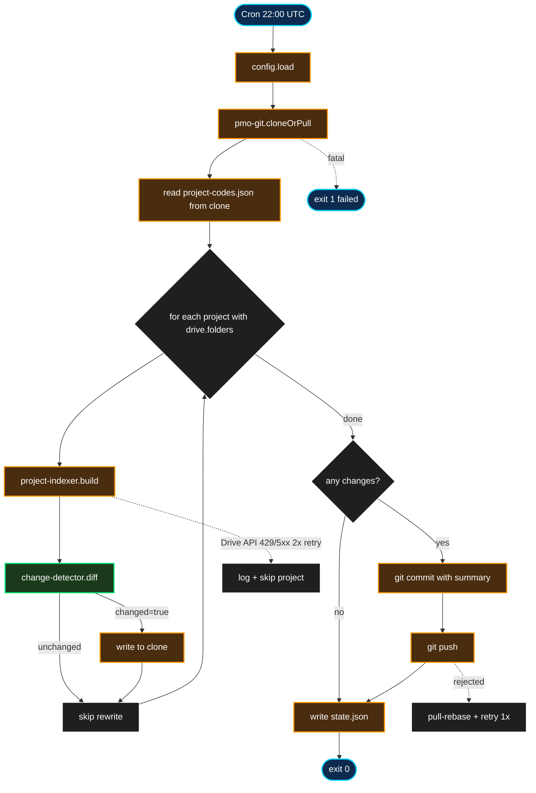

# gdrive-index — Design Spec

**Status:** Draft
**Date:** 2026-04-15
**Author:** Pedro Teruel (com JARVIS)
**Localização no infra repo:** `services/gdrive-index/`

## 1. Resumo

Formaliza o indexador de pastas Drive que hoje existe como script ad-hoc no JARVIS host (`scripts/gdrive-index.sh`), transformando-o num service padrão do infra. O service roda diariamente em `192.168.15.2`, consulta as pastas Drive de cada projeto registrado em `pmo/config/project-codes.json`, gera `drive-index.json` por projeto, e committa/pushba o resultado no repo PMO (transport via git).

**Pain que resolve:** o indexador existente é manual, não monitorado, e produz inconsistências porque roda só quando alguém lembra. Formalizar traz: cadência confiável, observabilidade via health-monitor, consistência arquitetural (mesmo padrão de auth e transport dos outros indexers — meeting-index, email-index), e shared auth lib.

**Escopo v1:** indexação diária de todos os projetos com `drive.folders[]` configurado em `project-codes.json`. Schema de output **mantido** — consumidores atuais (`/pmo` skill, engenheiros) não quebram.

## 2. Goals & non-goals

### Goals

- Rodar diariamente às 22:00 UTC em `/opt/jarvis-gdrive-index/` no infra server
- Indexar todos os projetos do PMO que têm `drive.folders[]` populado
- Produzir `pmo/projects/{code}/drive-index.json` com schema idêntico ao atual
- Usar service account direto (`googleapis` + shared lib `services/_shared/google-auth.mjs`) com domain-wide delegation impersonando `pedro@lumesolutions.com`
- Transportar output via git: clone local do PMO repo + commit + push no cada ciclo
- Change detection: zero rewrite quando nada mudou (git diff mínimo)
- State.json canônico emitido para health-monitor
- Resiliência: falha de 1 projeto não aborta os outros
- Substituir o script `scripts/gdrive-index.sh` (depreca-se na Fase 5 do rollout)

### Non-goals (v1)

- **Indexação sob demanda** (webhook, push notifications do Drive) — cron diário é suficiente
- **Indexação parcial por alteração detectada via Drive changes API** — scan completo é simples e previsível
- **Re-ranking ou filtering de entries** (ex: ocultar arquivos customer-sensitive) — schema mantido cru
- **Diff rico no commit message** (lista de arquivos added/removed) — apenas "N projects with changes"
- **Caching entre runs** — cada run faz scan completo; com service account + paginação concorrente, 25 projetos rodam em ≤20min, não vale a complexidade de cache/invalidação
- **Paralelização entre projetos** — serial é suficiente (20min total aceitável)
- **Execução interativa single-project** — `/gdrive index <code>` skill cobre esse caso

## 3. Decisões tomadas durante o brainstorming

| # | Decisão | Por quê |
|---|---|---|
| Q1 | Rewrite usando service account direto (`googleapis`) + shared auth lib `services/_shared/google-auth.mjs` | Indexers são batch mecânicos sem LLM-in-loop; service account ganha em throughput (batch APIs, concorrência nativa), debugabilidade (stack trace direto) e rate limit explícito com headers. MCP fica reservado para serviços LLM-driven (jarvis-chat, kb-generator). Chave GCP compartilhada entre os 3 indexers → zero custo marginal de segredo. |
| Q2 | Output transportado via git (clone local + commit + push no PMO repo) | PMO repo é o source of truth; consumidores via `git pull` normal; histórico auditável; padrão replicável para meeting-index e email-index |
| — | Schema `drive-index.json` mantido | Compatibilidade com `/pmo` skill e outros consumidores |
| — | Cadência diária 22:00 UTC (antes do meeting-index 23:00) | Per workflow doc; meeting-index pode consultar drive-index fresco |
| — | Change detector → zero rewrite quando nada mudou | Git diff mínimo, histórico só mostra mudanças reais |
| — | `alert_on_partial: true` no health-monitor | Queremos saber quando 1 projeto específico falha |
| — | SSH key reutilizada do github-clickup-sync para git push | Infraestrutura existente |
| — | Deprecação do script antigo em Fase 5, não antes | Rollback path em caso de problemas |

## 4. Arquitetura

### 4.1 Runtime

Node.js ESM em `/opt/jarvis-gdrive-index/` no infra server `192.168.15.2`, cron `0 22 * * *` (daily 22:00 UTC). Depende do `googleapis` npm package e do shared lib `services/_shared/google-auth.mjs` (que carrega `~/.secrets/gcp-service-account.json` e impersona `pedro@lumesolutions.com`). Autenticação git via SSH key existente.

### 4.2 Estrutura de arquivos

```
services/gdrive-index/
├── run.sh                        # cron entry; sources nvm
├── deploy.sh                     # rsync + install cron
├── package.json                  # type: module; dep: googleapis, ../_shared
├── index.mjs                     # orquestrador principal
├── config/
│   └── service.json              # repo URL, branch, paths, retry config
├── lib/
│   ├── config.mjs                # loader + validator
│   ├── drive-client.mjs          # wrapper googleapis Drive v3: listFolder, getMetadata
│   ├── project-indexer.mjs       # build drive-index.json per project
│   ├── change-detector.mjs       # PURE: diff old vs new
│   └── pmo-git.mjs               # clone/pull/add/commit/push
├── test/
│   ├── project-indexer.test.mjs  # ~8 testes
│   ├── change-detector.test.mjs  # ~6 testes
│   └── test-integration.mjs      # 1 smoke
├── data/
│   ├── pmo-clone/                # clone local persistente do PMO repo
│   └── state.json                # heartbeat canônico
└── logs/
    └── run-YYYY-MM-DD.log

services/_shared/                  # shared entre gdrive-index, meeting-index, email-index
├── google-auth.mjs                # factory: getDriveClient(), getGmailClient() — JWT + DWD
├── package.json                   # type: module; dep: googleapis, google-auth-library
└── state-writer.sh                # (já existe) bash helper canônico
```

### 4.3 Decomposição em módulos

| Módulo | Papel | Pureza |
|---|---|---|
| `project-indexer.mjs` | Build do `drive-index.json` dado project_code + lista de folders (chama drive-client recursivamente) | Lógica pura de agregação; I/O via injeção de drive-client |
| `change-detector.mjs` | `diff(oldIndex, newIndex) → {changed, added[], removed[], modified[]}` | 100% pura |
| `drive-client.mjs` | `listFolder(id, opts)`, `getMetadata(id)` via `googleapis` Drive v3 (paginação automática via `pageToken`, `supportsAllDrives=true`, `includeItemsFromAllDrives=true`); retry 2x backoff exponencial em 429/5xx | I/O (HTTP) |
| `pmo-git.mjs` | `cloneOrPull()`, `writeProject(code, data)`, `commitAll(msg)`, `push()` | I/O (git subprocess) |
| `config.mjs` | Lê `service.json` + `project-codes.json` do clone | Quase pura |
| `index.mjs` | Pipeline: `getDriveClient()` → pull → iterate → index → diff → commit changes → push → state.json | I/O composto |
| `../_shared/google-auth.mjs` | Factory compartilhada: `getDriveClient()` retorna cliente `googleapis` autenticado com JWT (service account + DWD, subject `pedro@lumesolutions.com`, scopes `drive`) | I/O de carregamento único da chave; cliente reutilizável |

Os 2 módulos puros críticos (`project-indexer` da lógica de build + `change-detector`) concentram a lógica de negócio. ~14 testes unitários cobrem seu comportamento sem I/O real.

### 4.4 Fluxo de execução



## 5. Schemas

### 5.1 `config/service.json`

```json
{
  "pmo_repo": {
    "url": "git@github.com:teruelskm/pmo.git",
    "branch": "master",
    "clone_path": "/opt/jarvis-gdrive-index/data/pmo-clone",
    "commit_author_name": "JARVIS gdrive-index",
    "commit_author_email": "jarvis-gdrive-index@strokmatic.internal"
  },
  "project_codes_path": "config/project-codes.json",
  "output_path_template": "projects/{code}/drive-index.json",
  "drive": {
    "max_depth": 10,
    "page_size": 100,
    "skip_folders": ["cache", "node_modules", ".git"],
    "skip_mime_types": []
  },
  "retry": {
    "attempts": 2,
    "backoff_ms": 2000
  }
}
```

### 5.2 `drive-index.json` — **schema mantido (compatibilidade)**

Exatamente como o script atual produz. Consumidores existentes continuam funcionando.

```json
{
  "project": "03002",
  "name": "ArcelorMittal Barra Mansa",
  "generated": "2026-04-15T22:03:18Z",
  "stats": { "folders": 12, "files": 287, "skipped": 0 },
  "sources": [
    {
      "name": "[03002] Arcelor Barra Mansa - Interno",
      "driveName": "[03] VISION KING",
      "role": "internal",
      "folderId": "1abc...",
      "entries": [
        {
          "path": "01 - Desenhos/",
          "type": "folder",
          "id": "1def...",
          "mimeType": "application/vnd.google-apps.folder",
          "size": 0
        },
        {
          "path": "01 - Desenhos/layout_v3.dwg",
          "type": "file",
          "id": "1xyz...",
          "mimeType": "image/vnd.dwg",
          "size": 1455220,
          "modifiedTime": "2026-03-18T14:22:00Z"
        }
      ]
    }
  ]
}
```

**Mudanças mínimas vs script atual:**
- `generated`: timestamp ISO completo (era só date como `2026-04-03`) — permite dedup diário precisão por hora
- `modifiedTime` por file: adicionado quando disponível no response `files.list` — usado por change-detector
- Determinismo: `entries[]` ordenado por `path` lexicográfico — garante git diff mínimo

### 5.3 `change-detector.mjs` — algoritmo

**Signature:** `diff(oldIndex, newIndex) → {changed, added[], removed[], modified[]}`

**Lógica:**
1. Build sets de entries de old e new usando `id` como chave
2. `added` = ids em new não em old
3. `removed` = ids em old não em new
4. `modified` = ids em ambos com `modifiedTime` ou `size` diferentes
5. `changed = added.length + removed.length + modified.length > 0`

**Usos:**
- Decidir se rewrite o arquivo (se unchanged → skip write, git diff fica limpo)
- Contagens para commit message e state.json details

**Edge case:** primeira run (oldIndex ausente) → changed=true, todas entries em added.

### 5.4 `state.json` — heartbeat canônico

```json
{
  "service": "gdrive-index",
  "last_run": "2026-04-15T22:08:42Z",
  "last_status": "success",
  "duration_ms": 418000,
  "exit_code": 0,
  "details": {
    "projects_scanned": 25,
    "projects_indexed": 22,
    "projects_skipped_no_drive_config": 3,
    "projects_with_changes": 7,
    "projects_failed": 0,
    "total_files_indexed": 4823,
    "git_commit_sha": "abc1234",
    "pushed": true
  }
}
```

Semântica:
- `success` — zero falhas, git push OK (inclusive no-op push quando nada mudou)
- `partial` — ≥1 projeto falhou, outros indexados, commit só dos que funcionaram
- `failed` — erro fatal (git clone/pull falhou, config inválida, push rejeitado após retry)

### 5.5 Commit message

Com mudanças:
```
chore(gdrive-index): daily refresh — 7 projects with changes

Changed: 01001, 02004, 02008, 03002, 03007, 03008, 03010
Unchanged: 14 projects
Skipped: 3 projects (no drive.folders configured)

Total: 25 projects scanned, 4823 files indexed, 418s duration

Co-Authored-By: JARVIS gdrive-index <jarvis-gdrive-index@strokmatic.internal>
```

Sem mudanças: pipeline pula `git commit` + `git push` (no-op). state.json atualizado normalmente com `projects_with_changes: 0`, `git_commit_sha: null`, `pushed: false`.

## 6. Tratamento de erros

| Cenário | Retry | Ação | state.json |
|---|---|---|---|
| `pmo-git.cloneOrPull` falha (rede, auth, conflito) | 1x | Abort ciclo | `failed` |
| `drive-client.listFolder` 1 folder | 2x backoff | Skip folder, `stats.skipped++`, continua projeto | `partial` se ≥1 skip |
| Todos os folders de 1 projeto falham | 2x cada | Skip projeto inteiro, log, próximo | `partial` |
| Write do `drive-index.json` falha | N/A | Abort (disk issue) | `failed` |
| `git commit` falha | N/A | Log, sem push, próximo ciclo tenta | `partial` |
| `git push` rejected | 1x: pull-rebase + retry | Se ainda falhar, deixa commits locais | `partial` |
| Config `service.json` inválido | N/A | Abort no startup | `failed` |
| Projeto sem `drive.folders[]` | N/A | Skip silencioso (`projects_skipped_no_drive_config++`) | `success` |
| Folder ID retorna 404 | 1x | Skip folder, log, continua | `partial` |

**Princípio:** preferir `partial + completar o que dá` a `failed + parar tudo`.

## 7. Integração com infraestrutura existente

| Componente | Mudança |
|---|---|
| `services/health-monitor/config/services.json` | Adiciona entry `gdrive-index` com `added_at: null`; flip após Fase 4 |
| PMO repo (`teruelskm/pmo`) | Commits diários do JARVIS vão aparecer; SSH key autorizada necessária (reutiliza `gui-strokmatic` key) |
| `scripts/gdrive-index.sh` no JARVIS host | Depreciado na Fase 5; move para `scripts/deprecated/` |
| `/pmo <code>` skill | Continua funcionando — schema mantido |
| `/gdrive index <code>` skill | Continua útil para ad-hoc interativo |
| `services/_shared/google-auth.mjs` | **Novo** — shared lib criado pelo gdrive-index (primeiro consumidor). Espelha `mcp-servers/lib/google-auth.mjs` do JARVIS (mesmo padrão de JWT + DWD). Reutilizado por meeting-index e email-index. |
| `~/.secrets/gcp-service-account.json` | Replicado do JARVIS (`config/credentials/gcp-service-account.json`). Mode 0600, owner `strokmatic`. Compartilhado entre os 3 indexers. |

## 8. Testes

### 8.1 Unitários (`node:test`)

| Arquivo | Contagem | Cobertura |
|---|---|---|
| `project-indexer.test.mjs` | ~8 | 1 folder simples, N folders, recursive deep, skip_folders aplicado, max_depth limit, folder ID inválido, projeto sem drive.folders, schema output validado |
| `change-detector.test.mjs` | ~6 | Old null → all added, identical → changed=false, 1 added, 1 removed, 1 modified (by modifiedTime), combinações múltiplas |

Total: ~14 testes. Rodam em <500ms. Zero I/O externo.

### 8.2 Integration smoke (`test-integration.mjs`)

1. tmpdir com `git init` simula o PMO clone
2. Mock `drive-client` retorna fixture de 2 projetos (1 com 5 arquivos, 1 com 12)
3. Spawn `node index.mjs` com env: `HM_CONFIG_PATH`, `HM_DATA_DIR`, `HM_SKIP_PUSH=1`
4. Assertions:
   - 2 `drive-index.json` gerados em `<tmp>/projects/{code}/`
   - Git commit único criado com message correto
   - `HM_SKIP_PUSH=1` impediu push (verificado via `git log origin/master..HEAD`)
   - state.json `projects_indexed: 2`, `projects_with_changes: 2`

### 8.3 Manual em produção

- `HM_DRY_RUN=1` flag: scan + diff + plan commit, não escreve nem commita
- Review do log: commit message esperado, projetos afetados, durações
- `HM_ONLY_PROJECT=03002`: scope para 1 projeto só, útil para validação em Fase 3

## 9. Rollout em fases

**Fase 0 — Setup (one-time manual):**

1. Verificar SSH key do `strokmatic@192.168.15.2` tem push access ao PMO (reutiliza setup do github-clickup-sync)
2. `ssh strokmatic@192.168.15.2 'git clone git@github.com:teruelskm/pmo.git /opt/jarvis-gdrive-index/data/pmo-clone'`
3. Verificar `git push --dry-run` funciona do clone
4. **Copiar GCP service account key** do JARVIS (`config/credentials/gcp-service-account.json`) para `/home/strokmatic/.secrets/gcp-service-account.json` no infra. Setup: `chmod 600`, owner `strokmatic`. Primeiro service do infra a usar GCP direto — esse arquivo passa a ser shared pelos demais indexers.
5. **Criar shared lib `services/_shared/google-auth.mjs`** espelhando `mcp-servers/lib/google-auth.mjs` do JARVIS (mesma lógica JWT + DWD, subject `pedro@lumesolutions.com`, scopes parametrizáveis). Criar também `services/_shared/package.json` declarando deps `googleapis` + `google-auth-library`. Deploy via rsync do `services/_shared/` para `/opt/_shared/` no servidor.
6. Smoke test da auth: `node -e "import('./services/_shared/google-auth.mjs').then(m => m.getDriveClient({scopes:['https://www.googleapis.com/auth/drive']}).then(c => c.files.list({pageSize:1})).then(r => console.log(r.data)))"` — deve listar 1 arquivo do Drive do Pedro.

**Fase 1 — Implementation + tests (local):**

1. Build `project-indexer.mjs` e `change-detector.mjs` TDD (~14 testes)
2. Build `drive-client.mjs` + `pmo-git.mjs`
3. Build `config.mjs` + `index.mjs`
4. Integration smoke passing
5. `run.sh` + `deploy.sh`

**Fase 2 — Deploy + dry-run:**

1. `bash deploy.sh`
2. `HM_DRY_RUN=1 node index.mjs` manualmente
3. Review: duração total, commit message, projetos identificados
4. Ajustar `skip_folders` se necessário

**Fase 3 — Single-project ativação:**

1. `HM_ONLY_PROJECT=03002 node index.mjs`
2. Verifica drive-index.json atualizado, commit pushed, outra máquina recebe via `git pull`
3. Se OK, prepara Fase 4

**Fase 4 — Ativação plena + health-monitor:**

1. Install cron (`0 22 * * *`) via `deploy.sh`
2. Primeiro ciclo automático à noite
3. Monitor pela manhã: state.json, health-summary.md, git log PMO
4. Registra no `health-monitor/config/services.json` (`added_at: now`)

**Fase 5 — Deprecação do script antigo:**

1. Mover `scripts/gdrive-index.sh` para `scripts/deprecated/gdrive-index.sh.DEPRECATED`
2. Adicionar nota no topo apontando para o service novo
3. Remover qualquer cron JARVIS-host que chama o script antigo (nenhum instalado hoje, mas verificar)

## 10. Critérios de sucesso v1

- 22 projetos com `drive.folders[]` configurados são indexados diariamente
- Commits noturnos aparecem no PMO repo — `git log` mostra atividade diária
- Zero conflitos de git push após 2 semanas de operação (test: commit manual + run do service = pull-rebase limpo)
- Duração média: ≤20 minutos total (25 projetos × ~50s cada)
- `git diff` entre runs é mínimo quando nada mudou no Drive (determinismo)
- Health-monitor reporta `healthy` consistentemente
- `/pmo <code>` skill funciona sem mudanças (schema mantido)

## 11. Itens deferidos para v1.1+

- **Paralelização entre projetos** — se 20min for muito, pode rodar 4 em paralelo (cap de concorrência por quota do Drive API)
- **Drive Changes API** para indexação incremental (delta sync) em vez de scan completo
- **Webhook / push notifications do Drive** para ingestão quasi-real-time
- **Diff rico no commit message** (lista de arquivos added/removed em cada projeto)
- **Indexação sob demanda via MCP tool** (`mcp__jarvis__reindex_project`)
- **Caching do Drive API response** entre runs (invalidar por modifiedTime)
- **Deprecação do `/gdrive index` skill** quando a cobertura do batch for 100%

## 12. Config exemplo completa

### 12.1 `config/service.json`

Ver seção 5.1.

### 12.2 Cron entry

```
0 22 * * * . /home/strokmatic/.nvm/nvm.sh && cd /opt/jarvis-gdrive-index && bash run.sh >> /opt/jarvis-gdrive-index/logs/cron.log 2>&1
```

Adicionado via `deploy.sh` idempotente, segue padrão dos outros services do infra.
