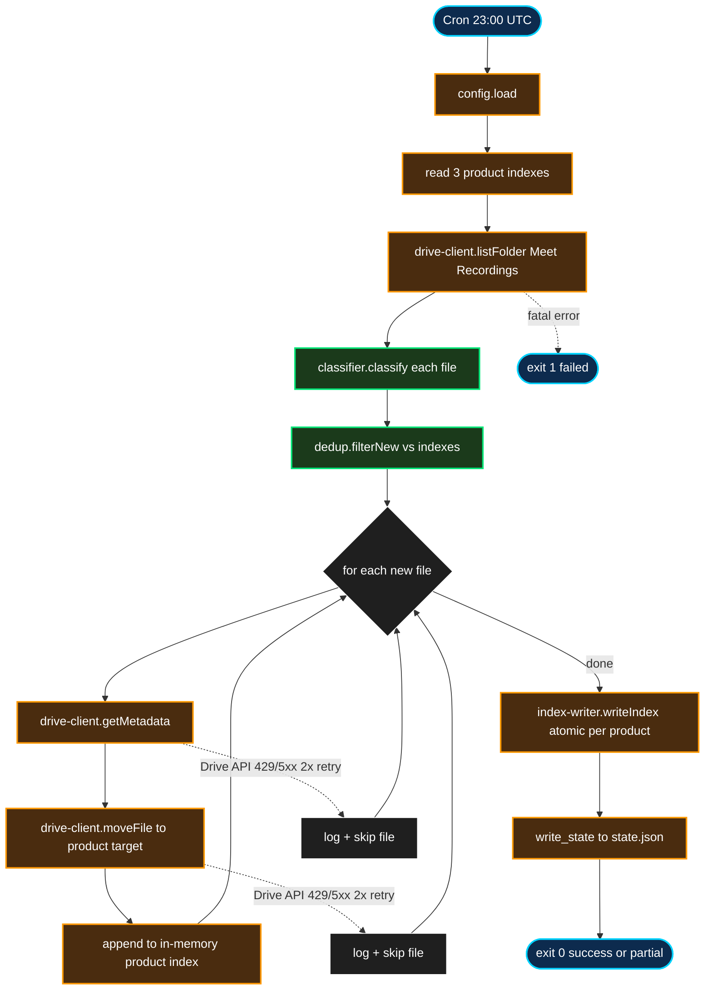

# meeting-index — Design Spec

**Status:** Draft
**Date:** 2026-04-15
**Author:** Pedro Teruel (com JARVIS)
**Localização no infra repo:** `services/meeting-index/`

## 1. Resumo

Serviço daily que organiza as notas de reunião geradas automaticamente pelo Gemini. Atualmente os arquivos ficam em `Meu Drive / Meet Recordings`, misturados com reuniões ad-hoc, reuniões com clientes, e os defaults do Gemini (`Reunião iniciada às ...`). O serviço move os 3 tipos de reunião recorrentes (daily, início de sprint, encerramento de sprint) para as pastas organizadas `[0N] Produto / 00 - Anotações Reuniões / ` nos 3 product drives, e mantém um index JSON por produto com metadados consumíveis por outros serviços (kb-generator futuro, jarvis-chat).

**Pain que resolve:** notas de reunião importantes ficam soltas no Meu Drive do Pedro. Encontrar a daily de ontem exige caçar; o time não tem acesso fácil a atas históricas; `jarvis-chat` não consegue referenciar "o que foi decidido na daily de terça" porque não há fonte consolidada.

**Escopo v1 (Phase 1):** só organização + metadados. Extração de action items, decisões e summaries fica para Phase 2 (acoplada ao kb-generator).

## 2. Goals & non-goals

### Goals

- Identificar no `Meet Recordings` os 3 tipos de reunião recorrentes (daily, sprint_start, sprint_end) dos 3 produtos (DieMaster, SpotFusion, VisionKing)
- Classificar cada arquivo via matching de regex permissivo sobre o filename (aliases múltiplos por produto e por tipo, ordem flexível)
- Mover arquivos classificados para `[0N] Produto / 00 - Anotações Reuniões /`
- Mover não-classificados para um subfolder dedicado `Meet Recordings / Não classificado/` (ou deixar intocados se flag desabilitada)
- Escrever index JSON per-product em `pmo/products/{produto}/meetings/index.json` com metadados (drive_file_id, date, title_clean, meeting_type, links)
- Idempotência: re-runs não duplicam entradas, não re-movem arquivos já processados
- Falhas parciais não abortam o ciclo (skip + log + continue)
- Integrar com health-monitor via state.json canônico

### Non-goals (v1)

- **Extração de conteúdo** (action items, decisões, summary) — Phase 2, acoplada ao kb-generator
- **Reuniões não-recorrentes** (alinhamentos ad-hoc, reuniões de cliente, técnicas gerais) — ficam em subfolder "Não classificado" ou intocadas
- **Reuniões com nome do Gemini default** (`Reunião iniciada às YYYY/MM/DD`) — mesmo status acima
- **Webhook-based triggering** — cron diário é suficiente
- **Cross-project para projetos específicos** (ex: daily VK 03002 Nissan) — o meeting é per-produto, não per-projeto (conforme workflow doc §Estrutura do PMO)
- **Content OCR/parsing** — tudo vem como Google Doc nativo; Phase 2 vai extrair conteúdo via MCP LLM-driven, não via parsing cru
- **Retroactive indexing de arquivos já arquivados** — Phase 2 opcional via flag `RECONCILE=1`

## 3. Decisões tomadas durante o brainstorming

| # | Decisão | Por quê |
|---|---|---|
| Q1 | Escopo restrito aos 3 tipos (daily, sprint_start, sprint_end) com matching determinístico por regex | Convenção de nomeação estável, sem ambiguidade; zero LLM no hot path |
| Q1 aliases | Aceita variações históricas: "Smart Die"/"Die Master"/"SmartDie"/"DieMaster", "Spark Eyes"/"Spot Fusion"/"SparkEyes"/"SpotFusion", "Vision King"/"VisionKing"/"VK" | Vocabulário real usado pelo time ao longo de 18 meses |
| Q1 posição | Regex permissivo: produto + tipo em qualquer ordem, qualquer posição no título | "Daily Smart Die" e "Smart Die - Daily" devem bater |
| Q1 acentuação | "Início" e "Inicio" ambos aceitos (e qualquer outro diacrítico normalizado) | Inconsistência inevitável na entrada humana |
| Q1 fallback | Não-classificados movidos para `Meet Recordings / Não classificado/` (se configurado) OU intocados | Evita move_file errado; subfolder facilita triagem manual |
| Q2 | Schema mínimo (só metadados), extensível para action items em v2 | YAGNI — sem consumidor de action items ainda (kb-generator não existe) |
| — | Cadência daily 23:00 UTC | Conforme workflow doc |
| — | Dedup via `drive_file_id` como chave primária nas entries | Único identificador estável |
| — | I/O Drive via service account direto (`googleapis`) + shared lib `services/_shared/google-auth.mjs` | Indexer batch mecânico sem LLM-in-loop; service account ganha em throughput, batch APIs e debugabilidade; compartilha chave e auth lib com gdrive-index e email-index (custo marginal zero). MCP fica reservado para jarvis-chat e kb-generator. |
| — | `target_folder_id` por produto resolvido uma vez e hardcoded em config | Estático; evita `list_folder` a cada run |

## 4. Arquitetura

### 4.1 Runtime

Node.js ESM, cron `0 23 * * *` (daily 23:00 UTC), rodando em `/opt/jarvis-meeting-index/` no infra server `192.168.15.2`. Depende do `googleapis` npm e do shared lib `services/_shared/google-auth.mjs` (JWT + DWD impersonando `pedro@lumesolutions.com`, scope `drive`). Shared lib e GCP key já foram provisionados pelo gdrive-index (primeiro service do infra a consumir GCP).

### 4.2 Estrutura de arquivos

```
services/meeting-index/
├── run.sh                        # cron entry; sources nvm; wraps node
├── deploy.sh                     # rsync + install cron
├── package.json                  # type: module; dep: googleapis, ../_shared
├── index.mjs                     # orquestrador principal
├── config/
│   ├── products.json             # aliases + Drive folder IDs
│   └── patterns.json             # regex de meeting types
├── lib/
│   ├── config.mjs                # loader + validador
│   ├── drive-client.mjs          # wrapper googleapis Drive v3 (list/move/metadata, supportsAllDrives=true)
│   ├── classifier.mjs            # PURE: (filename) → {product, type} | null
│   ├── index-writer.mjs          # I/O: read/write pmo/products/{prod}/meetings/index.json atomic
│   └── dedup.mjs                 # PURE: (scanned, indexes) → new_files
├── test/
│   ├── classifier.test.mjs       # ~20 testes
│   ├── dedup.test.mjs            # ~8 testes
│   ├── config.test.mjs           # ~4 testes
│   └── test-integration.mjs      # 1 smoke test end-to-end
├── data/
│   └── state.json                # health-monitor heartbeat
└── logs/
    └── run-YYYY-MM-DD.log
```

### 4.3 Decomposição em módulos

| Módulo | Papel | Pureza |
|---|---|---|
| `classifier.mjs` | Regex permissivo sobre filename → `{product, meeting_type, matched_text}` ou `null` | 100% pura |
| `dedup.mjs` | Compara scanned files com indexes existentes, retorna só novos | 100% pura |
| `config.mjs` | Lê `products.json` + `patterns.json`, valida, retorna normalizado | Quase pura |
| `drive-client.mjs` | `listFolder(id)`, `moveFile(id, fromParent, toParent)` (com `supportsAllDrives=true`), `getMetadata(id)` via `googleapis` Drive v3; retry 2x backoff em 429/5xx | I/O (HTTP) |
| `index-writer.mjs` | `readIndex()`, `writeIndex()` com atomic tmp+rename | I/O (filesystem) |
| `index.mjs` | Pipeline: `getDriveClient()` → load → scan → classify → dedup → move + upsert → write state | I/O composto |
| `../_shared/google-auth.mjs` | Factory compartilhada (provisionada pelo gdrive-index): `getDriveClient({scopes:['drive']})` retorna cliente `googleapis` autenticado | I/O de carregamento único |

Os 2 módulos puros (`classifier`, `dedup`) carregam toda a lógica de negócio. ~28 testes unitários cobrem seu comportamento sem I/O.

### 4.4 Fluxo de execução



## 5. Schemas

### 5.1 `config/products.json`

```json
{
  "source_folder_id": "1joPKNyMqkyqtyboMJ0xxq8nLXbABmCm2",
  "unclassified_folder_id": "<criar one-time e preencher>",
  "products": {
    "diemaster": {
      "aliases": ["Smart Die", "SmartDie", "Die Master", "DieMaster"],
      "product_drive_id": "0ALpYWXApVGjKUk9PVA",
      "target_folder_id": "<resolver one-time>"
    },
    "spotfusion": {
      "aliases": ["Spot Fusion", "SpotFusion", "Spark Eyes", "SparkEyes"],
      "product_drive_id": "0AAUuVGQz7cyDUk9PVA",
      "target_folder_id": "<resolver one-time>"
    },
    "visionking": {
      "aliases": ["Vision King", "VisionKing", "VK"],
      "product_drive_id": "0ALRu7RfQZ9ukUk9PVA",
      "target_folder_id": "<resolver one-time>"
    }
  }
}
```

**Semântica de `target_folder_id: null`**: produto ainda não ativado — classifier pode bater mas service não tenta mover; deixa em Meet Recordings. Útil durante rollout gradual por produto.

**Semântica de `unclassified_folder_id: null`**: arquivos não classificados ficam intocados em Meet Recordings (você segue organizando manualmente). Se preenchido, serviço move pra lá.

### 5.2 `config/patterns.json`

```json
{
  "meeting_types": [
    {
      "type": "daily",
      "aliases": ["Daily", "Daily Standup", "Standup"]
    },
    {
      "type": "sprint_start",
      "aliases": ["Início de Sprint", "Inicio de Sprint", "Abertura de Sprint"]
    },
    {
      "type": "sprint_end",
      "aliases": ["Encerramento de Sprint", "Final de Sprint", "Fim de Sprint", "Encerramento de Sprint e Refinamento"]
    }
  ],
  "gemini_suffix_pattern": "\\s*-\\s*\\d{4}[/-]\\d{2}[/-]\\d{2}\\s+\\d{2}:\\d{2}.*Anotações do Gemini$"
}
```

### 5.3 `classifier.mjs` — algoritmo

**Signature:** `classify(filename, config) → {product, meeting_type, matched_text} | null`

**Passos:**
1. Strip do sufixo Gemini via `gemini_suffix_pattern`. Resultado: `title_clean`.
2. Normaliza: lowercase + `title_clean.normalize('NFD').replace(/[\u0300-\u036f]/g, '')` (remove acentos) + colapsa whitespace.
3. Itera `config.meeting_types`: primeiro alias que aparece como substring → `meeting_type`.
4. Itera `config.products`: primeiro alias que aparece como substring → `product`.
5. Ambos presentes → retorna `{product, meeting_type, matched_text: title_clean}`. Qualquer um ausente → `null`.

**Ordem irrelevante.** `"Daily Smart Die"` e `"Smart Die - Daily"` e `"Reunião Daily Smart Die reforçada"` todos batem.

### 5.4 `dedup.mjs`

**Signature:** `filterNew(scannedFiles, allIndexes) → filesToProcess`

`allIndexes` é concatenação dos 3 product indexes com `drive_file_id` como chave global. Qualquer arquivo scanned cujo `id` já aparece em qualquer index é skip (já processado, mesmo que em produto diferente — impossível por design, mas defensivo).

### 5.5 `meetings/index.json` per-product

**Path:** `pmo/products/{produto}/meetings/index.json` (no repo PMO, não no infra)

```json
{
  "generated_at": "2026-04-15T23:00:00Z",
  "product": "diemaster",
  "meetings": [
    {
      "drive_file_id": "1Q7326FUU9ekZuETNiTNfgMPGmtqJd6xIY_8pb3aC3Wc",
      "drive_web_link": "https://docs.google.com/document/d/1Q7326.../edit",
      "title_original": "Daily Smart Die - 2026/04/15 08:30 GMT-03:00 - Anotações do Gemini",
      "title_clean": "Daily Smart Die",
      "meeting_type": "daily",
      "meeting_date": "2026-04-15",
      "created_time": "2026-04-15T11:30:00Z",
      "modified_time": "2026-04-15T12:45:00Z",
      "size_bytes": 40171,
      "indexed_at": "2026-04-15T23:00:00Z",
      "moved_to_folder_id": "1PL5zJo39OKq...",
      "classification_confidence": "exact_match"
    }
  ]
}
```

**Campos-chave:**
- `drive_file_id`: primary key de dedup
- `meeting_date`: parseado do sufixo Gemini (YYYY/MM/DD), não do conteúdo
- `title_clean`: título após strip do sufixo — útil para grep humano e para display
- `indexed_at`: quando a entry entrou no index (pode ser > meeting_date se processamento atrasou)
- `moved_to_folder_id`: rastreabilidade

**Extensibilidade v2** (sem breaking changes): adicionar opcionais `action_items[]`, `decisions[]`, `summary`, `participants[]`, `action_items_extracted_at`.

**Ordenação:** array ordenado por `meeting_date` desc (mais recente primeiro). Upsert garante isso.

### 5.6 `state.json` (heartbeat canônico)

```json
{
  "service": "meeting-index",
  "last_run": "2026-04-15T23:00:42Z",
  "last_status": "success",
  "duration_ms": 18500,
  "exit_code": 0,
  "details": {
    "files_scanned": 12,
    "files_classified": 3,
    "files_moved": 3,
    "files_unclassified": 2,
    "files_skipped_dedup": 7,
    "errors": 0
  }
}
```

`last_status`:
- `success` — zero erros, qualquer combinação de moved/skipped/unclassified
- `partial` — `errors > 0` mas `files_scanned > 0` (pelo menos listou)
- `failed` — `list_folder` do source falhou, config inválida, ou outro erro fatal

## 6. Tratamento de erros

| Cenário | Retry? | Ação se falha persiste | state.json |
|---|---|---|---|
| `list_folder` do Meet Recordings | 2x backoff | Abort ciclo | `failed` |
| `get_file_metadata` de 1 arquivo | 2x backoff | Skip arquivo, log, continua | `partial` se ≥1 skip |
| `move_file` falha | 2x backoff | Skip arquivo (não adiciona ao index), próximo ciclo tenta de novo | `partial` |
| Classifier encontra match mas `target_folder_id: null` | N/A | Log warning, deixa em Meet Recordings, não adiciona ao index | `success` |
| `index-writer` falha | N/A | Abort (sem index, arquivos já movidos ficam órfãos — reconciliation futura) | `failed` |
| Config `products.json` inválida ou ausente | N/A | Abort no startup | `failed` |
| Arquivo em Meet Recordings sem conteúdo (size 0, corrupted) | N/A | Move normal (é apenas metadata que importa) | `success` |

**Idempotência:** rodar o service 2x seguidas sem nada novo = zero operations destrutivas. Segunda execução: `list_folder` retorna só arquivos não-movidos (os anteriores já saíram), classifier roda, dedup filtra tudo, moves = 0, index rewritten identical.

## 7. Integração com infraestrutura existente

| Componente | Mudança |
|---|---|
| `services/health-monitor/config/services.json` | Adicionar entry `meeting-index` com `added_at: null` inicialmente; flip após Fase 3 do rollout |
| `pmo/products/{diemaster,spotfusion,visionking}/` | Diretórios CRIADOS pelo primeiro run do service (via `mkdir -p`). Arquivos committed manualmente por Pedro depois do primeiro index ser escrito (ou via cron separado se quiser). |
| Google Drive `Meu Drive / Meet Recordings` | Source. Service faz `files.list` + `files.update` (reparent) aqui. |
| Google Drive `[0N] Produto / 00 - Anotações Reuniões` | Target. Um por produto. IDs hardcoded em config. Shared Drive — requer `supportsAllDrives=true` + `includeItemsFromAllDrives=true`. |
| Google Drive `Meu Drive / Meet Recordings / Não classificado` | Novo subfolder, criado manualmente one-time. |
| `services/_shared/google-auth.mjs` | Shared lib provisionado pelo gdrive-index (primeiro a implementar). Reusa o mesmo arquivo em `/opt/_shared/`. Scope: `drive`. |
| `~/.secrets/gcp-service-account.json` | Já copiado pelo setup do gdrive-index. Zero mudança para meeting-index. |

## 8. Testes

### 8.1 Unitários (`node:test`)

| Arquivo | Contagem | Cobertura |
|---|---|---|
| `classifier.test.mjs` | ~20 | Cada combinação de alias (produto × tipo), acentuação, ordem invertida, false positives (COMAU, GVT, Alinhamento Geral), edge cases (empty, só sufixo) |
| `dedup.test.mjs` | ~8 | Indexes vazios, overlap parcial, file em index de produto diferente, duplicates entre products, scanned vazio, index malformed |
| `config.test.mjs` | ~4 | Config válida, missing required field, unknown product, regex inválido |

Total: ~32 testes. Rodam em <500ms. Zero I/O externo, zero mocks complexos.

### 8.2 Integration smoke (`test-integration.mjs`)

1 teste end-to-end:
1. `mkdtempSync` para fake PMO + fake data dir
2. Mock do `drive-client` (retorna 5 arquivos fixture: 3 classificáveis diferentes produtos, 1 unclassified, 1 já em index)
3. Spawn `node index.mjs` com env overrides (`HM_SKIP_MOVE=1`, `HM_CONFIG_PATH=...`, `HM_DATA_DIR=...`, `HM_PMO_ROOT=...`)
4. Asserts:
   - 3 entries novas em 3 indexes (1 por produto)
   - 1 unclassified "moved" via mock (ou deixado, conforme fixture config)
   - 1 dedup'd (zero operations)
   - `state.json` com `last_status: success`, `files_moved: 3`, `files_unclassified: 1`, `files_skipped_dedup: 1`

### 8.3 Manual em produção (pré-ativação)

1. Deploy + `HM_DRY_RUN=1 node index.mjs` — scan + classify + plan moves, não executa. Log completo review.
2. Ajustar `patterns.json` se aparecer falso positivo ou negativo inesperado.
3. Ativar 1 produto (`target_folder_id` preenchido) → monitor 1 semana.
4. Ativar os outros 2.

## 9. Rollout em fases

**Fase 0 — Setup (manual, one-time):**

1. **Pré-requisito:** `services/_shared/google-auth.mjs` + `~/.secrets/gcp-service-account.json` já devem estar setup no infra (provisionados pelo gdrive-index §9 Fase 0). Se meeting-index for implementado antes, replicar os passos 4-6 daquele spec.
2. Resolver IDs:
   - Usar o próprio `drive-client` (smoke script) em cada product drive (`[01] SMART DIE`, `[02] SPOT FUSION`, `[03] VISION KING`) → encontrar folder `00 - Anotações Reuniões` → pegar IDs
   - Criar folder `Meu Drive / Meet Recordings / Não classificado` → pegar ID
3. Popular `config/products.json` com os IDs
4. `mkdir -p pmo/products/{diemaster,spotfusion,visionking}/meetings/` no PMO repo

**Fase 1 — Implementation + local tests:**

1. Build modules (TDD: classifier.mjs + dedup.mjs primeiro, ~32 testes)
2. Build I/O modules (drive-client, index-writer, config)
3. Build orchestrator (index.mjs) + integration smoke
4. Build run.sh + deploy.sh seguindo padrão health-monitor
5. Tudo rodando localmente, suite green

**Fase 2 — Deploy + dry run:**

1. Deploy via `bash deploy.sh` → `/opt/jarvis-meeting-index/`
2. `HM_DRY_RUN=1 node index.mjs` manualmente
3. Review output com Pedro: classifier acertou? Aliases suficientes? Falsos positivos?
4. Iterar config até estável

**Fase 3 — Ativação gradual:**

1. Ativar só 1 produto (VisionKing primeiro — convenção mais estável conforme audit)
2. Rodar cron 1 semana
3. Monitor resultados: `pmo/products/visionking/meetings/index.json` cresce corretamente; zero falsos positivos
4. Ativar os outros 2 produtos (preencher `target_folder_id`)

**Fase 4 — Integração com health-monitor:**

1. Adicionar entry `meeting-index` em `services/health-monitor/config/services.json`
2. `added_at` = timestamp atual
3. Health-monitor passa a vigiar o service

**Fase 5 — Reconciliação retroativa (opcional):**

1. Rodar `RECONCILE=1 node index.mjs` manualmente
2. Scan dos 3 target folders (cada `00 - Anotações Reuniões` com 95-116 arquivos históricos)
3. Adiciona entries para cada arquivo já arquivado que não está no index
4. Popula index retroativamente sem mover nada

## 10. Critérios de sucesso v1

- Dailies + sprint_start + sprint_end dos 3 produtos saem do Meu Drive em ≤24h após criação
- Zero falsos positivos (arquivos não-meeting movidos pra pasta de produto) em 2 semanas
- ≤1 falso negativo por semana (reunião que deveria ter sido movida mas ficou em Meet Recordings) — aceitável, mesmo dentro da margem de convenção humana
- `pmo/products/*/meetings/index.json` cresce com entries válidas, git visível para o time
- `health-summary.md` mostra `meeting-index` como `healthy`
- Config `patterns.json` estabilizou em ≤2 semanas (sem ajustes semanais)

## 11. Itens deferidos para v1.1+

- **Phase 2: content extraction** — porta o prompt do meeting-assistant MCP, adiciona `action_items[]`, `decisions[]`, `summary`, `participants[]` a cada entry. Acoplado ao kb-generator.
- **RECONCILE mode** para indexar retroativamente arquivos já arquivados manualmente
- **Participants extraction from Drive metadata** (owner, sharedWith) em vez de parsear conteúdo
- **LLM fallback** para arquivos que não batem no regex (classes 2 e 3 do brainstorming: client names, ambíguos)
- **Webhook / Drive push notifications** para ingestão quasi-real-time em vez de daily
- **Cross-product meetings routing** (ex: daily conjunta Die Master + Spot Fusion) — hoje classifier pega o primeiro match
- **Retroactive re-classification** se `patterns.json` mudar após arquivos já indexados

## 12. Config exemplo completa (`services/meeting-index/config/`)

### 12.1 `products.json`

```json
{
  "source_folder_id": "1joPKNyMqkyqtyboMJ0xxq8nLXbABmCm2",
  "unclassified_folder_id": null,
  "products": {
    "diemaster": {
      "aliases": ["Smart Die", "SmartDie", "Die Master", "DieMaster"],
      "product_drive_id": "0ALpYWXApVGjKUk9PVA",
      "target_folder_id": null
    },
    "spotfusion": {
      "aliases": ["Spot Fusion", "SpotFusion", "Spark Eyes", "SparkEyes"],
      "product_drive_id": "0AAUuVGQz7cyDUk9PVA",
      "target_folder_id": null
    },
    "visionking": {
      "aliases": ["Vision King", "VisionKing", "VK"],
      "product_drive_id": "0ALRu7RfQZ9ukUk9PVA",
      "target_folder_id": null
    }
  }
}
```

Todos os `target_folder_id: null` inicialmente — Pedro preenche conforme resolve os IDs na Fase 0.

### 12.2 `patterns.json`

Ver seção 5.2.

### 12.3 Cron entry (adicionado em `crontab -l` do `strokmatic@192.168.15.2`)

```
0 23 * * * . /home/strokmatic/.nvm/nvm.sh && cd /opt/jarvis-meeting-index && bash run.sh >> /opt/jarvis-meeting-index/logs/cron.log 2>&1
```

Segue padrão das outras entries.
