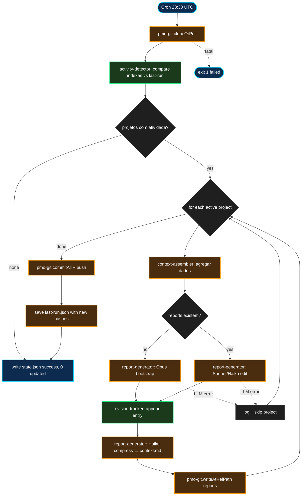

# kb-generator — Design Spec

**Status:** Draft
**Date:** 2026-04-16
**Author:** Pedro Teruel (com JARVIS)
**Localização no infra repo:** `services/kb-generator/`

## 1. Resumo

Serviço diário que detecta projetos com atividade recente, gera/atualiza 4 reports por projeto (overview, status, sprint, context.md) via LLM, e commita no PMO repo. Opera como **editor cirúrgico** — não reescreve reports do zero, apenas atualiza seções afetadas por mudanças nos dados. Mantém tabela de revisão no footer de cada report rastreando todas as alterações.

**Pain que resolve:** reports de projeto ficam desatualizados porque ninguém tem tempo de mantê-los. O kb-generator automatiza a atualização diária com base nos dados que os indexers já coletam (emails, drive, meetings, chat facts, ClickUp tasks).

**Escopo v1:** edição incremental de 4 reports por projeto com atividade. Publicação apenas no PMO repo. Detecção de atividade via PMO indexes + chat facts + ClickUp state.

## 2. Goals & non-goals

### Goals

- Rodar diariamente às 23:30 UTC em `/opt/jarvis-kb-generator/`
- Detectar projetos com atividade via comparação de hashes/timestamps dos indexes (drive, email, meetings) + chat facts + ClickUp state
- Gerar/atualizar 4 reports per projeto: `overview.md`, `status.md`, `sprint.md`, `context.md`
- Edição cirúrgica: preservar conteúdo existente, alterar apenas o que mudou
- Tabela de revisão (`## Histórico de revisões`) appendada ao footer de cada report modificado
- Bootstrap com Opus (primeira geração); edições com Sonnet/Haiku
- Transport via pmo-git (clone + commit + push no PMO repo)
- State.json canônico para health-monitor

### Non-goals (v1)

- **`decisions.md`** — extração semântica de decisões (v1.1, quando fact-extractor tiver campo de decisões)
- **Publicação no knowledge-base repo** — v1.1, requer mapping PMO → KB structure
- **Notificação de reports atualizados** via jarvis-chat (v1.1)
- **Regeneração de seções estáticas** (architecture, responsibilities) — mantidas manualmente
- **Reports cross-product** (plataforma, operações) — v1.1

## 3. Decisões tomadas durante o brainstorming

| # | Decisão | Por quê |
|---|---|---|
| Q1 | Incremental por projeto (não regenera tudo) | Minimiza custo de tokens, foca em freshness onde importa |
| Q2 | PMO como staging, KB como publicação (v1 só PMO) | PMO já é consumido por bots; publicação no KB repo deferida pra v1.1 |
| Q3 | 4 reports v1: overview, status, sprint, context.md (sem decisions) | decisions requer parsing semântico que fact-extractor ainda não faz |
| Q4 | Detecção de atividade: PMO indexes + chat facts + ClickUp state | Cobertura completa de todas as fontes de mudança |
| Q5 | 2 prompts por projeto: Call 1 (overview+status+sprint) + Call 2 (context.md como compressão) | context.md é derivado dos outros 3, faz sentido gerar depois |
| Q6 | Sonnet pra overview edições, Haiku pra status/sprint/context edições | Balanço qualidade/custo; overview precisa narrativa, o resto é mais estruturado |
| Q7 | Publicação no KB repo deferida pra v1.1 | Mapping PMO→KB é complexidade desnecessária no v1 |
| — | Edição cirúrgica, não reescrita | Preserva contexto acumulado, evita drift semântico |
| — | Tabela de revisão no footer | Rastreabilidade de quando e o que mudou |
| — | Opus pra bootstrap (primeira geração) | Qualidade máxima na criação do zero; edições usam modelos menores |
| — | Prompts como arquivos separados (`prompts/*.md`) | Permite iterar qualidade sem mudar código |

## 4. Arquitetura

### 4.1 Runtime

Node.js ESM em `/opt/jarvis-kb-generator/`, cron `30 23 * * *` (daily 23:30 UTC, após meeting-index 23:00). Depende de `_shared/pmo-git.mjs` pra transport. Usa `claude --print` pra LLM (legítimo — síntese narrativa).

### 4.2 Estrutura de arquivos

```
services/kb-generator/
├── run.sh                        # cron entry
├── deploy.sh                     # rsync + cron install
├── package.json                  # type: module
├── index.mjs                     # orquestrador
├── config/
│   └── service.json              # PMO repo URL, modelos, paths
├── lib/
│   ├── activity-detector.mjs     # PURE: compara hashes/timestamps
│   ├── context-assembler.mjs     # I/O: agrega dados por projeto
│   ├── report-generator.mjs      # I/O: chama claude --print
│   ├── revision-tracker.mjs      # PURE: parse/append tabela de revisão
│   └── config.mjs                # loader
├── prompts/
│   ├── bootstrap.md              # prompt pra primeira geração (Opus)
│   ├── edit-overview-status-sprint.md  # prompt pra edição (Sonnet/Haiku)
│   └── compress-context.md       # prompt pra context.md (Haiku)
├── test/
│   ├── activity-detector.test.mjs
│   ├── revision-tracker.test.mjs
│   └── test-integration.mjs
├── data/
│   ├── last-run.json             # hashes dos indexes no último run
│   └── state.json                # health-monitor
└── logs/
```

### 4.3 Decomposição em módulos

| Módulo | Papel | Pureza |
|---|---|---|
| `activity-detector.mjs` | Compara hashes/timestamps dos indexes (drive, email, meetings) + chat facts (por project_code) + ClickUp state files vs `last-run.json`. Retorna `{projectsWithActivity: [codes]}` | 100% pura |
| `context-assembler.mjs` | Dado project code, agrega: 10 emails recentes (subject, sender, date), drive stats (files/folders), 5 meetings recentes, chat facts filtrados por project, ClickUp tasks ativas. Retorna bundle de contexto (string) com budget de chars | I/O (lê filesystem) |
| `report-generator.mjs` | Dado report existente (ou null pra bootstrap) + contexto + prompt template, chama `claude --print` e retorna report atualizado + resumo de alterações. Seleciona modelo baseado em bootstrap vs edit | I/O (subprocess) |
| `revision-tracker.mjs` | Parse tabela `## Histórico de revisões` do footer, append nova entry `{date, source, changes}`. Cria tabela se não existe | 100% pura |
| `config.mjs` | Carrega `service.json` + `project-codes.json` do PMO mirror | Quase pura |
| `index.mjs` | Pipeline: detect → iterate active projects → assemble context → generate reports → append revision → pmo-git write/commit/push → state.json | I/O composto |

### 4.4 Fluxo de execução



## 5. Modelo LLM por situação

| Situação | Reports | Modelo |
|---|---|---|
| Primeira geração (report não existe) | overview, status, sprint | `claude-opus-4-6` |
| Primeira geração | context.md | `claude-sonnet-4-6` |
| Edições subsequentes | overview | `claude-sonnet-4-6` |
| Edições subsequentes | status, sprint | `claude-haiku-4-5-20251001` |
| Edições subsequentes | context.md | `claude-haiku-4-5-20251001` |

## 6. Prompts

### 6.1 Prompt de bootstrap (`prompts/bootstrap.md`)

Usado na primeira geração de reports (quando não existem). Recebe contexto agregado e produz os 3 reports de uma vez.

Instruções-chave:
- Gerar em PT-BR
- 3 reports delimitados por `--- REPORT: overview.md ---`, `--- REPORT: status.md ---`, `--- REPORT: sprint.md ---`
- Incluir `## Histórico de revisões` no footer de cada report com entry inicial
- Basear-se APENAS no contexto fornecido
- Restrição financeira: não revelar valores de contrato/margens com cliente

### 6.2 Prompt de edição (`prompts/edit-overview-status-sprint.md`)

Usado em edições subsequentes. Recebe report atual + diff de atividade.

Instruções-chave:
- "Você está EDITANDO um documento existente, não escrevendo do zero"
- "Altere APENAS parágrafos afetados pelas mudanças nos dados fornecidos"
- "Preserve todo conteúdo existente que não foi afetado"
- "Adicione uma linha à tabela de revisões: data, fonte 'kb-generator (auto)', resumo das alterações"
- "Se não há alterações relevantes, retorne o documento INALTERADO"
- Retornar 3 reports delimitados (mesmo formato do bootstrap)
- Restrição financeira ativa

### 6.3 Prompt de compressão (`prompts/compress-context.md`)

Gera `context.md` — digest comprimido para consumo de IA (jarvis-chat, agentes).

Instruções-chave:
- Comprimir os 3 reports em ~2000 tokens
- Foco em: estado atual, bloqueios, próximos passos, decisões pendentes
- Formato flat (sem headers markdown) — otimizado pra injeção em prompt
- Não incluir tabela de revisão (é um digest, não um report)

## 7. Detecção de atividade

### 7.1 Fontes e sinais

| Fonte | Arquivo | Sinal de mudança |
|---|---|---|
| Drive | `projects/{code}/drive-index.json` | Hash MD5 do conteúdo ou `generated` timestamp |
| Email | `projects/{code}/emails/index.json` | `message_count` ou `generated_at` |
| Meetings | `products/{product}/meetings/index.json` | Contagem de entries ou timestamp |
| Chat facts | `/opt/jarvis-chat/data/facts/*.jsonl` | Entries com `project_code` matching + timestamp > last run |
| ClickUp | `/opt/github-clickup-sync/.state-*.json` | Qualquer `_status` field mudou vs last-run snapshot |

### 7.2 `last-run.json`

```json
{
  "last_run": "2026-04-16T23:30:00Z",
  "projects": {
    "03002": {
      "drive_hash": "abc123",
      "email_count": 147,
      "meeting_count": 38,
      "facts_last_ts": "2026-04-16T20:00:00Z",
      "clickup_snapshot": "def456"
    }
  }
}
```

### 7.3 Primeira run (sem last-run.json)

Todos os projetos com pelo menos 1 index populado são considerados ativos. Reports são gerados com Opus (bootstrap).

## 8. Output

### 8.1 Reports por projeto

Path no PMO repo: `projects/{code}/reports/md/`

| Arquivo | Conteúdo | Tamanho típico |
|---|---|---|
| `overview.md` | Visão geral: escopo, equipe, estado, componentes, cronograma | ~500-1500 palavras |
| `status.md` | O que mudou recentemente: emails, meetings, commits, decisões | ~300-800 palavras |
| `sprint.md` | Sprint atual: tasks ativas, progresso, blockers, próximos passos | ~200-500 palavras |
| `context.md` | Digest comprimido pra IA: estado + bloqueios + próximos passos | ~200-400 palavras |

### 8.2 Tabela de revisão (footer de cada report)

```markdown
## Histórico de revisões

| Data | Fonte | Alterações |
|---|---|---|
| 2026-04-17 | kb-generator (auto) | Status de compras atualizado: SHELE entregue. Sprint 33 adicionado. |
| 2026-04-15 | Pedro Teruel (manual) | Migração IGUS → SHELE+Delta documentada. |
| 2026-04-10 | kb-generator (auto) | 3 emails novos incorporados. |
```

### 8.3 `state.json` canônico

```json
{
  "service": "kb-generator",
  "last_run": "2026-04-16T23:35:42Z",
  "last_status": "success",
  "duration_ms": 185000,
  "exit_code": 0,
  "details": {
    "projects_detected_active": 5,
    "projects_updated": 4,
    "projects_bootstrapped": 1,
    "projects_skipped_error": 0,
    "reports_written": 16,
    "llm_calls": 10,
    "git_commit_sha": "abc1234",
    "pushed": true
  }
}
```

## 9. Tratamento de erros

| Cenário | Ação | state.json |
|---|---|---|
| PMO clone/pull falha | Abort | `failed` |
| `claude --print` falha pra 1 projeto | Skip projeto, log, próximo | `partial` |
| `claude --print` retorna output malformado | Skip projeto, preserva report existente | `partial` |
| Todos os projetos falham LLM | Zero reports escritos | `partial` |
| Push rejeitado | Pull-rebase + retry 1x | `partial` |
| Nenhum projeto com atividade | Zero writes, success | `success` |

**Princípio:** nunca sobrescrever um report existente com output malformado. Se LLM falha ou retorna lixo, o report anterior é preservado.

## 10. Testes

### 10.1 Unitários (`node:test`)

| Arquivo | Contagem | Cobertura |
|---|---|---|
| `activity-detector.test.mjs` | ~8 | Nenhum index mudou → 0; 1 mudou → 1; múltiplos sinais; first run → todos; projeto sem indexes → skip; hash compare; timestamp compare; chat facts filter |
| `revision-tracker.test.mjs` | ~6 | Parse tabela existente; append entry; criar tabela; preservar entries; formato data; edge case sem footer |

Total: ~14 testes puros + 1 integration smoke.

### 10.2 Integration smoke

Fake PMO clone com 2 projetos (1 com atividade, 1 sem). Mock `claude --print` (retorna fixture). Verifica: só projeto ativo foi atualizado, tabela de revisão appendada, state.json correto.

## 11. Rollout

**Fase 0 — Setup:** feature branch, verificar PMO mirror, pmo-git shared lib.

**Fase 1 — Implementação + TDD:** módulos puros, context-assembler, report-generator, orchestrator.

**Fase 2 — Dry-run single project (03002):** revisar quality dos reports, verificar edição cirúrgica vs reescrita.

**Fase 3 — Ativação gradual:** 2-3 projetos ativos, iterar prompts, monitorar 1 semana.

**Fase 4 — Cron + health-monitor:** `30 23 * * *`, registrar no health-monitor.

## 12. Itens deferidos v1.1+

- **`decisions.md`** — extração de decisões de meetings e chat
- **Publicação no knowledge-base repo** — mapping PMO → KB structure
- **Notificação via jarvis-chat** — "Overview do 03008 atualizado"
- **Reports cross-product** (plataforma, operações, SDK)
- **Métricas de qualidade** — comparar diff size vs expectativa, alertar se >50% reescrito
