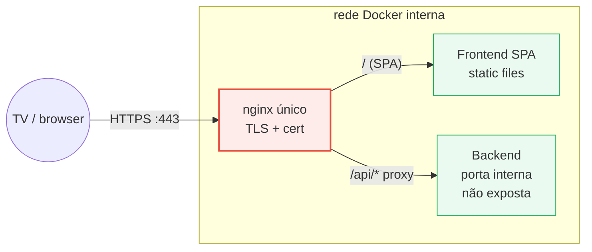
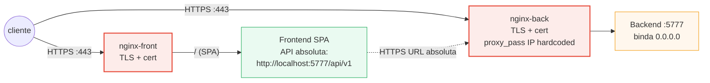
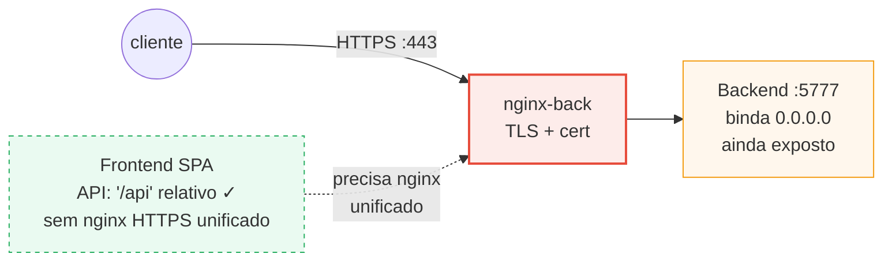
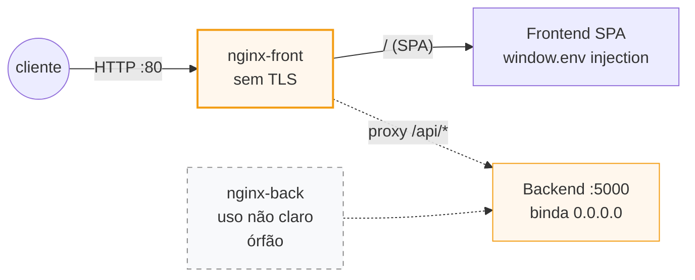
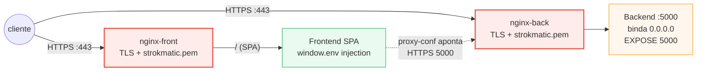
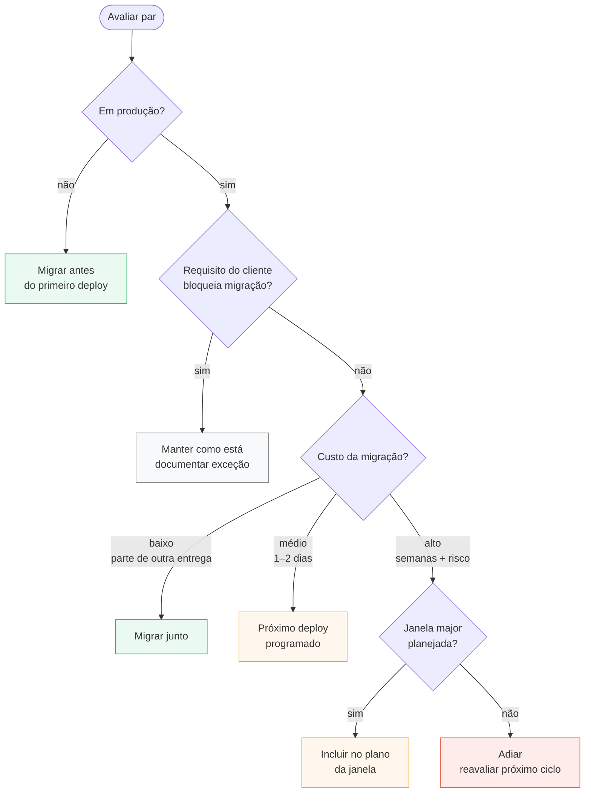

# Auditoria do padrão front + back + nginx — Strokmatic

**Status:** Draft para revisão interna (Pedro). Não distribuir antes de revisão.
**Author:** Pedro Teruel (with Claude)
**Date:** 2026-05-14
**Escopo:** transversal a todos os produtos Strokmatic (DieMaster, SpotFusion, VisionKing).

## 1. Contexto

A spec IRIS-06/07 (`docs/superpowers/specs/2026-05-13-iris-0{6,7}-*-design.md`) consolidou um padrão de exposição de rede para o conjunto front + back de um produto. Esse padrão não é universal entre os produtos hoje. Esta auditoria mapeia o estado atual de cada par front/back, explica o que ganhamos adotando o padrão alvo, identifica como cada implementação atual foge dele e propõe um framework de decisão para apoiar migrações repo a repo.

## 2. Implicações práticas de adotar o padrão alvo

O padrão alvo é: **backend escondido em rede interna, nginx único termina TLS na borda, frontend usa URLs relativas (`/api/*`), mesma origem**. Quatro consequências práticas:

### Em operação

- **1 cert TLS por deploy** em vez de 2-3. Renovação simples, política de rotação viável.
- **1 superfície pública** (1 IP : 1 porta). Audit, firewall, log e WAF aplicados num único ponto.
- **Backend pode mudar de porta/host interno** sem efeito externo. Deploy mais portátil entre clientes.
- **1 arquivo de config nginx por deploy**. Menos drift entre clientes; templates com overrides viáveis.

### Em segurança

- **Backend não exposto** na rede. Ataque externo só passa pelo nginx + frontend.
- **CORS desnecessário** (front e back mesma origem). Menos headers permissivos no backend.
- **HSTS, cipher policy, rate limit** configurados em ponto único.
- **Auth futura** (JWT cookie / OAuth proxy / mTLS) entra como middleware único no nginx, não duplicada em cada serviço.

### Em desenvolvimento

- **Frontend é portátil** — não conhece URL real do backend. Mesmo binário roda em N deploys.
- **Não precisa de `window.env.backendBaseUrl`** injetado em runtime (anti-padrão atual em 3 dos 5 pares).
- **`proxy.conf.json` em dev** continua funcionando do mesmo jeito.

### Em deploy/customização

- **Trocar cert** (Strokmatic self-signed → GEUE → Let's Encrypt → cert do cliente) = trocar 1 arquivo.
- **Mudar host/IP** do backend = editar 1 linha no nginx; frontend imutável.
- **Customização por cliente** vira override do nginx (raio, headers, allowlist), não fork do frontend.

### Como cada implementação foge — resumo

| Par | Falha principal | Implicação prática |
|---|---|---|
| **VK-steel** | 2 superfícies públicas + IP backend hardcoded no nginx | Renovação dupla de cert; deploy não-portátil; IP do servidor congelado no nginx |
| **VK-body** | Backend ainda binda `0.0.0.0`; front sem nginx HTTPS unificado | Está a 1 passo do padrão — falta exatamente a peça que IRIS-06/07 entrega |
| **DM** | Front-nginx só HTTP (sem TLS); back-nginx órfão em paralelo | TLS não unificado; complexidade injustificada (2 nginx pra fazer trabalho de 1) |
| **SF legacy** | 2 TLS terminations; certs `strokmatic.pem` self-signed versionados em vários repos | Renovação dupla; secrets em VCS; CORS sempre ligado |

## 3. Padrão alvo — diagrama

**Quatro propriedades-chave verificáveis:**

| Propriedade | Como verificar |
|---|---|
| (A) Backend listen interno | `app.listen()` em `127.0.0.1` ou compose sem `ports:` no serviço de back |
| (B) nginx único frontal | Apenas 1 container nginx publicado em 443 |
| (C) Frontend `/api` relativo | `environment.prod.ts` aponta para `/api`, não para `http://host:port` |
| (D) TLS único | nginx único termina HTTPS; back e front não têm SSL próprio |

## 4. Inventário (4 pares, 8 repos)

| Par | Backend | Frontend | Produto |
|---|---|---|---|
| **VK-steel** | `visionking/services/backend` | `visionking/services/frontend` | VisionKing — laminação (ArcelorMittal) |
| **VK-body** | `visionking/services/backend-ds` | `visionking/services/frontend-ds` | VisionKing — carrocerias (Stellantis 03010, IRIS 03007) |
| **DM** | `diemaster/services/backend` | `diemaster/services/frontend` | DieMaster (SJC GM, em produção) |
| **SF legacy** | `spotfusion/services/backend` | `spotfusion/services/frontend` | SpotFusion legacy SparkEyes |

## 5. Padrões em uso hoje — schemas por par

### 5.1 VK-steel — P1 (Dois nginx públicos)

**Falha:** 2 superfícies públicas, IP backend `192.168.15.208` hardcoded em `nginx-back.conf`, frontend conhece URL absoluta do backend → deploy não-portátil.

---

### 5.2 VK-body — P3 (Pré-convergência IRIS)

**Estado:** propriedade (C) já atendida (front usa `/api`). Falta (A) fechar binding do back e (B/D) consolidar nginx único frontal. **É exatamente o gap que IRIS-06/07 fecha.**

---

### 5.3 DM — P2 (nginx único no front com proxy /api)

**Estado:** **arquitetura mais próxima do padrão alvo** — nginx do front faz o proxy correto. Mas TLS não está no nginx do front (só HTTP), e há um `nginx-back.conf` separado de propósito não claro (provavelmente vestigial).

---

### 5.4 SF legacy — P1 (Dois nginx públicos)

**Falha:** 2 TLS terminations independentes, mesmo cert `strokmatic.pem` versionado no repo, CORS necessário.

---

## 6. Tabela comparativa

| Dimensão | VK-steel | VK-body | DM | SF legacy | **Alvo** |
|---|---|---|---|---|---|
| (A) Back binding interno | ❌ | ❌ | ❌ | ❌ | ✅ |
| (B) nginx único frontal | ❌ (2) | ⚠️ (só back) | ⚠️ (front + back órfão) | ❌ (2) | ✅ |
| (C) Front `/api` relativo | ❌ absoluta | ✅ | ⚠️ injetada | ⚠️ injetada | ✅ |
| (D) TLS único | ❌ (2 certs) | ⚠️ (só back) | ⚠️ (só HTTP no front) | ❌ (2 certs) | ✅ |
| CORS necessário | sim | não | não | sim | não |
| Esforço para migrar ao alvo | alto | baixo | médio-baixo | alto | — |
| Em uso em produção | sim (ArcelorMittal) | sim (Stellantis 03010) | sim (SJC GM) | sim (SparkEyes legacy) | — |
| Risco se ficar como está | médio | médio | baixo | médio | — |

## 7. Limitações específicas observadas

### VK-steel
- `proxy_pass http://192.168.15.208:5777` no nginx do back — **IP hardcoded**, deploy não-portátil.
- Environment do front: `http://localhost:5777/api/v1` hardcoded.
- 3 arquivos de nginx no front (`nginx_prod.conf`, `nginx.http.conf`, `nginx.https.conf`) sem clareza qual é o "atual" — drift de configuração.

### VK-body / IRIS
- Já está mais alinhado. Falta o nginx-front unificado (a entregar na implementação IRIS-06).
- Backend `app.listen(5777)` precisa virar `app.listen(5777, '127.0.0.1')` ou ficar implícito via compose sem `ports:`.

### DM
- Tem o **proxy `/api/`** no nginx do front (linha mais próxima do padrão IRIS) — mas o **back ainda tem seu próprio nginx separado** sem propósito claro.
- Múltiplas APIs (`API`, `DIE_SETUP_API`, `TEST_API`) apontando para o mesmo backend — vale consolidar.
- Frontend nginx só em 80 (sem TLS) — pode ser que TLS esteja em outro layer (gateway?).

### SF legacy
- Dois nginx, ambos com TLS, ambos com cert `strokmatic.pem` self-signed.
- proxy.conf.json aponta para `https://localhost:5000` (com TLS direto no back) — fora do padrão.
- Migrar tem risco: SparkEyes em produção em vários clientes.

## 8. Framework de decisão — migrar ou não?

**Critérios em texto:**

1. **Em produção?** Se não, migrar antes do primeiro deploy — custo praticamente zero.
2. **Requisito do cliente?** Cert separado, CORS aberto deliberado, etc. → manter; documentar exceção.
3. **Custo de migrar?** Baixo (junto de outra entrega) → fazer junto. Médio (1-2 dias) → agendar próximo deploy. Alto → só em janela major.
4. **Ganho de segurança/operação?** Cliente sensível (GM, automotivo) eleva prioridade.
5. **Benefício colateral?** Renovação de cert simplificada, CORS removido, deploy portátil.

## 9. Decisões sugeridas aplicando o framework

| Par | Decisão sugerida | Motivo |
|---|---|---|
| **VK-body** | Migrar agora (parte do IRIS-06/07) | Custo baixo, parte de outra entrega, cliente GM sensível |
| **DM** | Migrar em próximo deploy programado | Já está 60% lá; ganho de simplificação operacional |
| **VK-steel** | Não migrar agora; reavaliar em próxima entrega de cliente | Em produção estável; custo alto vs ganho moderado |
| **SF legacy** | Não migrar — colocar em modo manutenção | SparkEyes está sendo substituído pela linha vision; investir lá faz mais sentido |

## 10. Perguntas abertas para revisão

1. **Vale formalizar isso como padrão Strokmatic-wide?** (ex: ADR-001 num registro de decisões arquiteturais, ou skill nova `architecture/front-back-nginx-pattern`).
2. O nginx unificado vive no repo do **frontend** ou em um **repo de infra separado**? Hoje há drift (back-ds tem nginx em `infra/docker/production/nginx/`; DM idem; SF tem nginx no próprio repo). Vale unificar onde a config mora.
3. **TLS termination** — quem renova o cert? Hoje há `strokmatic.pem` self-signed espalhado por vários repos (anti-padrão: cert versionado). Vale política de cert externa (Let's Encrypt onde aplicável, cert do cliente onde necessário).
4. **Auth no frontend** — IRIS-07 deixou para iteração futura. Quando voltar, vale definir mecanismo unificado (JWT cookie? OAuth proxy no nginx?) que sirva todos produtos.
5. **Quem mantém o padrão?** — sem owner explícito, drift é certo. Vale designar.
6. Cada deploy custom de cliente vai forkar a config? Ou ter um template + overrides por env?

## 11. Próximos passos (se você aprovar)

1. Você revisa este doc e aprova/edita.
2. Documento vira ADR-001 (ou skill arquitetural) — fica no repo.
3. Comunicar à equipe — apresentação curta no Chat de Desenvolvimento Strokmatic.
4. Aplicar primeiro caso real: implementação IRIS-06/07 (já em andamento).
5. Migração DM agendada para próxima janela de release.
6. VK-steel e SF legacy permanecem no estado atual; reavaliados no próximo ciclo de renovação de cert ou major release.
